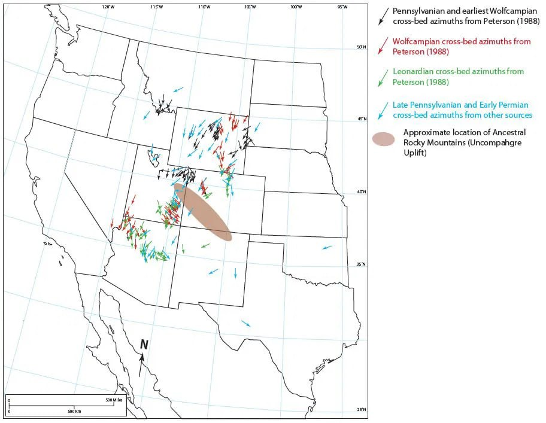

# Grand Canyon

Canonical work on this is done by the Is Genesis History team.

Coconino Sandstone stuff: https://answersresearchjournal.org/coconino-permian-sandstones/

Two bangers from the paper:

