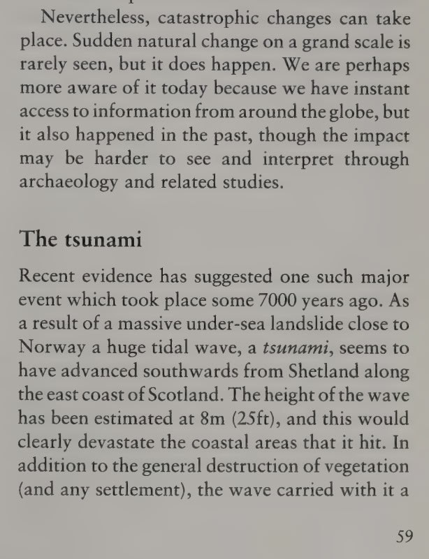
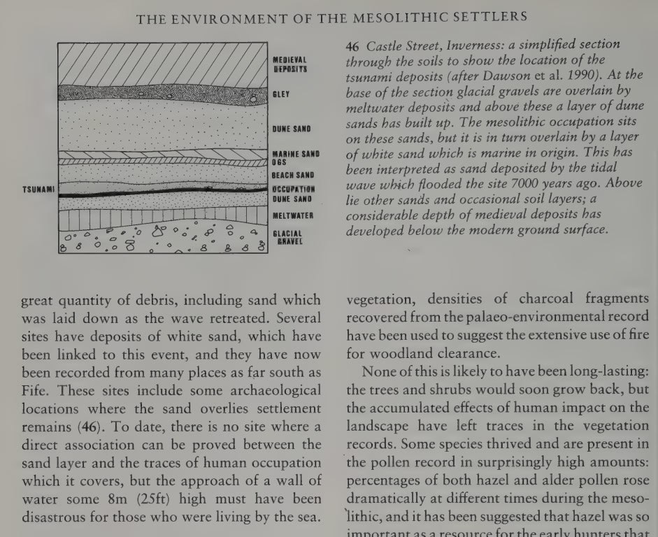
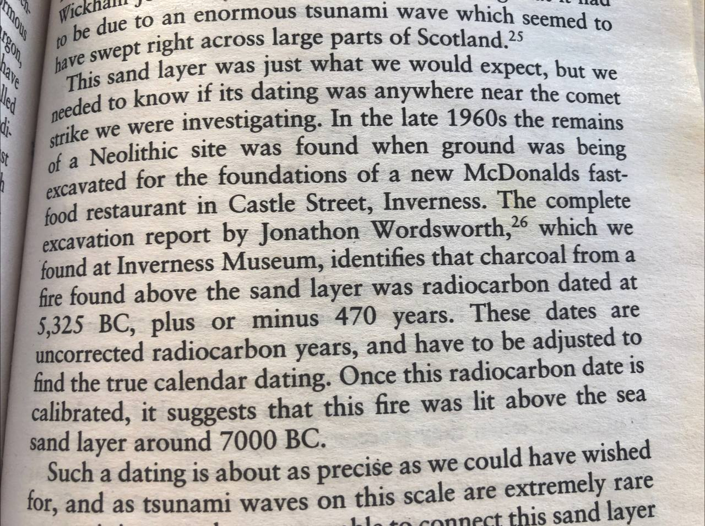

# Shetland

## Shetland

The Tsunami Sands of Scotland. "Recent evidence has suggested one such major event which took place some 7000 years ago. As a result of a massive under-sea landslide close to Norway a huge tidal wave, a tsunami, seems to have advanced southwards from Shetland along the east coast of Scotland. The height of the wave has been estimated at 8m (25ft), and this would clearly devastate the coastal areas that it hit."
- Scotland's First Settlers, Wickham-Jones (1994)

[1] https://archive.org/details/scotlandsfirstse0000wick

Found the precise unadjusted dating obtained from the Scottish tsunami sands - 5325 BC, or 7400 BP.  An exact match to the Noahic deluge on the harmonic timeline. The calibration they applied was to compensate for the presumed changes which the comet (or comets) would have caused to the ozone and C14 levels. If there was no comet, their adjustment would be unnecessary. [1,2]

Regarding the book's mention of flood elevation: "Says Castle Street, Inverness. Inverness lies between sea level and about 130m. Castle street must be about half that - around 50-60m asl at least." [2]

See `LOCATION-MAPPING/europe/great-britain` for flood analysis.

### THREE Shetland tsunami deposits - 7300, 5500 and 1500 YBP

"Coastal fen- and lake deposits enclose sand layers that record at least three Holocene tsunamis at the Shetland Islands. The oldest is the well-known Storegga tsunami (ca 8100 cal yr BP), which at the Shetlands invaded coastal lakes and ran up peaty hillsides where it deposited sand layers up to 9.2 m above present high tide level. Because sea level at ca 8100 cal yr BP was at least 10–15 m below present day sea level, the runup exceeded 20 m. In two lakes, we also found deposits from a younger tsunami dated to ca 5500 cal yr BP. The sediment facies are similar to those of the Storegga tsunami—rip-up clasts, sand layers, re-deposited material and marine diatoms. Runup was probably more than 10 m. Yet another sand layer in peat outcrops dates to ca 1500 cal yr BP. This sand layer thins and fines inland and was found at two sites 40 km apart and traced to ca 5–6 m above present high tide. The oldest tsunami was generated by the Storegga slide on the Norwegian continental slope. We do not know what triggered the two younger events."
[1] https://www.sciencedirect.com/science/article/abs/pii/S0277379105000739
