# Ice

There's some bond event data overlaid with predicted ECDO dates in `EVIDENCE/solar-system`.

## Bond Events

Bond events are North Atlantic ice rafting events that are tentatively linked to climate fluctuations in the Holocene. Eight such events have been identified. Bond events were previously believed to exhibit a roughly c. 1,500-year cycle, but the primary period of variability is now put at c. 1,000 years. [2]

There is a nice timeline from the Wikipedia page:

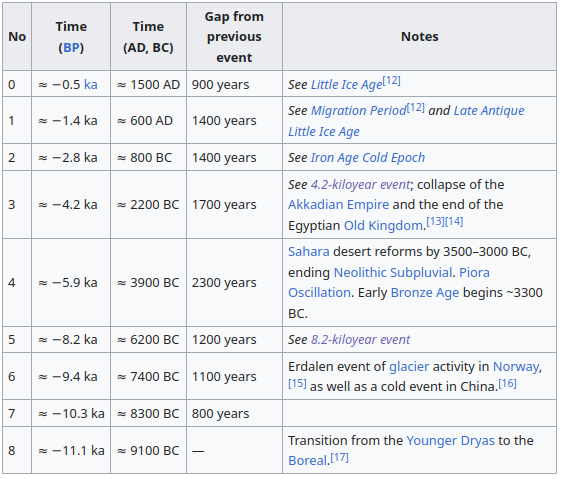

## Ice Rafting [3]

Ice rafting is the transport of various materials by ice. Various objects deposited on ice may eventually become embedded in the ice. When the ice melts after a certain amount of drifting, these objects are deposited onto the bottom of the water body, e.g., onto a river bed or an ocean floor.[1][2] These deposits are called ice rafted debris (IRD) or ice rafted deposits. Ice rafting was a primary mechanism of sediment transport during glacial episodes of the Pleistocene when sea levels were very low and much of the land was covered by large masses (sheets) of ice. The rafting of various size sediments into deeper ocean waters by icebergs became a rather important process. Ice rafting is still a process occurring today, although its impact is significantly less and much harder to gauge.

## Camp Century Ice Core

"The long-term trend was removed from both curves by applying a binomial high-pass filter. The resulting curves... are very similar; for example, the prominent maxima of the tree-ring record at ~2800 BC, 1900 BC, 700 BC, 300 BC, AD 800, Ad 1100 and AD 1700 (Maunder Minimum) are also found in the 10BE-based model curve."

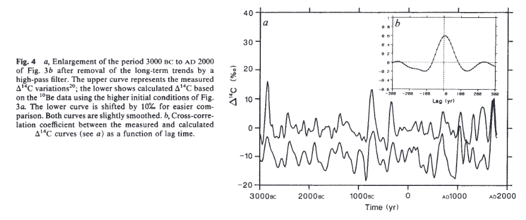

Hard copy in this folder.

## Holocene temperature variations inferred from Antarctic ice cores

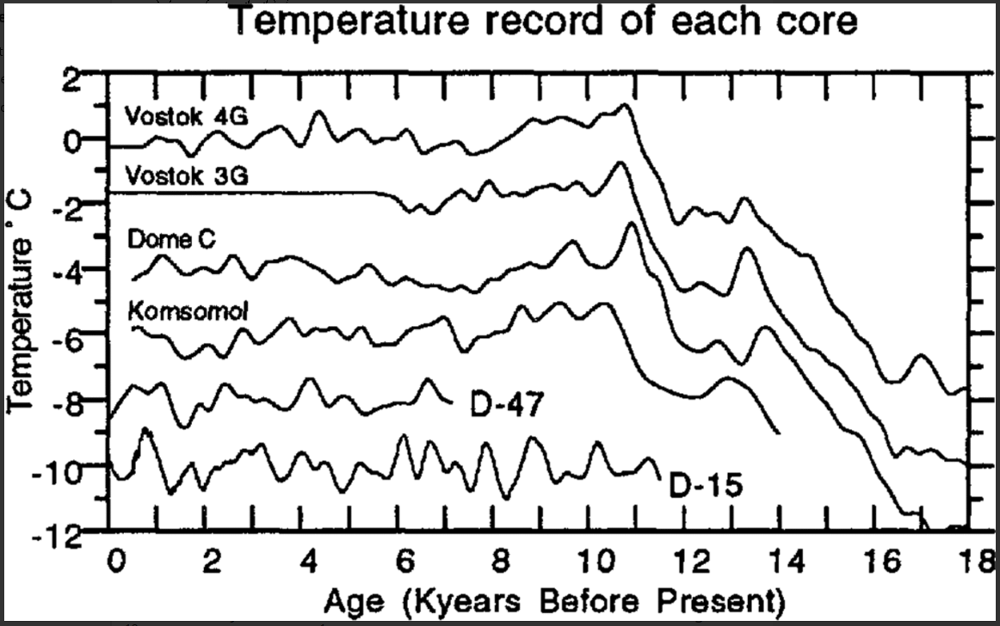

https://www.cambridge.org/core/journals/annals-of-glaciology/article/holocene-temperature-variations-inferred-from-antarctic-ice-cores/4615D12D0C046B19397D1E9BF4F2A641

## Mid-to Late Holocene East Antarctic ice-core tephrochronology: Implications for reconstructing volcanic eruptions and assessing their climatic impacts over the last 5,500 years (hard copy here)

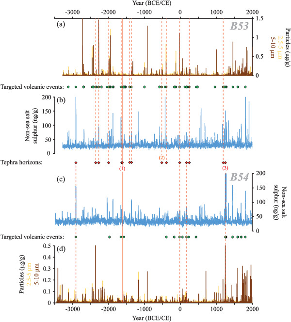

"Fig. 2. Centimetre-resolution non-sea-salt-sulphur and insoluble particle (2.5–5 μm and 5–10 μm diameter) records from the (a and b) B53 and (c and d) B54 ice cores. The volcanic events targeted in the cores are denoted with green diamonds. Red diamonds denote samples containing geochemically characterised glass tephra shards and red dashed lines denote their position in the corresponding core. The solid red line represents a visible tephra horizon that can be correlated between the cores. Previously identified tephra horizons now isolated in B53 and/or B54 are labelled: (1) Vostok tephra (2) HW6 (3) Rittmann tephra."

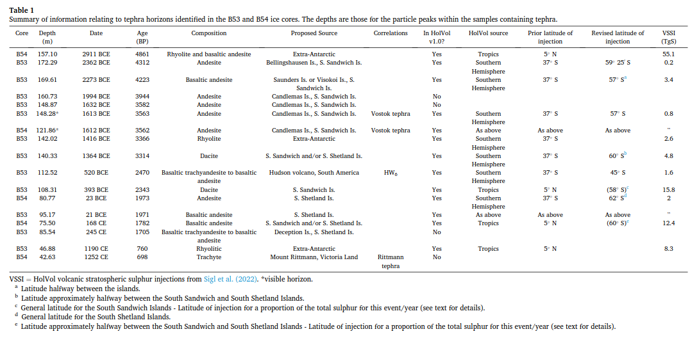

"Table 1. Summary of information relating to tephra horizons identified in the B53 and B54 ice cores. The depths are those for the particle peaks within the samples containing tephra."

Of particular note are the Extra-Antarctic tephra of 2911 BC, 1416 BC, and 1190 CE, along with the Vostok tephra of 1613 BC, the Rittman tephra of 1252 CE, and the Hudson volcano tephra of 520 BCE. These cluster around potential cataclysm dates of 3000 BC, 1700 BC, 1200 BC, 400 BC, and 1200 CE.

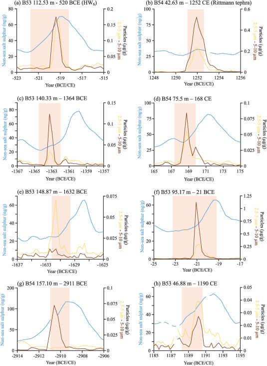

"Fig. 6. Centimetre-resolution (∼3–4 analyses per year resolution) non-sea-salt-sulphur and insoluble particle (2.5–5 μm and 5–10 μm diameter) records over volcanic events containing geochemically characterised glass tephra shards. Red bars denote the sample intervals containing glass tephra shards. Events are dated to (a) 520 BCE (b) 1252 CE (c) 1364 BCE (d) 168 CE (e) 1632 BCE (f) 21 BCE (g) 2911 BCE (h) 1190 CE."

You can see that the sulphur rises trail the tephra particles.

https://www.sciencedirect.com/science/article/pii/S0277379124000453

## Kilimanjaro Ice Core Records: Evidence of Holocene Climate Change in Tropical Africa

"Six ice cores from Kilimanjaro provide an ~11.7-thousand-year record of Holocene climate and environmental variability for eastern equatorial Africa, including three periods of abrupt climate change: ~8.3, ~5.2, and ~4 thousand years ago (ka). The latter is coincident with the "First Dark Age", the period of the greatest historically recorded drought in tropical Africa".

"These indicate ice that formed during the well-documented African Humid Period (~11 to 4 ka), when warmer and wetter conditions prevailed in response to the precession-driven increase in solar radiation. During this interval, lakes in the region rose as much as 100m above present levels, and in sub-Saharan Africa lake expansion was massive, with Lake Chad expanding 25-fold from ~17,000 km^2 to cover an area between ~330,000 and 438,000 km^2, comparable to that of the Caspian Sea today. A paleo-lake filled the Magadi Natron basin on the border between Tanzania and Kenya to a depth 50m above the present level and had an area of ~1600 km^2 in the early Holocene."

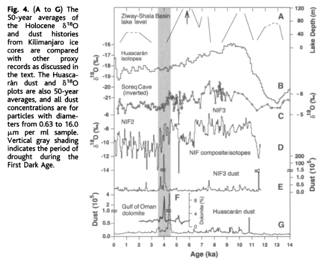

## An event stratigraphy for the Last Termination in the North Atlantic region based on the Greenland ice-core record: a proposal by the INTIMATE group

I see 6200 BC and 7300 Tollman events in here.

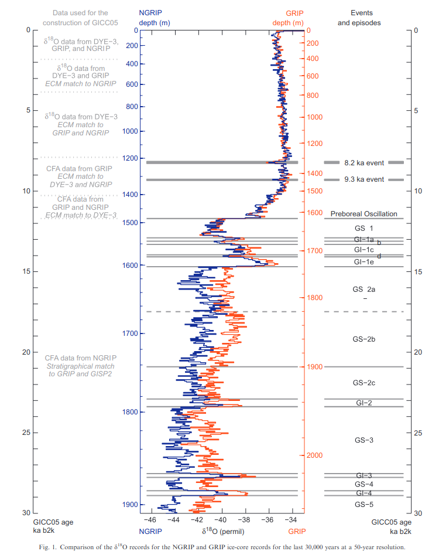

## Gas giants grand cycle harmonic and bond event data

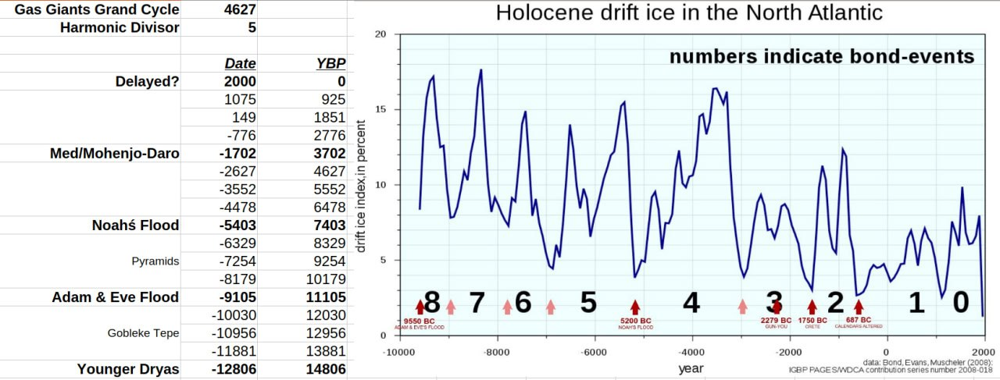

There is a 4627 year gas giant master cycle. If you divide it by 5, and break time down into intervals, every fourth coincides with a potential ECDO event.

It is referenced against historical bond event (ice-rafting) data.

## Speculation on melting ice caps

It would require centuries - possibly a millennium or more to completely melt Antarctic's ice sheet at the equator. 30 million gigatonnes of ice is roughly 5-6 times the mass of Australia's exposed (above sea level) land. Only a tiny fraction of it is going to melt during 20-40 years of nuclear-type winter, even at the equator. Same goes for Greenland. Probably be too cold for any deep ice to melt. Think snowpiercer.

If S2 persists for 3700 years, then surely there is no reason for Antarctica/Greenland to have all the ice and the poles during S2 to have none?

That sort of narrows it down to 2 options:

1. Ice fully melts each cycle
2. S2 doesn't persist for nearly as long as S1

If logic dictates that even 3700 years is not nearly long enough to melt the ice, then that's fairly conclusive proof that S2 is shorter than S1.

## Antarctic ice-core temperature dataset [1]

I found an Antarctic 800ka raw ice-core temperature dataset. Here's the last 20ky plotted against the harmonics.

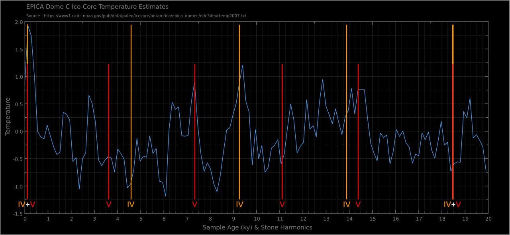

[1] https://www1.ncdc.noaa.gov/pub/data/paleo/icecore/antarctica/epica_domec/edc3deuttemp2007.txt

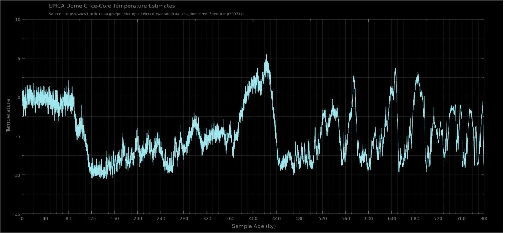

The complete 800ky record set fairly obliterates the "unprecedented warming" narrative. It's been much warmer (and colder) in the past. This core spans from the surface (now) right down to 3260m (800ky).

## Carbon in Antarctica Lakes

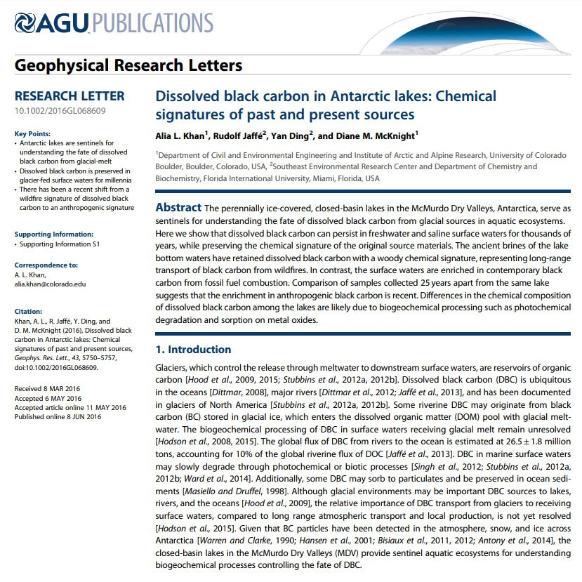
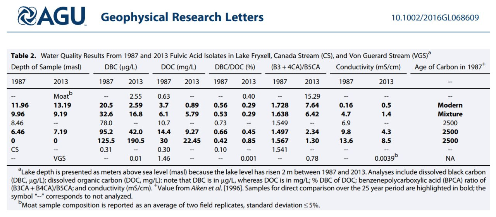

1. https://annas-archive.org/scidb/10.1002/2016GL068609
2. https://www.nsf.gov/news/news_summ.jsp?cntn_id=138871

## Citations

1. [Craig Stone](https://nobulart.com)
2. https://en.wikipedia.org/wiki/Bond_event
3. https://en.wikipedia.org/wiki/Ice_rafting