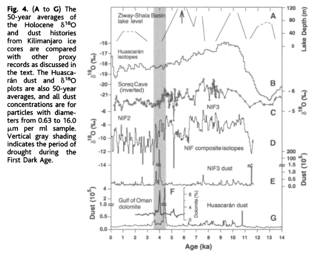

# Africa

## Kilimanjaro Ice Core Records: Evidence of Holocene Climate Change in Tropical Africa

"Six ice cores from Kilimanjaro provide an ~11.7-thousand-year record of Holocene climate and environmental variability for eastern equatorial Africa, including three periods of abrupt climate change: ~8.3, ~5.2, and ~4 thousand years ago (ka). The latter is coincident with the "First Dark Age", the period of the greatest historically recorded drought in tropical Africa".

"The 50-year averages of 18-O and insoluble dust are shown along with several other proxy records for the past ~11.7 thousand years (Fig. 4)."

"These indicate ice that formed during the well-documented African Humid Period (~11 to 4 ka), when warmer and wetter conditions prevailed in response to the precession-driven increase in solar radiation. During this interval, lakes in the region rose as much as 100m above present levels, and in sub-Saharan Africa lake expansion was massive, with Lake Chad expanding 25-fold from ~17,000 km^2 to cover an area between ~330,000 and 438,000 km^2, comparable to that of the Caspian Sea today. A paleo-lake filled the Magadi Natron basin on the border between Tanzania and Kenya to a depth 50m above the present level and had an area of ~1600 km^2 in the early Holocene."

Page 5 documents in-depth analysis of each of the 3 proposed climate change events.

8.2 ka event:
- F- concentrations between ~8.4 and 8.2ka are the highest yet reported from an ice core
- large, abrupt reduction in methane (CH4) at ~8.2ka and the greatest Holocene depletion of 18-O in both the GRIP and the Greenland Ice Sheet Project 2 records
- The highest sustained levels of F- and Na+ occur at ~8.3 ka and likely reflect a large rapid drop in lake levels (brief but strong drying period) in this region

5.2 ka event:
- abrupt 18-O depletion at ~6.5ka that continued for more than a millenium. It culminated as a sharp dip of >5% at ~5.2ka that was followed by rapid recovery and sustained 18-O enrichment from ~5 to 4 ka.
- The cooling indicated by the more negative 18-O values from ~6.5 to 5 ka is coincident with a "second humid period" (~6.5 to 4.5 ka) when conditions were wetter than today but drier than the early Holocene "first humid period"
- During this second humid period, the Ziway-Shala Basin attained its highest levels (~6.0 to 5.5ka) before drapping rapidly (beginning ~5.5 ka) to near modern low levels by ~4 ka.
- The abrupt cooling event ~5.2 ka is recorded as the largest 18-O depletion in Kilimanjaro ice and the largest 18-O enrichment in the Soreq cave record.
- This climatic change recorded in Kilimanjaro ice is concomitant with a decline in both lake levels and vegetative cover, as well as the lowest CH4 concentrations in Holocene ice from Greenland.
- This century-scale rapid cooling and drying event correlates with the 5.2-ka Late Uruk abrupt climate change that is suggested to have altered environments and subsistence outside the Mesopotamian lowlands.

4 ka event:
- The third abrupt climate event recorded in Kilimanjaro ice is associated with the most distinct visible dust layer, 30 mm thick, in NIF3 at 32.53m.
- This layer also contains high concentrations of other chemical species and may represent a hiatus in mass accumulation of undetermined length.
- There is abundant ancillary evidence for the dry climate at this time. Water levels were very low in the lakes of tropical east Africa, and the effects of this drought were experienced throughout northern and tropical Africa, the Middle East, and western Asia.
- This drought event was so severe that it has been considered instrumental in the collapse of a number of civilizations.
- The regional coincidence of low lake levels, reduction of ice cover on Kilimanjaro, deposition of a thick layer of dust, and societal upheaval suggest a large climate event centered at ~4 ka.
- The possibility that the drought was much more extensive is suggested by the contemporaneity of the Kilimanjaro dust event with an enormous dust event recorded in ice cores from Huascaran in the Andes of Northern Peru at ~4.3 ka.