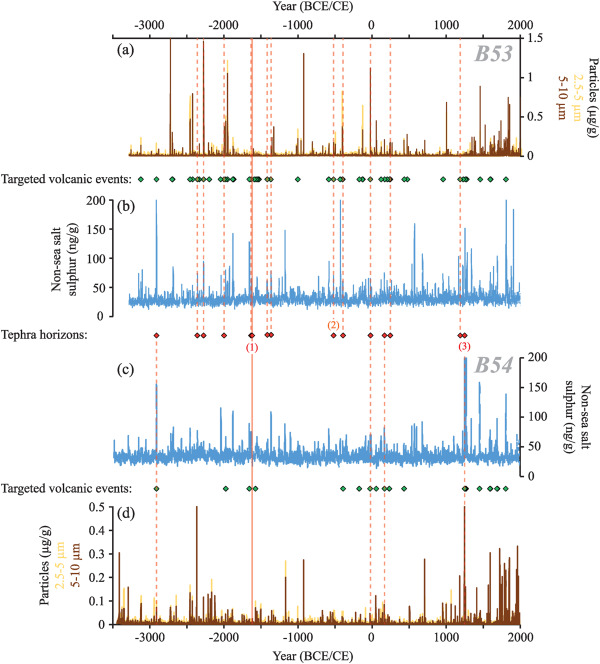
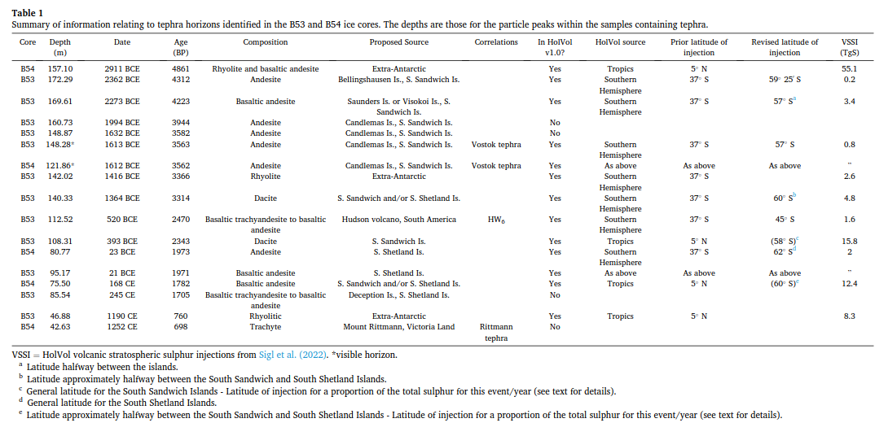
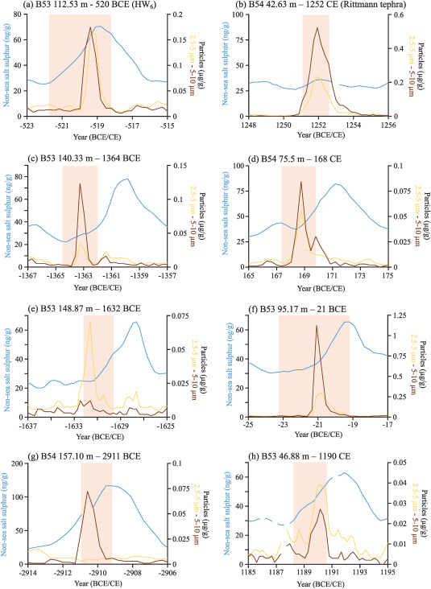
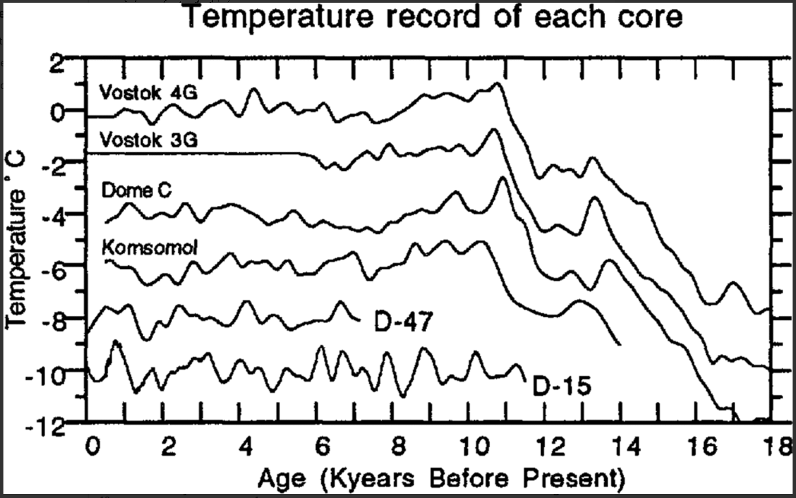

# Antarctica

## Mid-to Late Holocene East Antarctic ice-core tephrochronology: Implications for reconstructing volcanic eruptions and assessing their climatic impacts over the last 5,500 years (hard copy here)

"Fig. 2. Centimetre-resolution non-sea-salt-sulphur and insoluble particle (2.5–5 μm and 5–10 μm diameter) records from the (a and b) B53 and (c and d) B54 ice cores. The volcanic events targeted in the cores are denoted with green diamonds. Red diamonds denote samples containing geochemically characterised glass tephra shards and red dashed lines denote their position in the corresponding core. The solid red line represents a visible tephra horizon that can be correlated between the cores. Previously identified tephra horizons now isolated in B53 and/or B54 are labelled: (1) Vostok tephra (2) HW6 (3) Rittmann tephra."

"Table 1. Summary of information relating to tephra horizons identified in the B53 and B54 ice cores. The depths are those for the particle peaks within the samples containing tephra."

Of particular note are the Extra-Antarctic tephra of 2911 BC, 1416 BC, and 1190 CE, along with the Vostok tephra of 1613 BC, the Rittman tephra of 1252 CE, and the Hudson volcano tephra of 520 BCE. These cluster around potential cataclysm dates of 3000 BC, 1700 BC, 1200 BC, 400 BC, and 1200 CE.

"Fig. 6. Centimetre-resolution (∼3–4 analyses per year resolution) non-sea-salt-sulphur and insoluble particle (2.5–5 μm and 5–10 μm diameter) records over volcanic events containing geochemically characterised glass tephra shards. Red bars denote the sample intervals containing glass tephra shards. Events are dated to (a) 520 BCE (b) 1252 CE (c) 1364 BCE (d) 168 CE (e) 1632 BCE (f) 21 BCE (g) 2911 BCE (h) 1190 CE."

You can see that the sulphur rises trail the tephra particles.

https://www.sciencedirect.com/science/article/pii/S0277379124000453

## Holocene temperature variations inferred from Antarctic ice cores

https://www.cambridge.org/core/journals/annals-of-glaciology/article/holocene-temperature-variations-inferred-from-antarctic-ice-cores/4615D12D0C046B19397D1E9BF4F2A641