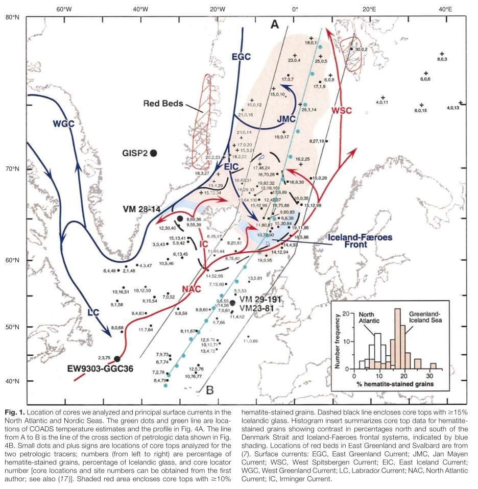
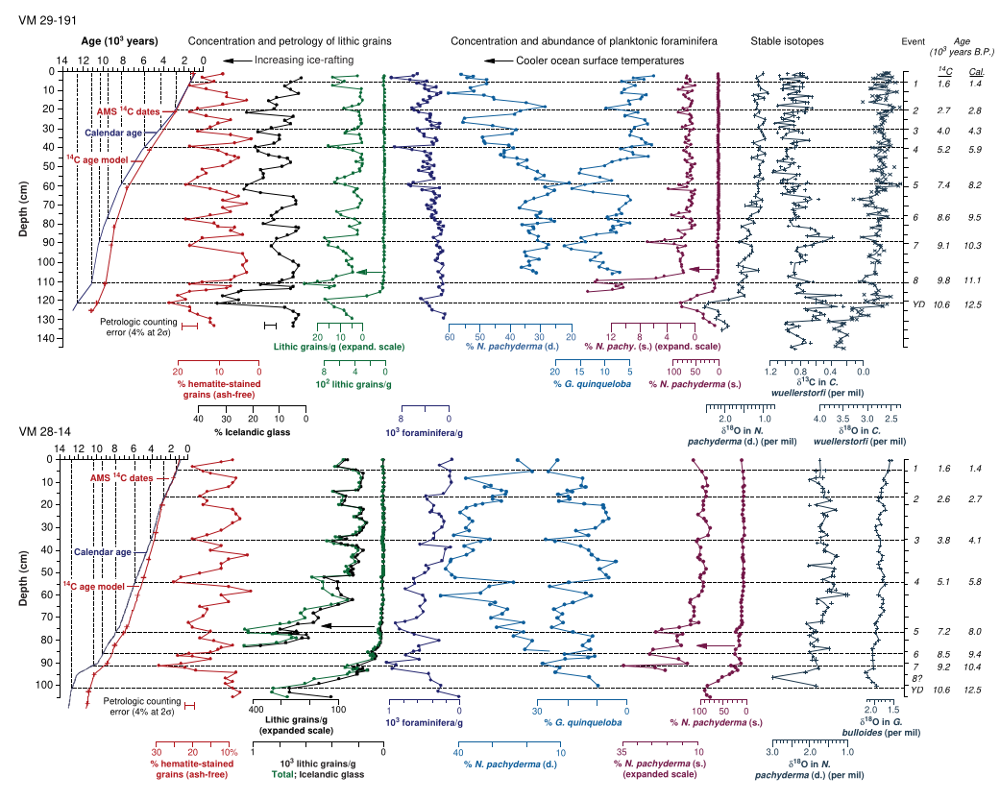
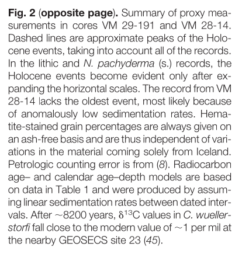
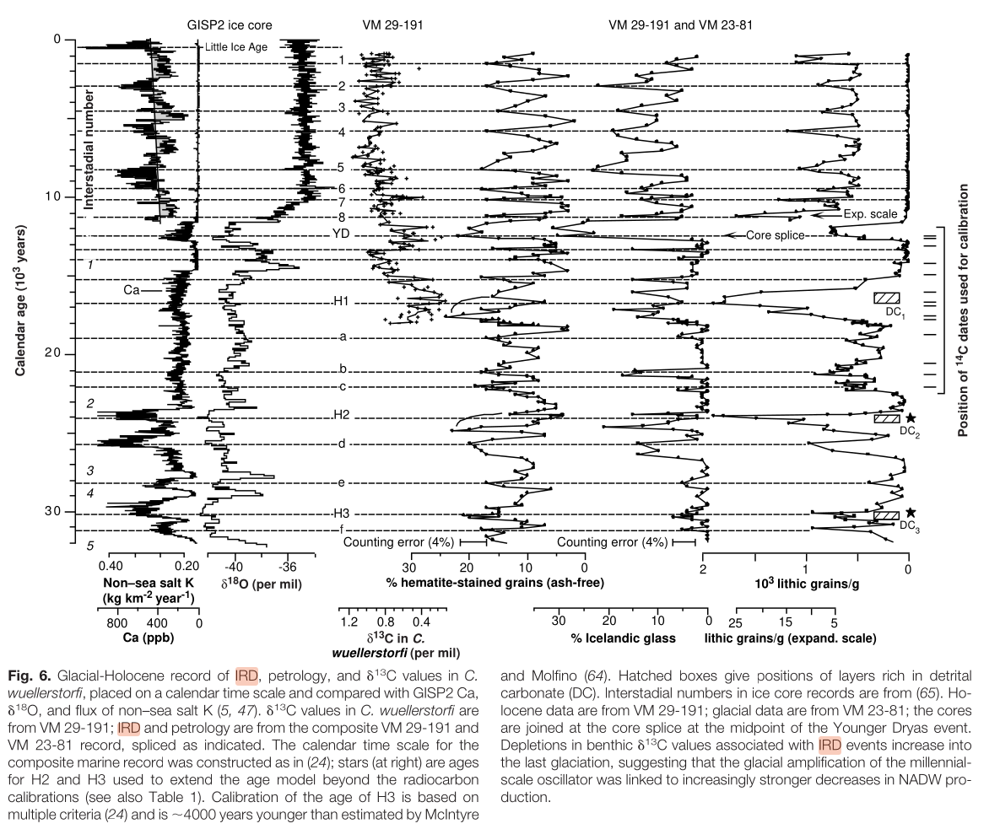
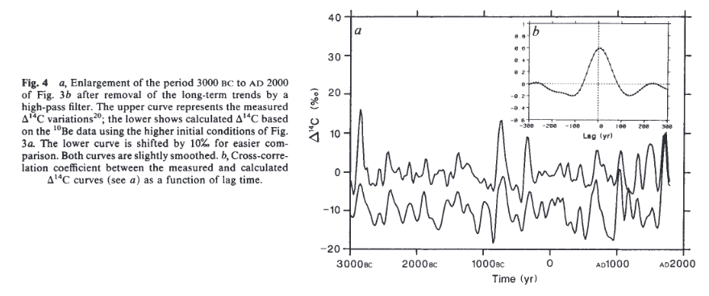
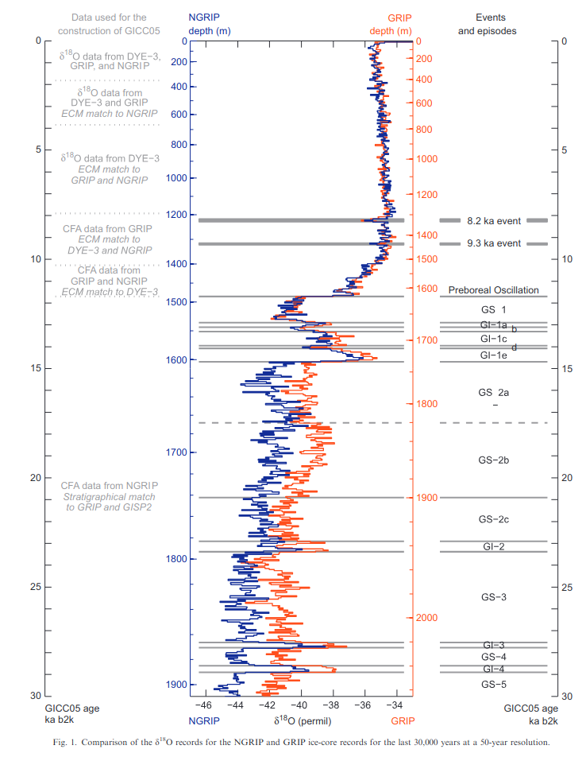
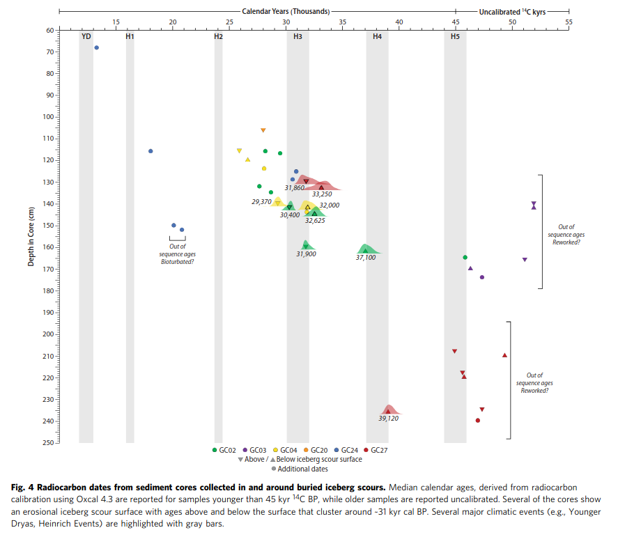

# North Atlantic

Greenland.

## A Pervasive Millennial-Scale Cycle in North Atlantic Holocene and Glacial Climates (hard copy here)

The OG "bond event" paper. As far as I understand, they took two deep-sea cores, along with a large sampling of "core tops", for their analysis.

"The most conspicuous evidence of variations in the North Atlantic’s Holo- cene climate comes from the same three proxies that we used to document ice-raft- ing in the North Atlantic during the last glaciation (7). One proxy is the concentra- tion of lithic grains, defined as the number of grains with diameters greater than 150 mm in 1 g of core. At both sites we found a series of increases in grain concentrations, which, although of much smaller magnitude than those of the last glaciation, are distinct and reach peak values several times that of the ambient grain concentrations (Fig. 2)."

"The other two proxies are petrologic tracers, defined as the percentages of cer- tain types of lithic grains. One of the tracers is fresh volcanic glass, which comes from Iceland or Jan Mayen, and the other is hematite-stained grains, mostly quartz and feldspar, **that come from sedimentary depos- its containing red beds** (Fig. 3) (7). During each of the lithic events, both tracers dis- play prominent increases well above the 2s counting error (Fig. 2) (8)."

"Hence, contrary to the conventional view, the North Atlantic’s Holocene cli- mate must have undergone a series of abrupt reorganizations, each with sufficient impact to force concurrent increases in de- bris-bearing drift ice at sites more than 1000 km apart and overlain today by warm, large- ly ice-free surface waters of the North At- lantic and Irminger currents. The ice-rafted debris (IRD) events exhibit a distinct pac- ing on millennial scales, with peaks at about 1400, 2800, 4200, 5900, 8100, 9400, 10,300, and 11,100 years ago."

This is an interesting diagram. The red dash-shaded areas are the "red beds" which are the sources for hematite-stained grains, which are found in high percentages in the red fill-shaded area between the red beds.

Some interesting analysis on VM 29-191 ice core: "The strongest evidence for changes in ocean surface circulation during the ice-rafting events comes from VM 29-191."

"We find instead that the sources of IRD at VM 29-191 must have been much farther to the northeast in the Greenland-Iceland seas. There, percentages of the two tracers in core top sediments consistently reach or even exceed their peak values in VM 29- 191 (Figs. 1 and 4B). The Icelandic mate- rial probably was erupted onto drifting ice [see also (18)], and hematite-stained grains may have come from along coastal East Greenland and Svalbard (Fig. 1) and per- haps from farther north around the Arctic Ocean, where red beds also are present. The abrupt eastward and southward drops in tracer percentages almost certainly result from melting of ice along frontal systems where warm and cool surface waters mix (Figs. 1 and 4B). The low tracer percentages in Labrador Sea ice, therefore, likely reflect melting of tracer-rich ice in the Denmark Strait frontal system and the dearth of he- matite-bearing sources of IRD around the Labrador Sea (7)."

"Hence, the North Atlantic’s surface cir- culation must have alternated between two modes. At times of minimum concentra- tions of IRD and warmer sea surface tem- peratures at the coring sites, circulation probably was similar to today’s, such that small amounts of tracer-poor ice from the Labrador Sea reached both coring sites. During the ice-rafting events, export of ice from the Labrador Sea may have increased, but surface waters of the Greenland-Iceland seas must have been advected much farther southward or southeastward than they are today, carrying tracer-rich ice to both cor- ing sites (Fig. 1)."

## Information on past solar activity and geomagnetism from Be in the Camp Century ice core

"The long-term trend was removed from both curves by applying a binomial high-pass filter. The resulting curves... are very similar; for example, the prominent maxima of the tree-ring record at ~2800 BC, 1900 BC, 700 BC, 300 BC, AD 800, Ad 1100 and AD 1700 (Maunder Minimum) are also found in the 10BE-based model curve."

Hard copy in this folder.

## An event stratigraphy for the Last Termination in the North Atlantic region based on the Greenland ice-core record: a proposal by the INTIMATE group

I see 6200 BC and 7300 Tollman events in here.

# Pre-Holocene

### Timing of iceberg scours and massive ice-rafting events in the subtropical North Atlantic (hard copy here)

## NORTH ATLANTIC CLIMATIC OSCILLATIONS REVEALED BY DEEP GREENLAND ICE CORES

Pre-Holocene Dansgaard-Oeschger events 1984 paper. Hard copy here.