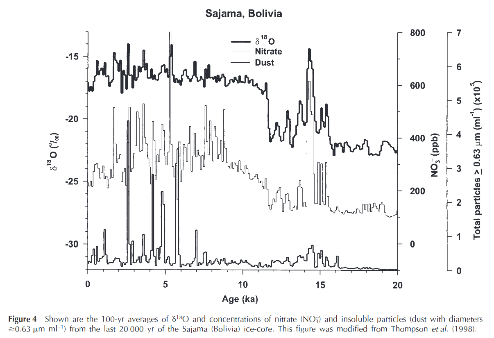

# South America

## Ice-core palaeoclimate records in tropical South America since the Last Glacial Maximum (hard copy here)

https://bpcrc.osu.edu/sites/default/files/2021-01/lgt00-jqs-1.pdf

## An Andean ice-core record of a Middle Holocene mega-drought in North Africa and Asia (hard copy here)

"An ice core from the Nevado Huascara´n col in the Cordillera Blanca of northern Peru
contains high-resolution time series of dust concentrations and size distributions since the end of the last
glacial stage. A large dust peak, dated ~4500 years ago, is contemporaneous with a widespread and
prolonged drought that apparently extended from North Africa to eastern China, evidence of which
occurs in historical, archeological and paleoclimatic records. "

https://www.researchgate.net/publication/228495939_An_Andean_ice-core_record_of_a_Middle_Holocene_mega-drought_in_North_Africa_and_Asia