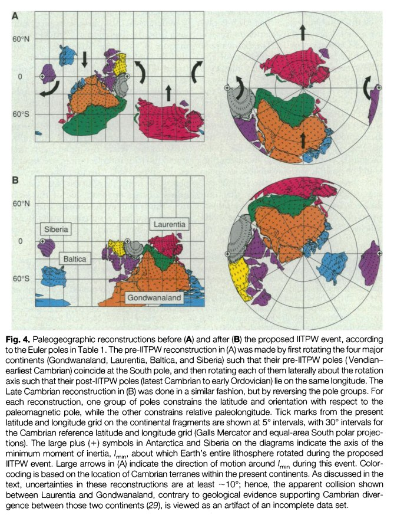
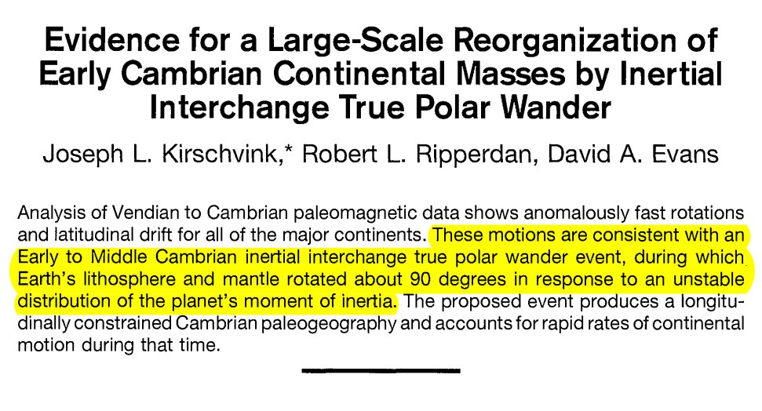

# Earth Samples

This folder is for evidence coming from samples of the Earth.

## Laschamp Excursion: Laj and Lund Studies [2]

Hard copy in this folder. Cited by TES in his thesis.

## Varved Clay [1]

Varved clay proxies provide sub-annular paleomagnetic resolutions. The following charts are taken from Annual and inter‐annual magnetic variations in varved clay, Nils‐Axel Mörner (1978)[1], wherein paleomagnetic findings from VC cores dated to ±13,150 BP (spanning 156 varves/years) and ±10,000 BP (spanning 300 varves/years) are shown. These two cores span the Gothenburg Flip & Excursion[2] and the Ornö Declination Departure.

What appears to be recorded in these proxies are multiple geomagnetic excursions and reversals which occurred within short succession, most within a few years to a couple of decades apart, with the majority reflecting a declination change of 80°-120°. This looks very much like what I would expect to see recorded from a series of ECDO-type events[3].

Coloured elements are my own additions. Blue and red indicate selected reversal points of magnetic declination. Orange numbers are the approximate number of varves/years between the reversals. Green curves and text indicate the approximate number of degrees change between the selected reversals. Raw chart values which exceed 180° have been subtracted from 360° and the absolute delta value displayed bracketed.

[1] http://dx.doi.org/10.1080/09291017809359640
[2] https://sciencedirect.com/science/article/abs/pii/003358947790031X
[3] https://theethicalskeptic.com/2024/05/23/master-exothermic-core-mantle-decoupling-dzhanibekov-oscillation-theory/

## Varved clay 13150 BP

https://x.com/nobulart/status/1816565694244192663

## Sediment data: 18.5k cycle (Milankovitch cycle) effects on climate

https://oceanrep.geomar.de/id/eprint/31064/1/Fl%C3%B6gel_Diss.pdf

## Paleomagnetic data: Earth rotation ~500 mm years ago

This paper is describing something which sounds remarkably similar to an ECDO state 2 to state 1 rotation a half a billion years ago:

"..at least two tectonic plates, involving more than two-thirds of Earth's continental lithosphere, were involved in a rapid rotation of ~90° relative to the spin axis. We speculate that the entire lithosphere may have been involved in this rotation. // The new ages, along with paleomagnetic data, indicate that continents moved at rapid rates that are difficult to reconcile with our present understanding of mantle dynamics.."

(continued...) "// The pole for this sequence is >80° away from the Vendian-Early Cambrian poles, implying that Australia underwent a large rotation while remaining near the equator sometime between Tommotian and Late Cambrian time. // Australia rotated counterclockwise during this time. // Antarctica, India, Africa, South America, and perhaps parts of East Asia also rotated with Australia. // True polar wander (TPW) is the process through which quasi-rigid spheroids align their maximum moments of inertia with the spin axis, pushing positive mass anomalies toward the rotational equator. // A variant of this mechanism, inertial interchange true polar wander (IITPW), involves discrete bursts of TPW of up to 90° in geologically short intervals of time if the magnitudes of the intermediate and maximum moments of inertia cross. This would result in a rapid movement away from the spin axis by the geographic location of the former pole with rotation of the entire solid Earth centered about the minimum moment of inertia located on the equator. // These two poles, with their stated polarity interpretation, are separated by about 68°; together they yield a plausible tropical position for Siberia, nearly on the opposite side of the globe from Australia. // If the velocities are due to TPW, however, such geodynamical considerations are obviated because the entire mantle would have rotated along with the lithosphere."

https://www.researchgate.net/publication/235243439_Evidence_for_a_Large-Scale_Reorganization_of_Early_Cambrian_Continental_Masses_by_Inertial_Interchange_True_Polar_Wander

## Vredefort Impact Structure

https://en.wikipedia.org/wiki/Vredefort_impact_structure

The unusually mineral rich composition of the crust here probably has something to do with the LLSVP intrusion and the Vredefort crater which exposed some of what was below. Agreed on the alternate concepts - I find valuable knowledge in most areas of inquiry, especially if its something new to me. 

## Opal (Australia)

Like all fine things, gem opal is exceedingly rare. Much of the world's precious opal is mined in the harsh outback of Australia, where a unique combination of geological conditions permitted the formation of opal near the margins of an ancient inland sea.

https://www.opalsdownunder.com.au/learn/australian-opal-mining-fields/

## Citations

1. [Craig Stone](https://nobulart.com)
2. https://hal.science/hal-03118231v1/file/2005GC001122.pdf
