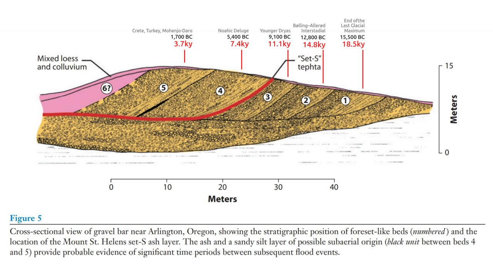

# Earth Samples

This folder is for evidence coming from samples of the Earth.

## Varved Clay

Varved clay proxies provide sub-annular paleomagnetic resolutions. The following charts are taken from Annual and inter‐annual magnetic variations in varved clay, Nils‐Axel Mörner (1978)[1], wherein paleomagnetic findings from VC cores dated to ±13,150 BP (spanning 156 varves/years) and ±10,000 BP (spanning 300 varves/years) are shown. These two cores span the Gothenburg Flip & Excursion[2] and the Ornö Declination Departure.

What appears to be recorded in these proxies are  multiple geomagnetic excursions and reversals which occurred within short succession, most within a few years to a couple of decades apart, with the majority reflecting a declination change of 80°-120°. This looks very much like what I would expect to see recorded from a series of ECDO-type events[3].

Coloured elements are my own additions. Blue and red indicate selected reversal points of magnetic declination. Orange numbers are the approximate number of varves/years between the reversals. Green curves and text indicate the approximate number of degrees change between the selected reversals. Raw chart values which exceed 180° have been subtracted from 360° and the absolute delta value displayed bracketed.

[1] http://dx.doi.org/10.1080/09291017809359640
[2] https://sciencedirect.com/science/article/abs/pii/003358947790031X
[3] https://theethicalskeptic.com/2024/05/23/master-exothermic-core-mantle-decoupling-dzhanibekov-oscillation-theory/

## Varved clay 13150 BP

https://x.com/nobulart/status/1816565694244192663

## Vredefort Impact Structure

https://en.wikipedia.org/wiki/Vredefort_impact_structure

The unusually mineral rich composition of the crust here probably has something to do with the LLSVP intrusion and the Vredefort crater which exposed some of what was below. Agreed on the alternate concepts - I find valuable knowledge in most areas of inquiry, especially if its something new to me. 

## Opal (Australia)

Like all fine things, gem opal is exceedingly rare. Much of the world's precious opal is mined in the harsh outback of Australia, where a unique combination of geological conditions permitted the formation of opal near the margins of an ancient inland sea.

https://www.opalsdownunder.com.au/learn/australian-opal-mining-fields/

## Scablands flood deposits

Potential explanation for the Scablands flood deposits based on the ECDO. The "Set S" tephta is an ash layer from Mt. Saint Helens and is a temporal marker for the termination of the Younger Dryas.

https://www.geo.umass.edu/climate/papers2/Baker_retrospective_2009.pdf