# Soil Organic Matter

Interesting correlation between DEM and soil organic matter.

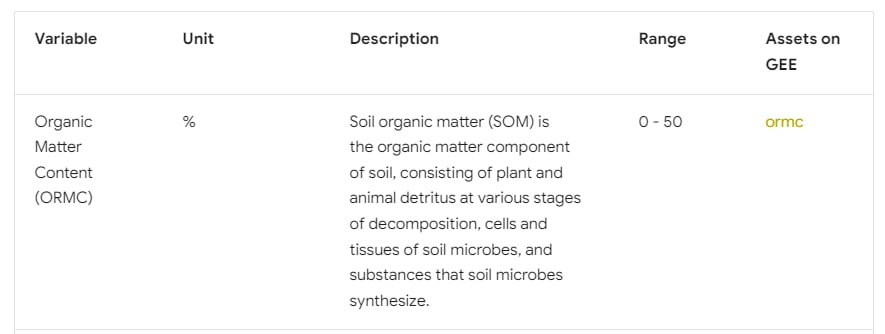

Under 5% = Black, Above 30% = White:

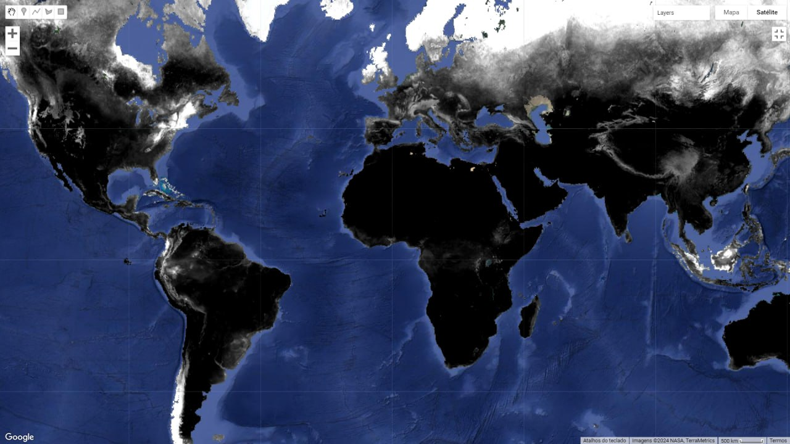

The areas with the most organic material are in white. The Tundra areas and others close to sea level are the richest. And then, extremely high areas, for no very clear reason, are richer than the soil of the Amazon.

On the top of mount roraima:

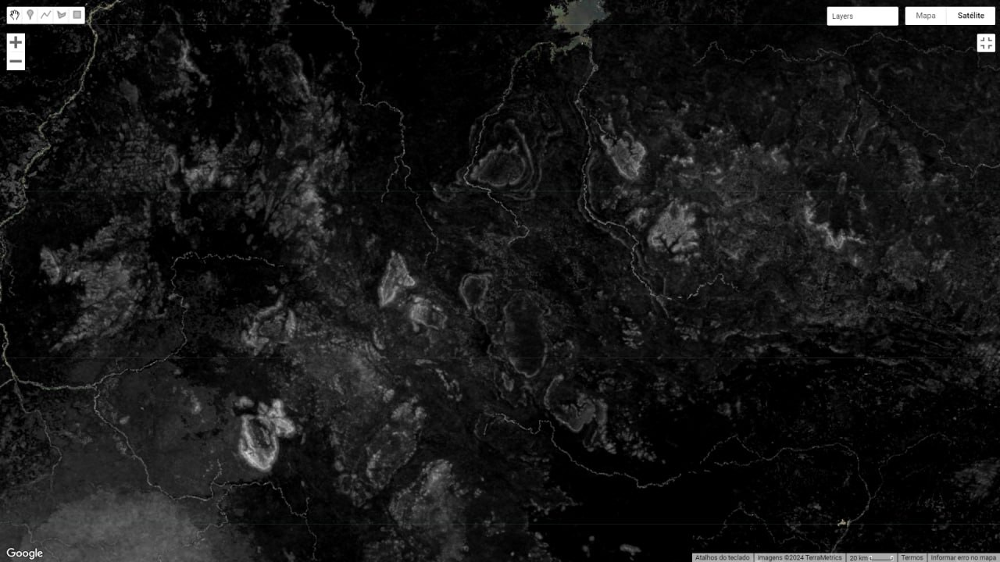
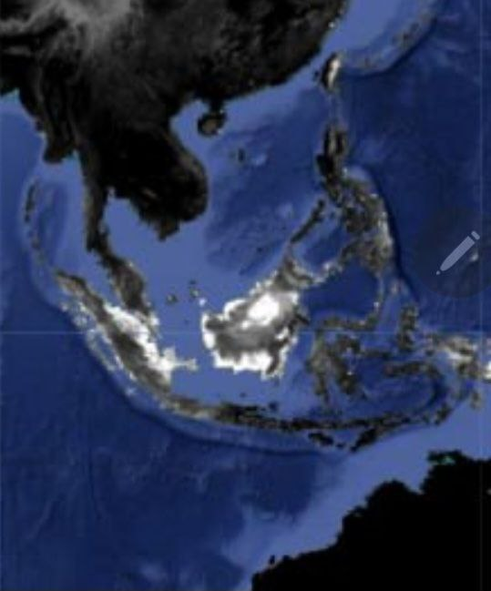

One way to have such an organically rich layer is for it to never have been "washed".

Soil map:
- Under 5% = Black
- Above 30% = White

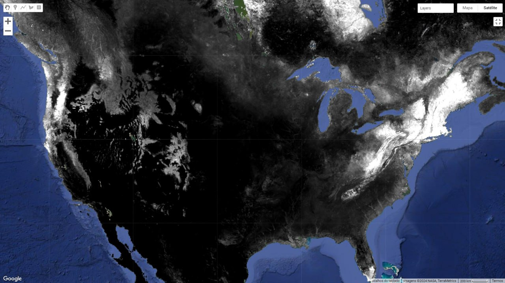

DEM Map:
- Under 200m / 577ft = Black
- Above 3.500m / 11.400ft = White

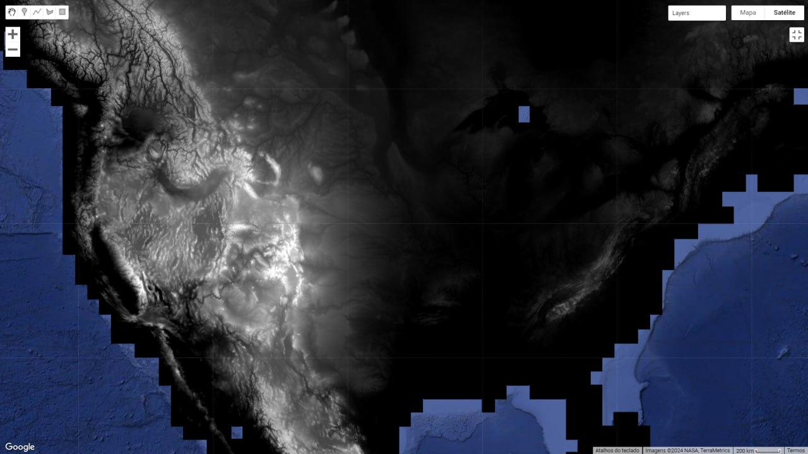

This align with the green areas in the midle of the desert:

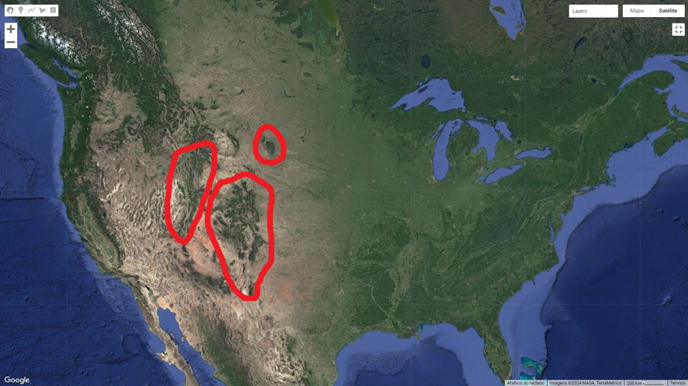

Soil Map (Organic Matter Content (ORMC)), Shaded Relief and Satellite:

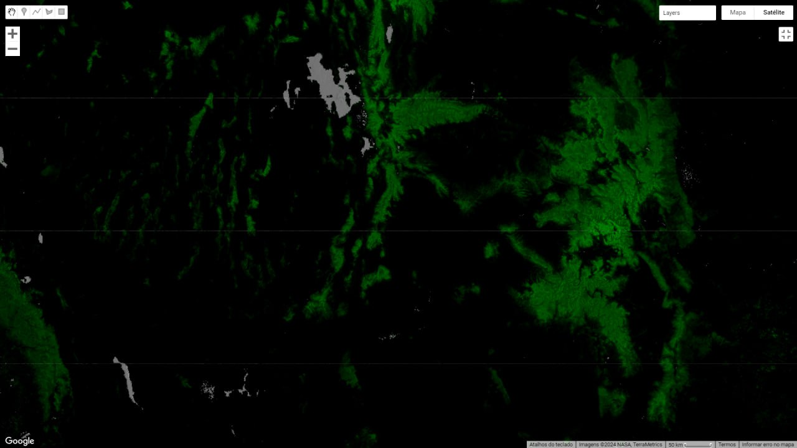
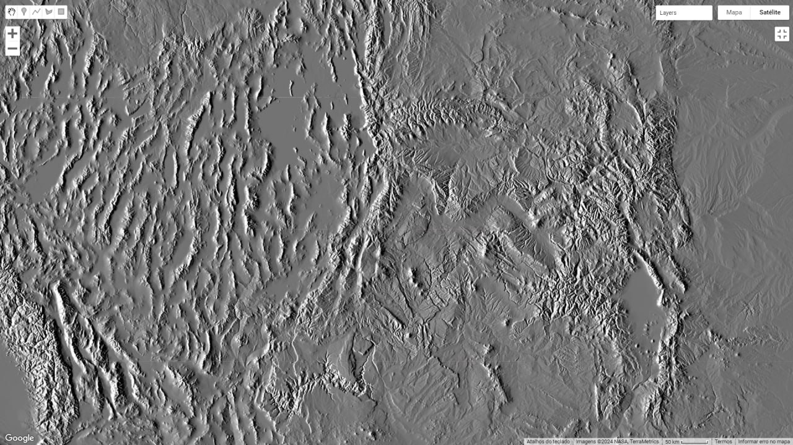
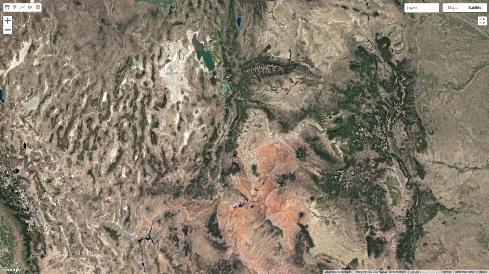

All together:

Mount Rushmore:

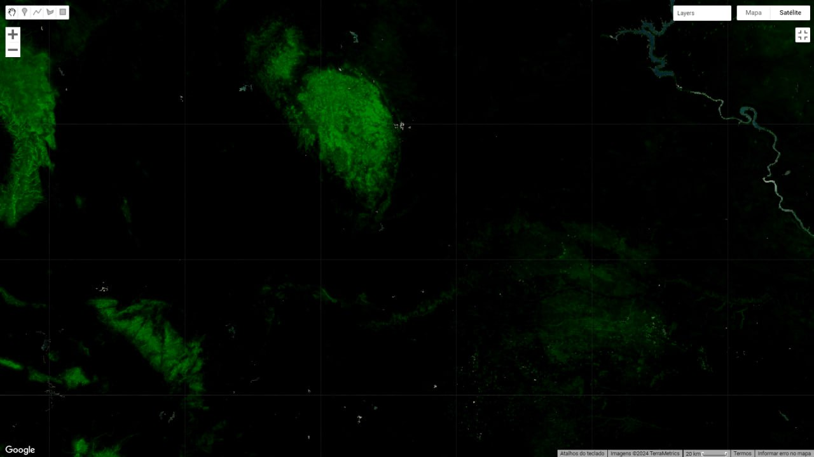
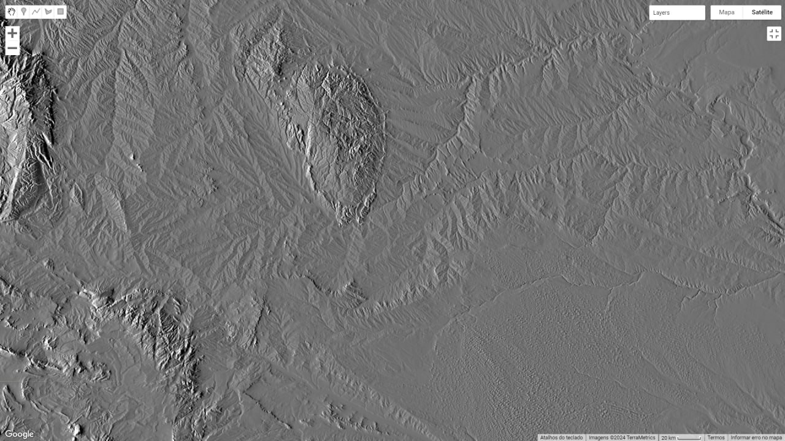
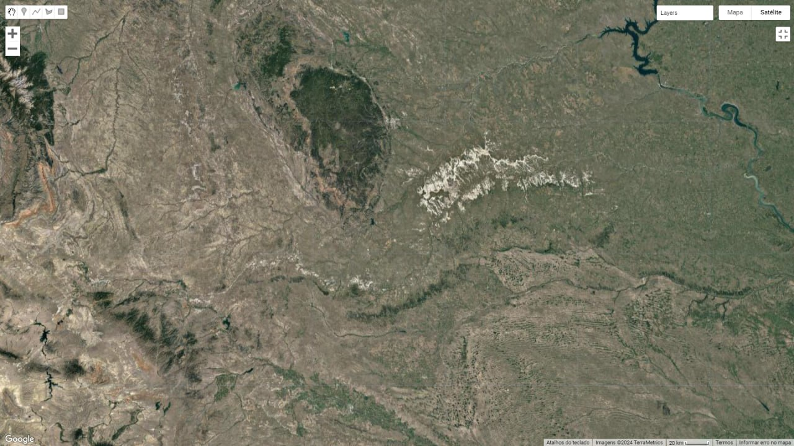

DEM and Soil map combined, sea level at 175m / 576ft:

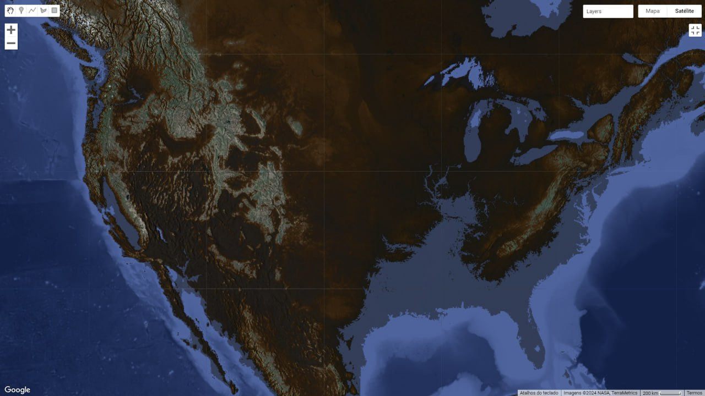
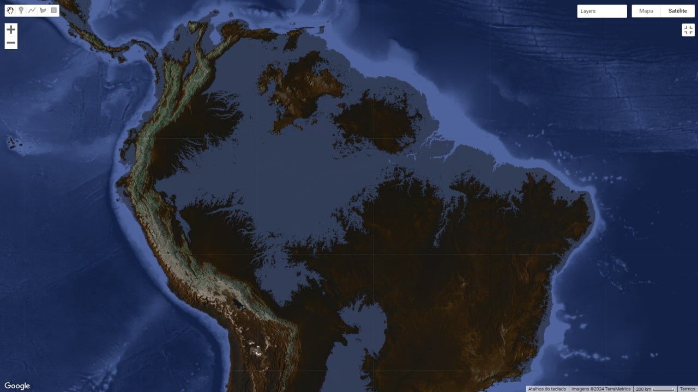
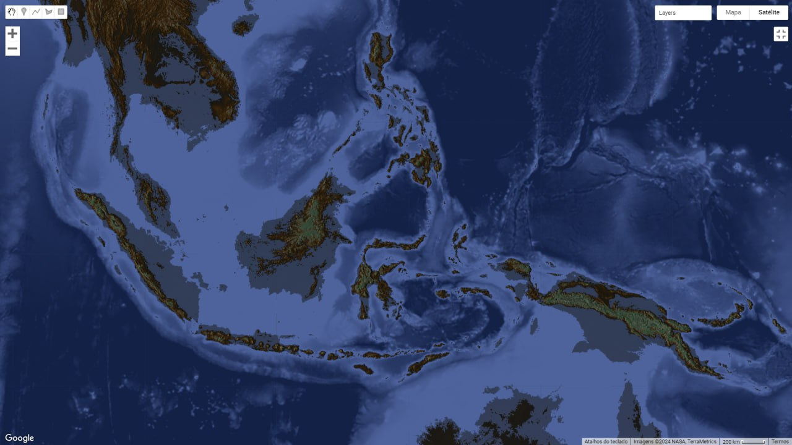

