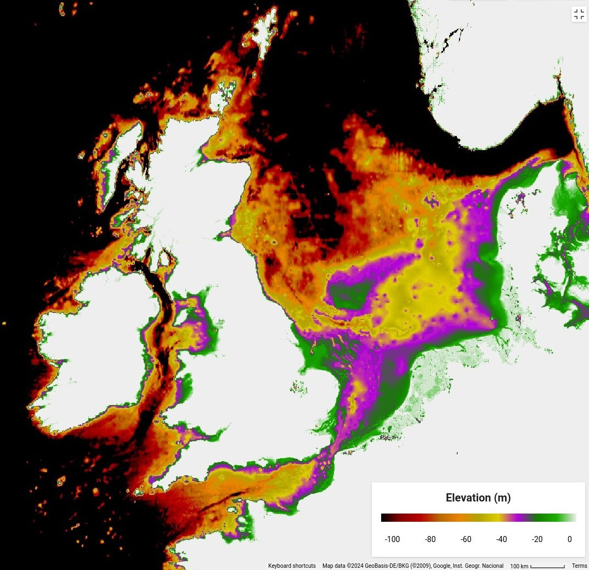
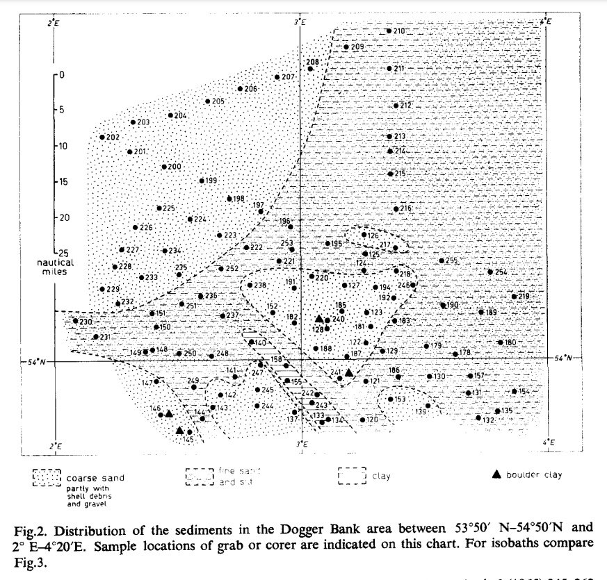
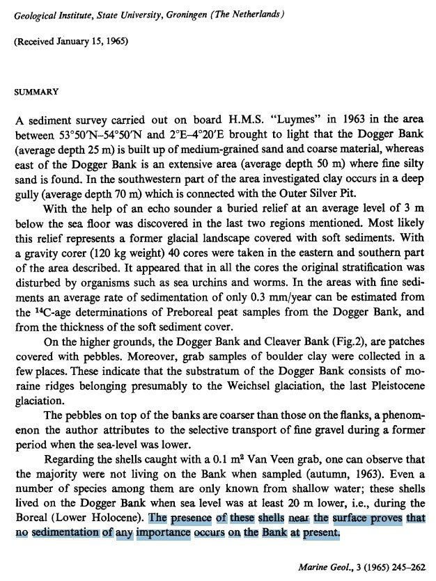

# Landslides

## Precise radiocarbon dating of the giant Köfels landslide (Eastern Alps, Austria)

"Wiggle matching analysis of six radiocarbon samples constrains the event to 9527–9498 cal BP which is slightly younger and significantly more precise than the previously established age. The landslide occurred shortly after the onset of the vegetation period, i.e. in May or June. The new dating moves the Köfels landslide strikingly close to the less well constrained age of the Flims landslide, the largest of its kind in the Alps located 130 km west of Köfels (9475–9343 cal BP). This near-synchronicity of these giant mass movements raises the question of a possible common, albeit currently unknown, trigger."

https://www.sciencedirect.com/science/article/abs/pii/S0169555X15002548

## 6200 BC Norway Submarine Landslide [11]

"The three Storegga Slides (Norwegian: Storeggaraset) are amongst the largest known submarine landslides. They occurred at the edge of Norway's continental shelf in the Norwegian Sea, approximately 6225–6170 BCE. The collapse involved an estimated 290 km (180 mi) length of coastal shelf, with a total volume of 3,500 km3 (840 cu mi) of debris, which caused a paleotsunami in the North Atlantic Ocean."

https://images.app.goo.gl/EDqL25iWFUBFgymH6

https://www.youtube.com/watch?v=1S__dy0nA0k is talking about a tsunami 6170 BC and an other around 3000 BC @ 7:30
+ https://www.youtube.com/watch?v=OsawYPFPLMc

Map is an elevation slice from -100m up to 0m, trying to extract as much elevation information as I can for the Dogger Bank. It has a considerable sedimentary layer over it which obscures the bedrock and possible flow morphologies, but I found this interesting comment that the sediment that is there was laid down during the Lower Holocene (YDB appears again!), and there is no appreciable ongoing sedimentation since that time.

[1] https://doi.org/10.1016/0025-3227(65)90036-8

https://en.wikipedia.org/wiki/Storegga_Slide