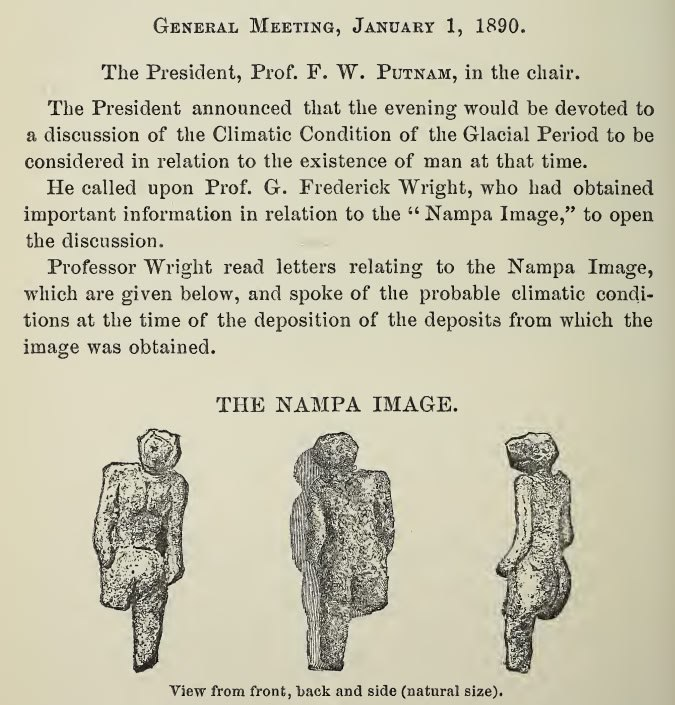

# Lava

## Columbia Plateau Lava Flow

The Columbia Plateau. "Great quantities of lava “flowed out in Washington, Oregon and Idaho, where some two hundred thousand square miles were covered to depths of hundreds and even several thousands of feet. The Snake River has cut the Seven Devils Canyon more than three thousand feet deep without reaching the bottom of the lavas.” This enormous area, embracing all the Northern states between the Rocky Mountains and the Pacific Coast, was flooded with molten rock and metal pouring out of fissures torn in the ground. Certainly it does not look like a volcanic eruption of our days, and for this reason alone, if not for a multitude of others, the principle of uniformity is definitely misleading.

The depth of the lava of this vast Columbia Plateau is “as great as 5000 feet or more.” Even on the supposition that it was ejected in paroxysms, each time spreading a sheet only seventy-five feet thick, it is still enormous, and then such an ejection must have been repeated as much as seventy times in the Cenozoic Age – the age of mammals and man. And here is a striking thing, striking because we are too readily disposed to consider that we have solved a problem when we remove it to the remote past. “All competent observers have remarked the freshness of lava deposits in the Snake River valley in Idaho.”

Only a few thousand years ago lava flowed there over an area larger than France, Switzerland, and Belgium combined; it flowed not as a creek, not as a river, not even as an overflowing stream, but as a flood, deluging horizon after horizon, filling all the valleys, devouring all the forests and habitations, steaming large lakes out of existence as though they were little potholes filled with water, swelling ever higher and overtopping mountains and burying them deep beneath molten stone, boiling and bubbling, thousands of feet thick, billions of tons heavy.

In 1889, on the occasion of the boring of an artesian well at Nampa, Idaho, on the Columbia Plateau near the Snake River, a small figurine of baked clay was extracted from a depth of 320 feet, penetrated after piercing a sheet of basalt lava fifteen feet thick. G.F. Wright described the find and wrote: “The well was tubed with heavy iron tubing six inches in diameter, so that there could be no mistake about the occurrence of the image at the depth stated.” He also added: “No one has come forward to challenge the evidence except on purely a priori grounds arising from preconceived opinions of the extreme antiquity of the deposits.”

Before the last lava sheets spread over the Columbia Plateau there were human abodes in the area." - Excerpt from Earth in Upheaval, Velikovsky (1955 edition)

[1] https://archive.org/details/EarthInUpheavalVelikovsky
[2] https://annas-archive.org/md5/1db6b83a3efd5299af60671561a5b515

This find was named the Nampa Image

Quite a few more mentioned in this publication as well. I sense that I've only just scratched the surface of this. Many more editions of the PBSNH here:
[1] https://catalog.hathitrust.org/Record/000527149