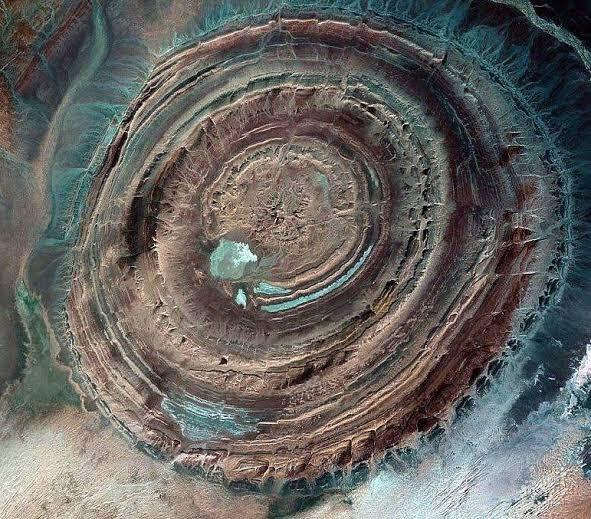

# Lightning

## Richat Structure

Was the ancient volcano underlying the Richat Structure the contact point for a discharge between the Earth and Encke’s progenitor 12,500 YBP, shattering the comet, strewing destruction across the northern hemisphere from Turkey to Alaska?

## Impact structures

https://en.m.wikipedia.org/wiki/List_of_impact_structures_on_Earth