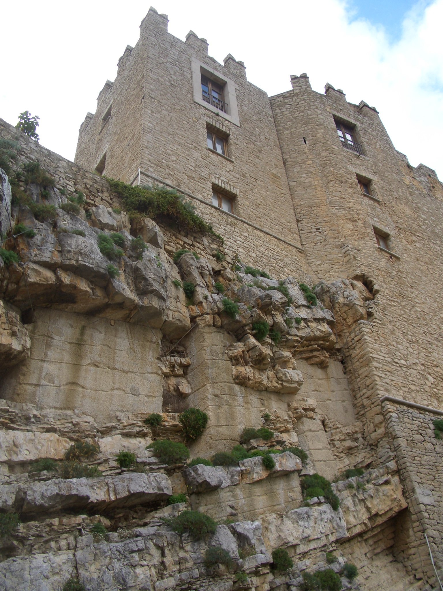
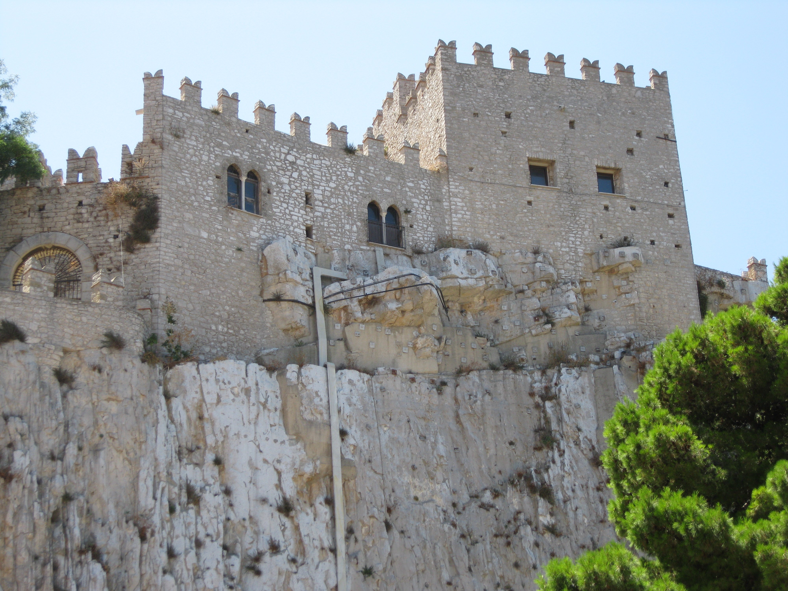
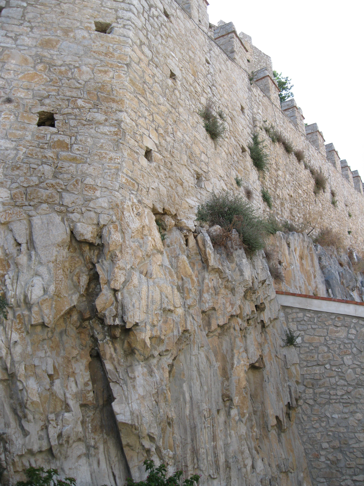
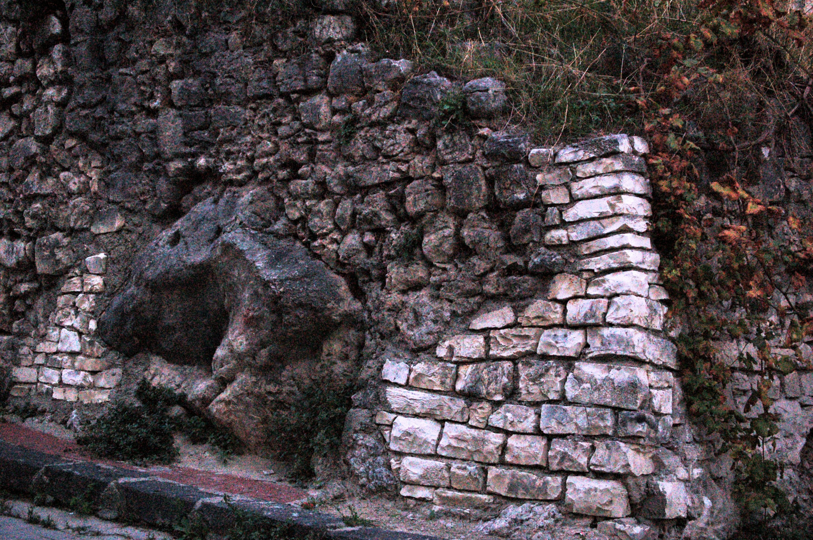

# Melting

See meltology.mp4.

## Meltology

If Mainstream News Had a Brain

OMR | @MeltedWorld | @Undoctrinate

See /img for OMR If Main stream News had a Brain-(720p).mp4.

## Red Brick Appreciatoor

https://x.com/daiddosnadad/status/1846470497514803281

## Castello di Caccamo (Italy)

They have morphed - what's weird is that some morphed and some didn't. It must depend on the ratio of brick ingredients affecting the blooming.

https://x.com/daiddosnadad/status/1855504753008214085/photo/1

## Castello di Bauso

## Castello di Bivona

Yakimochi wall.

## Madeira (West Tip, Tidepool)

Those ballooned rocks have brickwork each side that was not affected, yet the erupting swollen central part was blown right out - very weird how some bricks succumbed and are cooked and others not. A meltology specimen indeed. I've seen some other great examples. Certainly it's an example of the morphing of elements.

## New Mexico, Gila Cliff Dwellings National Monument

## Royal Tomb, Machu Picchu

