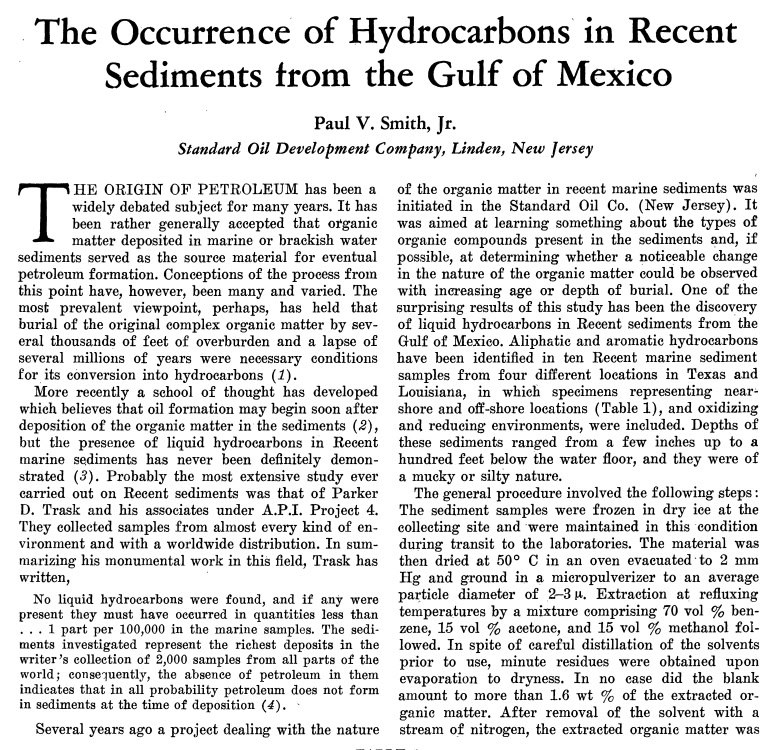

# Oil and Gas

## Marcellus Shale Gas Field in Appalachian Basin

Came across this article on the formation of the Marcellus Shale gas field in the Appalachian Basin. Interesting it states it was formed when the area was at 15o to 30o south latitude which is where the area would be in S2...        https://co2coalition.org/2012/10/04/bloomin-algae-how-paleogeography-and-algal-blooms-may-have-significantly-impacted-deposition-and-preservation-of-the-marcellus-shale/

## Dating of Hydrocarbons in the Gulf of Mexico

The Age of Oil. In Science (24 October 1952), Paul Smith reported on the radiocarbon dating of oil deposits in the Gulf of Mexico: "Ages of 11,800-14,600 ±1400 years were obtained for the hydrocarbons extracted from several sections of the Grande Isle core of recent sediments. A composite carbonate sample from the entire core proved to be 12,300±1200 years old, and the non-extractable organic matter, which comprises a major portion of the original organic content, had an average age of 9,200±1000 years."
[1] https://sci-hub.ru/10.1126/science.116.3017.437

## Is Oil Organic?

From the Rockefeller University: The document, On the Origins of Oil, authored by D. Mendeleev in 1877, challenges the prevailing biogenic theory of oil formation, which posits that oil originates from the decomposition of ancient organic matter. Mendeleev argues for a mineral origin, proposing that oil is produced through chemical reactions deep within the Earth, particularly involving water and carbonated metals like iron.

Mendeleev disputes the evidence for oil originating from organic material, highlighting inconsistencies such as the absence of sufficient organic remnants in ancient geological layers. He proposes that oil forms when water penetrates Earth's crust through cracks and reacts with carbonated metals, producing hydrocarbons under high pressure and temperature. The association of oil deposits with mountain ranges and straight-line geological features supports his hypothesis. Mendeleev draws parallels from meteorite compositions and the behavior of gases to support the idea of a deep, inorganic origin for oil. [GPT Summary]
h/t @AristocraticBro 
[1] https://phe.rockefeller.edu/news/2008/02/11/mendeleev/