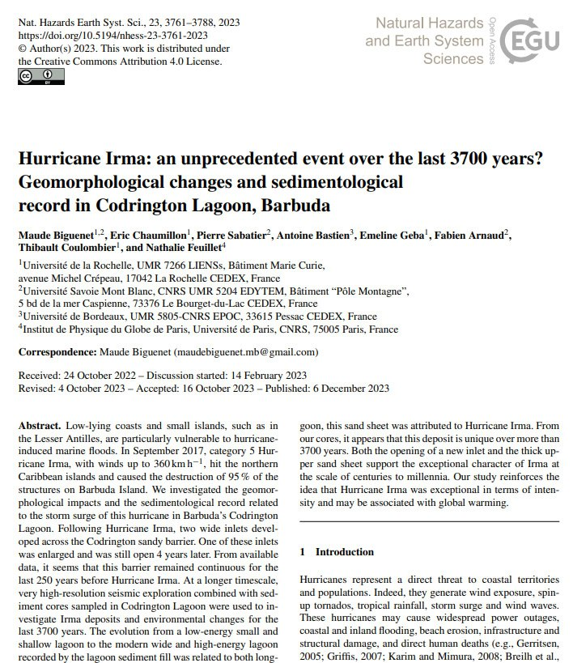
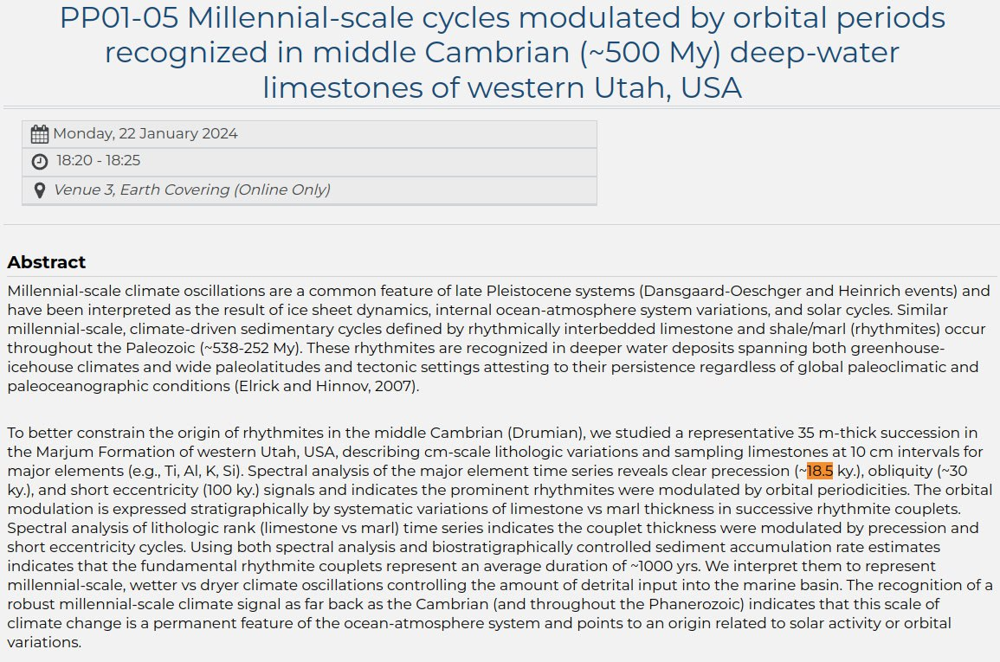
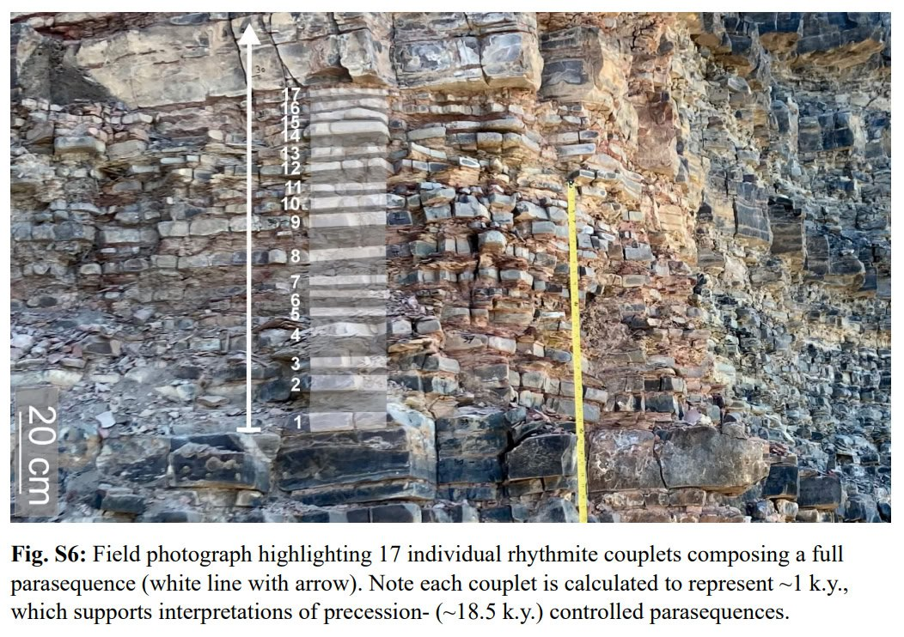

# Paleoclimate Data

## 3 drought events: Staubwasser, Weiss

"The paper by Staubwasser and Weiss concerns itself only with past abrupt changes in climate and the impact these changes may have had on civilizations in the past. It identifies and discusses three abrupt climate change events at roughly 2200 B.C., 3200 B.C., and 6200 B.C. In all three cases, it finds that populations were reduced to a greater or lesser extent over large geographical areas."

"Staubwasser and Weiss postulate widespread drought as the cause of these depopulation events in all three instances. However, the middle event, the one they date to 3200 B.C., uniquely exhibits the three signa- tures of Noah’s Flood discussed in the previous chapter. They call this event “the late Uruk collapse.” (Refer back to the Figure 5.2 chronology to understand this terminology.) They find it to be (1) a “hemispheric and possibly global”10 event, (2) accompanied by widespread depopula- tion and (3) with very clear evidence, specifically in the archaeology of South Mesopotamia, of the inception of the institution of human govern- ment in an easily recognized, capital punishment-wielding form—that of monarchy."

"The last temples of the late Uruk IV Eanna precinct were abandoned, replaced by terraces and light post and reed constructions."

## Sediment data: 18.5k cycle (Milankovitch cycle) effects on climate

https://oceanrep.geomar.de/id/eprint/31064/1/Fl%C3%B6gel_Diss.pdf

## Hurricane Irma: 3700 year history

"Hurricane Irma: an unprecedented event over the last 3700 years? Geomorphological changes and sedimentological record in Codrington Lagoon, Barbuda"

https://nhess.copernicus.org/articles/23/3761/2023/nhess-23-3761-2023.pdf

## 18.5k year climate cycles?

An 18.5ky precessional supercycle which modulates long term climate.

Links:
- https://agu.confex.com/agu/fm23/meetingapp.cgi/Paper/1382125
- https://doi.org/10.1130/G52182.1