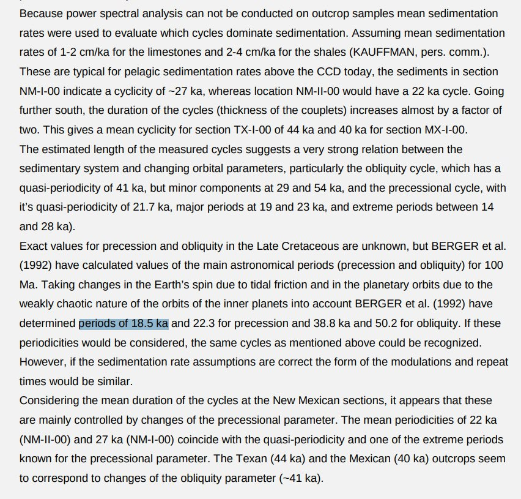

# Paleoclimate Data

## Sediment data: Milankovitch cycle effects on climate

https://oceanrep.geomar.de/id/eprint/31064/1/Fl%C3%B6gel_Diss.pdf

## Hurricane Irma: 3700 year history

"Hurricane Irma: an unprecedented event over the last 3700 years? Geomorphological changes and sedimentological record in Codrington Lagoon, Barbuda"

https://nhess.copernicus.org/articles/23/3761/2023/nhess-23-3761-2023.pdf

## 18.5k year climate cycles?

An 18.5ky precessional supercycle which modulates long term climate.

Links:
- https://agu.confex.com/agu/fm23/meetingapp.cgi/Paper/1382125
- https://doi.org/10.1130/G52182.1