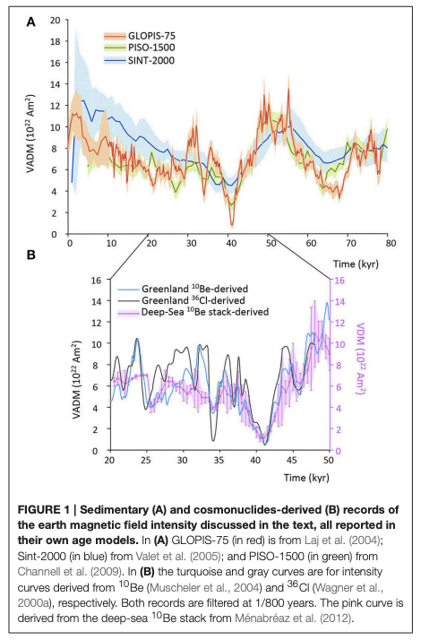
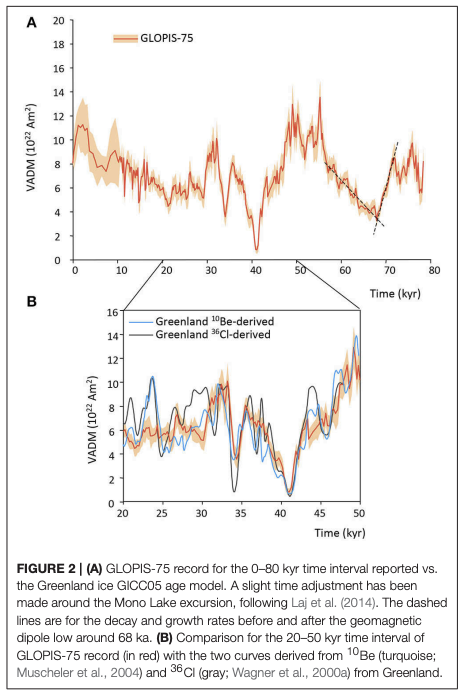
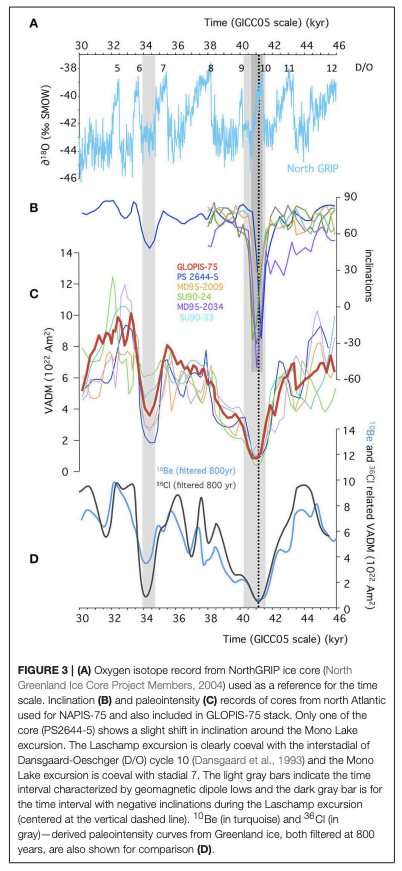
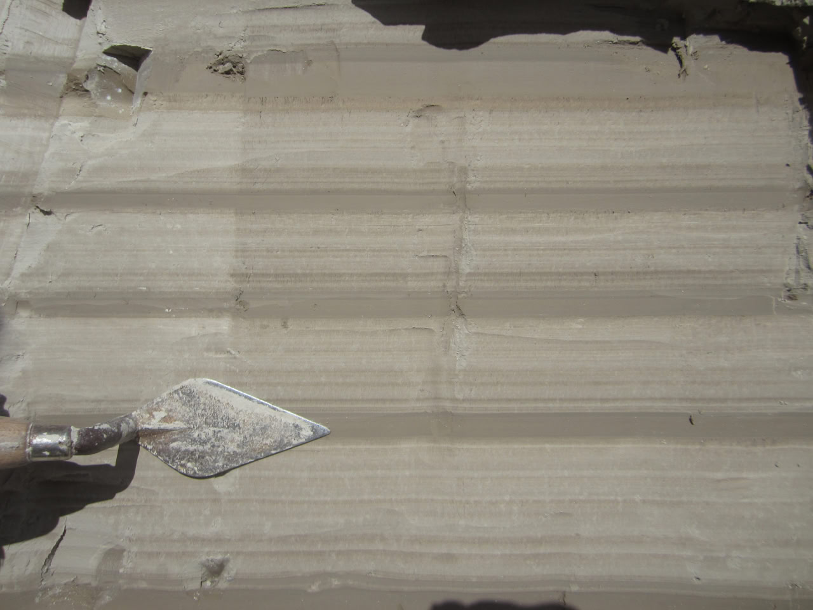
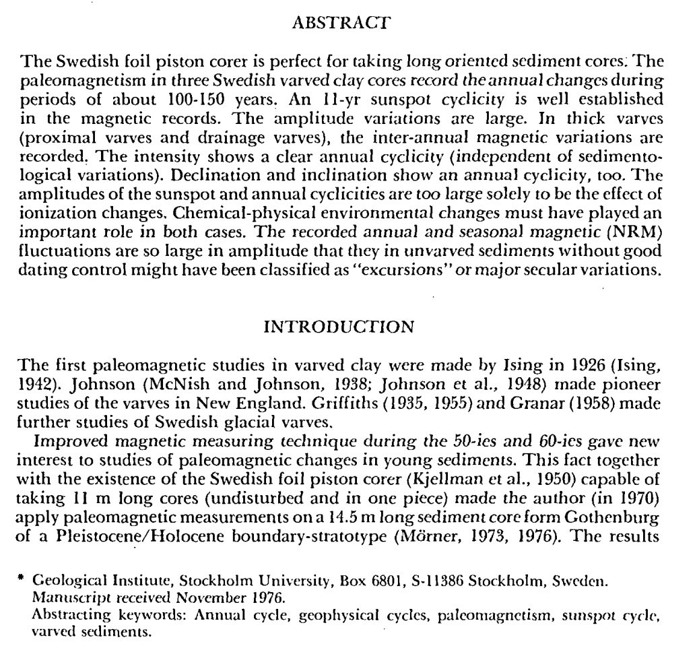
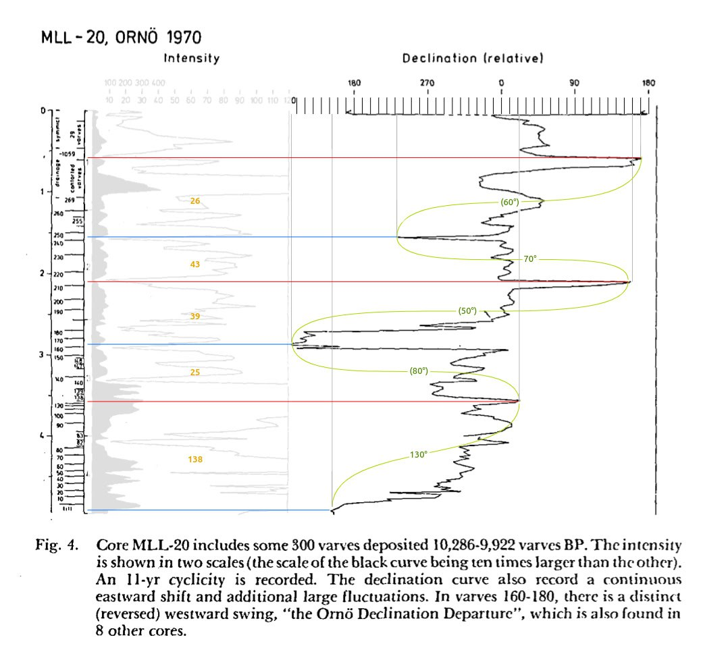
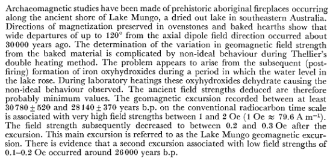
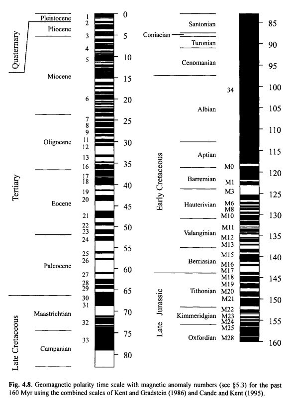

# Paleomagnetic Data

The difficulty I see here is that paleomagnetic data is only recorded under certain conditions; you need to have igneous rocks cooling from a molten state, or the settling of sediments that then get compacted and undisturbed. It's not a continuous chronology such as one you might have from tree rings. Still, surely a lot that can be gleaned from the right samples...

Paleomagnetic studies that date material back in the last several millenium (4000 BC to now) are in `recent-anomalies`.

What follows are anomalies that date back at least to Younger Dryas.

## Laj: An impending geomagnetic transition? Hints from the past

We find that some aspects of the present-day geomagnetic field have some similarities with those documented for the Laschamp excursion 41 kyr ago. Under the assumption that the dynamo processes for an eventual future reversal or excursion would be similar to those of the Laschamp excursion, we tentatively suggest that, whilst irreversible processes that will drive the geodynamo into a polarity change may have already started, a reversal or an excursion should not be expected before 500–1000 years.

Gubbins (1987) noted that a patch of flux occurring below the southern tip of Africa had opposite sign to that expected for a dipole field in the Southern Hemisphere, when extrapolated at the core mantle boundary (the South Atlantic Anomaly or SAA). He suggested that “the present fall of the dipole field is directly related to the intensification and southward migration of this and other similar patches and that the fall may occasionally leads to polarity reversal.”

More recently, Hulot et al. (2002) have compared the 2002 data from the Danish Oersted Satellite with those obtained from the US satellite Magsat that operated in 1979/1980 and interpreted variations of the magnetic field over this 20 years period down to previously inaccessible length scales. Hulot et al. (2002) showed that growth and poleward migration of these reversed flux patches account almost entirely for the decrease in the dipole field in the last two centuries. They postulate “that the present magnetic state of the Earth may be one in which the geodynamo operates before reversing,” consistent with, but with a much better spatial resolution than Gubbins’ (1987) suggestion.

Very recently, De Santis and Qamili (2015 and references therein) have considered the evolution of the South Atlantic Anomaly (SAA) and its progressive extension over the last 400 years. They find that there has been an acceleration in the rate at which the SAA expands. Also, fitting the surface extension of the SAA with power laws or logarithmic functions, in analogy with critical phenomena, they define a critical time tc when the SAA area will reach almost an hemisphere in the very near future (tc = 2034 ± 3 yr AD). They interpret tc not as the exact moment of a geomagnetic reversal or excursion, but rather as the time when irreversible processes that will drive the geodynamo into a polarity change will start.

However, in the three records the growth rate is significantly slower than the decrease. This results into a very significantly asymmetric form of the intensity low (Figure 4A) which makes it difficult to precisely define its duration, as this depends on a somewhat arbitrary choice: estimates of the duration of the intensity low corresponding to the Laschamp excursion defined as the time interval during which the dipole intensity is lower than half the average non-excursional value may vary between 1500 and 3000 years depending on whether the GLOPIS-75 record or whether either one of the two cosmogenic isotopes records are considered. In all cases the decrease occurs about twice as fast as the recovery.

The Mono Lake excursion (Figure 4B) appears to be shorter than the Laschamp excursion and that may explain the difficulty to identify it in geological archives. Its intensity profile is more symmetric than that of the Laschamp excursion.

The high decay rate of the Laschamp excursion is virtually identical to that discussed by Gubbins et al. (2006) since 1840 and Suttie et al. (2011) since 1590 (documented by the IGRF since 1900). They both start from about the same dipole intensity value but it is delicate to directly compare them because their respective timescales are different: historically only a period of about 400 years has been documented, whilst the Laschamp excursion decays over a period roughly three times as long. To compare the two decay rates, one has to admit that the presentday decreasing trend of the dipole field will continue until it reduces to very small values, as already hypothesized by Olson (2002).

While several lines of evidence point toward an imminent change of polarity, using a different approach we reach the same conclusions as several authors that nothing has to be expected before a period of a few hundreds years, maybe as short as 500 years.

https://www.frontiersin.org/journals/earth-science/articles/10.3389/feart.2015.00061/full

Hard copy in LITERATURE.

## Laschamp Excursion: Laj and Lund Studies [2]

Hard copy in LITERATURE. Cited by TES in his thesis.

## Morner - Varved Clay 13150 YBP Gothenburg Flip [1]

Paper hard copies in LITERATURE.

Varved clay proxies provide sub-annular paleomagnetic resolutions. The following charts are taken from Annual and inter‐annual magnetic variations in varved clay, Nils‐Axel Mörner (1978)[1], wherein paleomagnetic findings from VC cores dated to ±13,150 BP (spanning 156 varves/years) and ±10,000 BP (spanning 300 varves/years) are shown. These two cores span the Gothenburg Flip & Excursion[2] and the Ornö Declination Departure.

What appears to be recorded in these proxies are multiple geomagnetic excursions and reversals which occurred within short succession, most within a few years to a couple of decades apart, with the majority reflecting a declination change of 80°-120°. This looks very much like what I would expect to see recorded from a series of ECDO-type events.

Coloured elements are my own additions. Blue and red indicate selected reversal points of magnetic declination. Orange numbers are the approximate number of varves/years between the reversals. Green curves and text indicate the approximate number of degrees change between the selected reversals. Raw chart values which exceed 180° have been subtracted from 360° and the absolute delta value displayed bracketed.

1. http://dx.doi.org/10.1080/09291017809359640
2. https://sciencedirect.com/science/article/abs/pii/003358947790031X

https://x.com/nobulart/status/1816565694244192663

## Mungo Lake Excursion

https://www.jstor.org/stable/74622

## Mono Lake Excursion

The Mono Lake Excursion ( MLE ) was a polarity excursion of the Earth's magnetic field within the Brunhes polarity zone . It was therefore not a polarity reversal , but only a dip. The event took place around 34,000 years ago in the Weichselian High Glacial .

https://de.wikipedia.org/wiki/Mono-Lake-Exkursion

## Magnetic profiles [1]

Quick glance at the long term magnetic reversal history. Black/White transitions are 180° flips.

This is recorded all over the earth in thousands of proxies. Uniformitarian geology ascribes them to magnetic field reversals rather than physical ones.

## Paleomagnetic data: Earth rotation ~500 mm years ago

This paper is describing something which sounds remarkably similar to an ECDO state 2 to state 1 rotation a half a billion years ago:

"..at least two tectonic plates, involving more than two-thirds of Earth's continental lithosphere, were involved in a rapid rotation of ~90° relative to the spin axis. We speculate that the entire lithosphere may have been involved in this rotation. // The new ages, along with paleomagnetic data, indicate that continents moved at rapid rates that are difficult to reconcile with our present understanding of mantle dynamics.."

(continued...) "// The pole for this sequence is >80° away from the Vendian-Early Cambrian poles, implying that Australia underwent a large rotation while remaining near the equator sometime between Tommotian and Late Cambrian time. // Australia rotated counterclockwise during this time. // Antarctica, India, Africa, South America, and perhaps parts of East Asia also rotated with Australia. // True polar wander (TPW) is the process through which quasi-rigid spheroids align their maximum moments of inertia with the spin axis, pushing positive mass anomalies toward the rotational equator. // A variant of this mechanism, inertial interchange true polar wander (IITPW), involves discrete bursts of TPW of up to 90° in geologically short intervals of time if the magnitudes of the intermediate and maximum moments of inertia cross. This would result in a rapid movement away from the spin axis by the geographic location of the former pole with rotation of the entire solid Earth centered about the minimum moment of inertia located on the equator. // These two poles, with their stated polarity interpretation, are separated by about 68°; together they yield a plausible tropical position for Siberia, nearly on the opposite side of the globe from Australia. // If the velocities are due to TPW, however, such geodynamical considerations are obviated because the entire mantle would have rotated along with the lithosphere."

https://www.researchgate.net/publication/235243439_Evidence_for_a_Large-Scale_Reorganization_of_Early_Cambrian_Continental_Masses_by_Inertial_Interchange_True_Polar_Wander

## Citations

1. [Craig Stone](https://nobulart.com)
2. https://hal.science/hal-03118231v1/file/2005GC001122.pdf
3. https://en.wikipedia.org/wiki/South_Atlantic_Anomaly

# TODO Chatgpt: Notable Geomagnetic Excursions in Recent History

## 1. Laschamp Excursion (~41,000 years ago)
This is one of the most studied geomagnetic excursions, characterized by a significant drop in field intensity and a brief reversal of the magnetic field. Recent studies, such as those by [Nowaczyk et al. (2013)](https://doi.org/10.1002/ggge.20198) and [Laj et al. (2014)](https://doi.org/10.1016/j.quascirev.2013.09.006), have used sediment cores and volcanic records to refine the timing and duration of the Laschamp event.

## 2. Mono Lake Excursion (~34,000 years ago)
The Mono Lake excursion is another well-documented event, recorded in sediments from Mono Lake, California. Research by [Lund et al. (2017)](https://doi.org/10.1016/j.epsl.2017.06.025) provides detailed paleomagnetic data showing the rapid changes in magnetic field direction and intensity associated with this excursion.

## 3. Gothenburg Excursion (~13,000 years ago)
This excursion, less widely accepted or documented compared to Laschamp and Mono Lake, has been proposed based on paleomagnetic data from the Nordic regions and other parts of Europe. It suggests a brief but notable deviation of the magnetic field.

## 4. Lake Mungo Excursion (~32,000 years ago)
This event is recorded in Australian lake sediments and is contemporaneous with the Mono Lake excursion. Studies, such as those by Roberts and Turner (2013), have explored its potential global significance.

## 5. Blake Excursion (~120,000–110,000 years ago)
The Blake excursion is another significant event documented in marine sediments and volcanic rocks. Research such as that by [Channell et al. (2012)](https://doi.org/10.1029/2011JB008968) provides insights into its chronology and characteristics.

# TODO Chatgpt: Recent Studies Highlighting Geomagnetic Excursions

- **Roberts, A.P., et al. (2013).** "Magnetic excursions: Precursors to geomagnetic reversals?"  
  This study discusses the nature of geomagnetic excursions and their relationship to geomagnetic reversals. It explores whether excursions can be considered as failed reversals and their implications for understanding the geomagnetic field's behavior.

- **Nowaczyk, N.R., et al. (2013).** "Multiple geomagnetic reversals and excursions recorded in a sediment core from Lake El'gygytgyn, Arctic Russia."  
  This research documents multiple geomagnetic excursions and reversals over the past several hundred thousand years, providing high-resolution records of geomagnetic field behavior.

- **Lund, S., et al. (2017).** "Geomagnetic field excursions in the late Brunhes and late Matuyama."  
  This paper reviews late Quaternary geomagnetic field excursions, providing a comprehensive overview of their timing, geographic extent, and paleointensity characteristics.

- **Panovska, S., & Constable, C.G. (2017).** "An updated magnetic field model for the Holocene."  
  This study provides a detailed model of the Earth's magnetic field over the past 10,000 years, identifying several geomagnetic excursions and secular variation features.

# TODO Chatgpt: Recent Geomagnetic Excursions After the Gothenburg Excursion

## 1. **Hilina Pali Excursion (~8,000 years ago)**
This excursion is recorded in lava flows from Hawaii and other regions. It is characterized by a significant deviation in the geomagnetic field direction and intensity.

## 2. **Mungo Excursion (~6,000 years ago)**
Also known as the Holocene anomaly, this event is not the same as the older Lake Mungo excursion. It shows a distinct deviation in the geomagnetic field, though its global extent is debated.

## 3. **Delta Excursion (~2,700 years ago)**
This excursion, identified in lake sediments and archaeological materials, shows rapid changes in the magnetic field intensity and direction around 700 BCE.

## 4. **Levanto Excursion (~3,000 years ago)**
Documented in several parts of the world, this excursion corresponds to a brief geomagnetic anomaly during the early first millennium BCE.

## 5. **Mono Lake Reversal (~34,000 years ago)**
Though not more recent than Gothenburg, it is worth mentioning because of its prominence and wide documentation across different regions.

## 6. **The Laschamp Event Revisited (~41,000 years ago)**
New research has refined the timing and characteristics of this event, making it a benchmark for understanding excursions during the last 100,000 years.

These events provide insight into the complex and dynamic nature of the Earth's magnetic field in recent geological history. They also highlight that geomagnetic field changes can occur much more rapidly and frequently than full-scale reversals.
