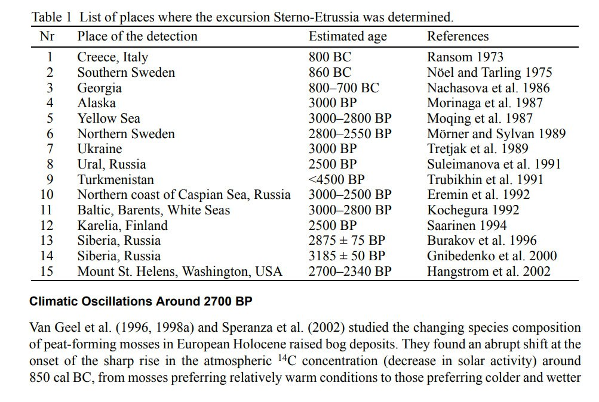

# Paleomagnetic studies for recent dates

## North America Holocene Paleomagnetic Data

I see end of Younger Dryas, 6200 BC, and 400 BC event in here, simply based on the changes in inclination.

Hard copy in this folder (2003_GJI.pdf). https://commons.trincoll.edu/cgeiss/files/2015/10/2003_GJI.pdf

The inclinations don't reverse to negative as they would during an ECDO event but if S2 is as short as we predict it would be a microscopic fraction of time in the sample and hard to capture.

## Levantine Iron Age Anomaly (LIAA) - first millenium BC

Levantine Iron Age anomaly
- https://agupubs.onlinelibrary.wiley.com/doi/full/10.1002/2016GL071494
- https://www.researchgate.net/publication/314070285_Further_evidence_of_the_Levantine_Iron_Age_geomagnetic_anomaly_from_Georgian_pottery_High_geomagnetic_field_in_Georgia_900BCE

"Here we report archaeointensity data from Georgia showing high field values in the tenth or ninth century B.C.E., low field values in the twelfth century B.C.E., and fast field variation in the fifth and fourth centuries B.C.E. High field values in the time frame of LIAA have been observed so far only in three localities near the Levant: Eastern Anatolia, Turkmenistan, and now Georgia, all located east of longitude 30°E. West of this, in the Balkans, field values in the same time are moderate to low. These constraints put geographic limits on the extent of the LIAA and support the hypothesis of an unusually intense regional geomagnetic anomaly during the beginning of the first half of the first millennium B.C.E., comparable in area and magnitude (but of opposite sign) to the presently active South Atlantic anomaly."

Six centuries of geomagnetic intensity variations recorded by royal Judean stamped jar handles https://www.pnas.org/doi/10.1073/pnas.1615797114

"In addition, the study provides further evidence of extremely strong field in the late eighth century BCE (“geomagnetic spike”), and of rapid rates of change (>20% over three decades)."

## Iran Syria last 5000 years

"We report new archeointensity results from Iranian and Syrian archeological excavations dated from the second millennium BC. These high-temperature magnetization data were obtained using a laboratory-built triaxial vibrating sample magnetometer. Together with our previously published archeointensity results from Mesopotamia, we constructed a rather detailed geomagnetic field intensity variation curve for this region from 3000 BC to 0 BC. Four potential geomagnetic events (“archeomagnetic jerks”), marked by strong intensity increases, are observed and appear to be synchronous with cooling episodes in the North Atlantic."

Altogether these data show several interesting features, particularly the occurrence of strong geomagnetic field intensity variations. The two older ones, already discussed by Gallet and Le Goff [3], are dated at ∼2800–2600 BC and ∼2100–1900 BC. In these two cases, significantly different archeointensity values are observed although the corresponding sites are dated from the same age based on archeological constraints. The new result from Terqa provides evidence for yet another occurrence between ∼1750 and 1500 BC.

Added 5400 BP. That's some serious ice-melt in the bond cycle. I've also overlaid a 462.7 year grid - this is one tenth of the outer planet cycle.

https://www.ipgp.fr/~legoff/Download-PDF/Archeomag/GalletEtAl_EPSL2006.pdf

## Russia peat deposits - Geomagnetic excursion 2500 ybp

A new study published in the Russian Journal of Pacific Geology looks into geomagnetic excursions over the last 10 000 years utilizing peat deposits from Russia’s Khabarovsk Territory. The study called into attention the importance of understanding these transitory shifts in Earth’s magnetic poles, which differ from total geomagnetic reversals and impact climatic and environmental circumstances. 

"The most recent magnetic excursion occurred 2 500 years ago, during which the North Magnetic Pole moved to southern latitudes before returning to its original position. This event is indirectly supported by research from Japanese scientists. In 2019, they published a study based on ancient Assyrian clay tablets that contained records of the northern lights seen over Assyria 2 500 years ago. These sightings occurred at 30 – 40 degrees north latitude, where auroras are not seen today due to the current position of Earth’s magnetic poles."

One of the study’s primary results is a clear link between the 1 700-year harmonic and multiple Bond events, which are significant climatic occurrences associated with changes in global temperature and environmental circumstances.

The research also offered light on geomagnetic excursions, such as the Etruscan and Solovki, and their potential impact on climate.

https://watchers.news/2024/09/18/geomagnetic-excursions-over-the-last-10-000-years/

Really would like to find the research paper cited in this article but it's behind a paywall: https://link.springer.com/article/10.1134/S1819714024700143

## UK Recent Paleomagnetic [1]

It's a problem with shorter term proxies. They're generally softer and less stable than older material. More difficult to obtain good data from. I haven't seen many palaeomagentic proxies on that timescale at all. This one is from the UK.

Paleomagnetic records of the past 10,000 years show something interesting: the magnetic north does not completely invert, but the direction of its wander abruptly changes direction at certain points. This would be consistent with a crustal displacement relative to the magnetic field. Notice there appear to be at least four of these in the past 10ky.

## Setrno-Etrussia 2700 BP

"THE ‘STERNO-ETRUSSIA’ GEOMAGNETIC EXCURSION AROUND 2700 BP AND CHANGES OF SOLAR ACTIVITY, COSMIC RAY INTENSITY, AND CLIMATE"

https://journals.uair.arizona.edu/index.php/radiocarbon/article/viewFile/4201/3626

## South America

https://www.sciencedirect.com/science/article/pii/S0016716915000100

Hard copy in this folder.

## Citations

1. [Craig Stone](https://nobulart.com)

# TODO

The research also offered light on geomagnetic excursions, such as the Etruscan and Solovki, and their potential impact on climate.

Solovki excursion dated at 4.5–7.5 ka BP (Guskova et al., 2008)
