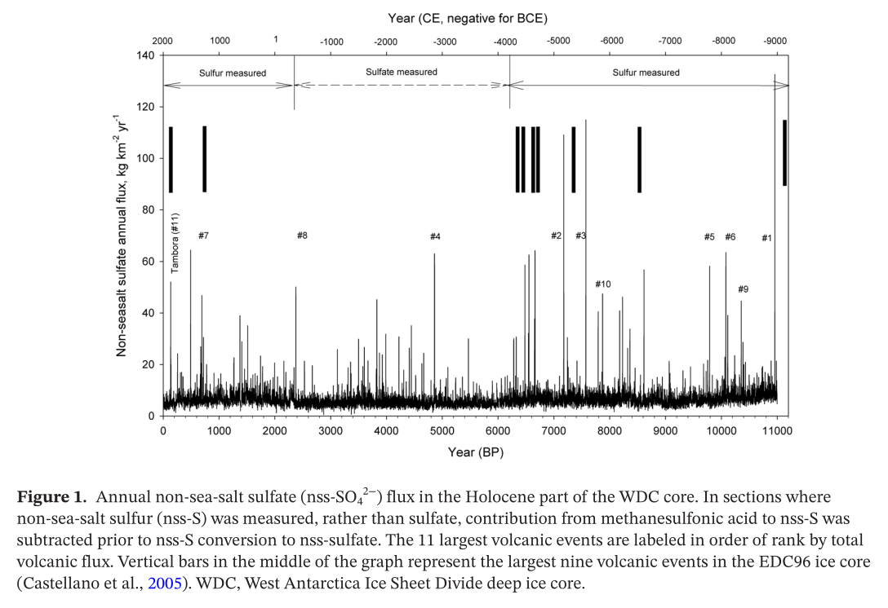

# Volcanoes

## The timing and widespread effects of the largest Holocene volcanic eruption in Antarctica (hard copy here)

Lake sediments and tephra.

"The caldera collapse of Deception Island Volcano, Antarctica, was comparable in scale to some of the largest eruptions on Earth over the last several millennia. Despite its magnitude and potential for far-reaching environmental effects, the age of this event has never been established, with estimates ranging from the late Pleistocene to 3370 years before present. Here we analyse nearby lake sediments in which we identify a singular event produced by Deception Island’s caldera collapse that occurred 3980 ± 125 calibrated years before present."

## Comprehensive Record of Volcanic Eruptions in the Holocene (11,000 years) From the WAIS Divide, Antarctica Ice Core (hard copy here)

This paper is using ice cores as a proxy for volcanoes.

## Climatic and societal impacts of a “forgotten” cluster of volcanic eruptions in 1108-1110 CE (hard copy here)

Ice core proxy.

"Recently revised ice core chronologies for Greenland have newly identified one of the largest sulfate deposition signals of the last millennium as occurring between 1108 and 1113 CE. Long considered the product of the 1104 CE Hekla (Iceland) eruption, this event can now be associated with substantial deposition seen in Antarctica under a similarly revised chronology. This newly recognized bipolar deposition episode has consequently been deemed to reveal a previously unknown major tropical eruption in 1108 CE."

## Volcaniclastic tide-modulated tempestite in a coastal tuff ring, Jeju Island, Korea (hard copy here)

"In this paper, we introduce a unique record of a 3.7 ka BP storm event preserved in a coastal tuff ring on Jeju Island, Korea. The tuff ring formed mostly above high tide level by primary volcanic processes, but contains three interbeds of horizontally laminated to hummocky/swaly cross-stratified deposits with intervening mud drapes up to an altitude of ~4.6 m above high tide level. These interbeds were formed by wave activity in a swash to surf zone when the sea level rose several meters above normal high-tide level during a storm event, and the triple intercalation of the wave-worked deposits reflects three tidal cycles during a storm event that lasted 1.5 day. Jeju Island contains the most complete record of an ancient storm event ever reported in the tuff ring, and highlights the significance of coastal volcanoes in the study of extreme depositional events in coastal areas, such as storms and tsunamis."

GPT simplification: "There are three layers of sand or rock that are stacked on top of each other. These layers have patterns that are either flat (like a smooth blanket) or wavy (like gentle hills). In between these layers, there are thin coverings of mud. All of this goes up to a height of about 4.6 meters, which is a little bit above the highest point the ocean's waves reach."

## "[Mount St. Helen's] Set S... [1]

"[Mount St. Helen's] Set S apparently was erupted between about 13,600 and 12,500 years ago", right around Younger Dryas. So the fourth flood recorded here was the largest of them, and it occurred sometime around the YDB. Then there was another one since; time indeterminate. [1]…

## Citations

1. [Craig Stone](https://nobulart.com)