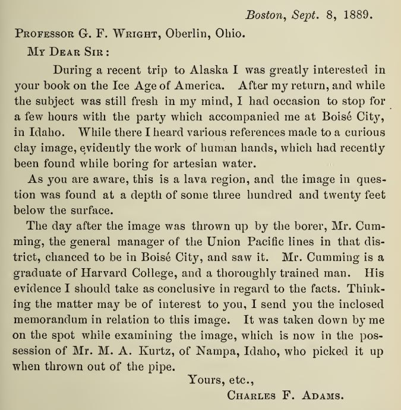

# Volcanoes

## The timing and widespread effects of the largest Holocene volcanic eruption in Antarctica (hard copy here)

Lake sediments and tephra.

"The caldera collapse of Deception Island Volcano, Antarctica, was comparable in scale to some of the largest eruptions on Earth over the last several millennia. Despite its magnitude and potential for far-reaching environmental effects, the age of this event has never been established, with estimates ranging from the late Pleistocene to 3370 years before present. Here we analyse nearby lake sediments in which we identify a singular event produced by Deception Island’s caldera collapse that occurred 3980 ± 125 calibrated years before present."

## Comprehensive Record of Volcanic Eruptions in the Holocene (11,000 years) From the WAIS Divide, Antarctica Ice Core (hard copy here)

This paper is using ice cores as a proxy for volcanoes.

## Climatic and societal impacts of a “forgotten” cluster of volcanic eruptions in 1108-1110 CE (hard copy here)

Ice core proxy.

"Recently revised ice core chronologies for Greenland have newly identified one of the largest sulfate deposition signals of the last millennium as occurring between 1108 and 1113 CE. Long considered the product of the 1104 CE Hekla (Iceland) eruption, this event can now be associated with substantial deposition seen in Antarctica under a similarly revised chronology. This newly recognized bipolar deposition episode has consequently been deemed to reveal a previously unknown major tropical eruption in 1108 CE."

https://www.researchgate.net/publication/340841275_Climatic_and_societal_impacts_of_a_forgotten_cluster_of_volcanic_eruptions_in_1108-1110_CE

## Volcaniclastic tide-modulated tempestite in a coastal tuff ring, Jeju Island, Korea (hard copy here) 1700 BC

"In this paper, we introduce a unique record of a 3.7 ka BP storm event preserved in a coastal tuff ring on Jeju Island, Korea. The tuff ring formed mostly above high tide level by primary volcanic processes, but contains three interbeds of horizontally laminated to hummocky/swaly cross-stratified deposits with intervening mud drapes up to an altitude of ~4.6 m above high tide level. These interbeds were formed by wave activity in a swash to surf zone when the sea level rose several meters above normal high-tide level during a storm event, and the triple intercalation of the wave-worked deposits reflects three tidal cycles during a storm event that lasted 1.5 day. Jeju Island contains the most complete record of an ancient storm event ever reported in the tuff ring, and highlights the significance of coastal volcanoes in the study of extreme depositional events in coastal areas, such as storms and tsunamis."

GPT simplification: "There are three layers of sand or rock that are stacked on top of each other. These layers have patterns that are either flat (like a smooth blanket) or wavy (like gentle hills). In between these layers, there are thin coverings of mud. All of this goes up to a height of about 4.6 meters, which is a little bit above the highest point the ocean's waves reach."

## "[Mount St. Helen's] Set S... [1] Washington State 11.6k-10.5k BC

"[Mount St. Helen's] Set S apparently was erupted between about 13,600 and 12,500 years ago", right around Younger Dryas. So the fourth flood recorded here was the largest of them, and it occurred sometime around the YDB. Then there was another one since; time indeterminate. [1]…

https://pubs.usgs.gov/pp/p1563/tephrasetk.html

## The Columbia Plateau

"Great quantities of lava “flowed out in Washington, Oregon and Idaho, where some two hundred thousand square miles were covered to depths of hundreds and even several thousands of feet. The Snake River has cut the Seven Devils Canyon more than three thousand feet deep without reaching the bottom of the lavas.” This enormous area, embracing all the Northern states between the Rocky Mountains and the Pacific Coast, was flooded with molten rock and metal pouring out of fissures torn in the ground. Certainly it does not look like a volcanic eruption of our days, and for this reason alone, if not for a multitude of others, the principle of uniformity is definitely misleading.

The depth of the lava of this vast Columbia Plateau is “as great as 5000 feet or more.” Even on the supposition that it was ejected in paroxysms, each time spreading a sheet only seventy-five feet thick, it is still enormous, and then such an ejection must have been repeated as much as seventy times in the Cenozoic Age – the age of mammals and man. And here is a striking thing, striking because we are too readily disposed to consider that we have solved a problem when we remove it to the remote past. “All competent observers have remarked the freshness of lava deposits in the Snake River valley in Idaho.”

Only a few thousand years ago lava flowed there over an area larger than France, Switzerland, and Belgium combined; it flowed not as a creek, not as a river, not even as an overflowing stream, but as a flood, deluging horizon after horizon, filling all the valleys, devouring all the forests and habitations, steaming large lakes out of existence as though they were little potholes filled with water, swelling ever higher and overtopping mountains and burying them deep beneath molten stone, boiling and bubbling, thousands of feet thick, billions of tons heavy.

In 1889, on the occasion of the boring of an artesian well at Nampa, Idaho, on the Columbia Plateau near the Snake River, a small figurine of baked clay was extracted from a depth of 320 feet, penetrated after piercing a sheet of basalt lava fifteen feet thick. G.F. Wright described the find and wrote: “The well was tubed with heavy iron tubing six inches in diameter, so that there could be no mistake about the occurrence of the image at the depth stated.” He also added: “No one has come forward to challenge the evidence except on purely a priori grounds arising from preconceived opinions of the extreme antiquity of the deposits.”

Before the last lava sheets spread over the Columbia Plateau there were human abodes in the area." - Excerpt from Earth in Upheaval, Velikovsky (1955 edition)

1. https://archive.org/details/EarthInUpheavalVelikovsky
2. https://annas-archive.org/md5/1db6b83a3efd5299af60671561a5b515

### Nampa Image

https://m.youtube.com/watch?v=xWfff8f3-AQ

## Citations

1. [Craig Stone](https://nobulart.com)