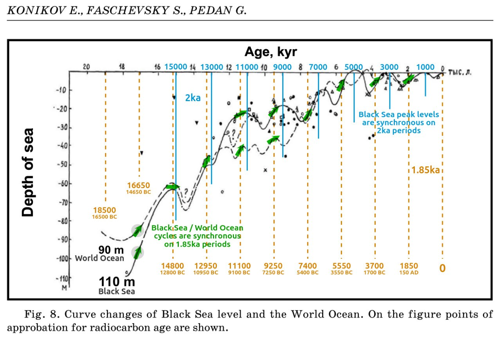
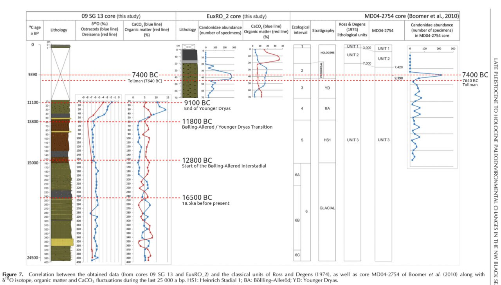
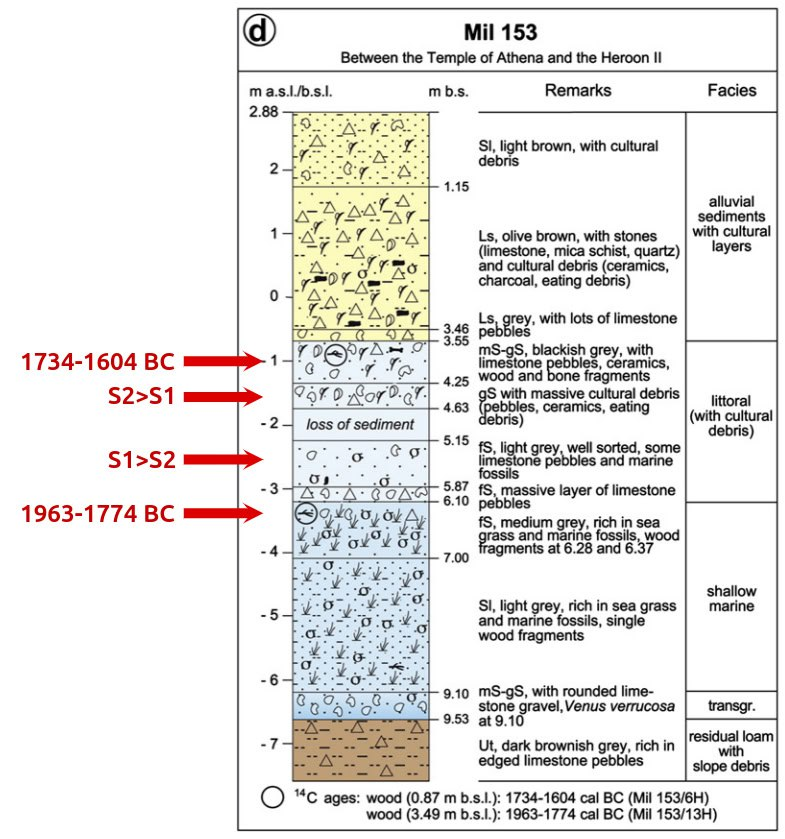
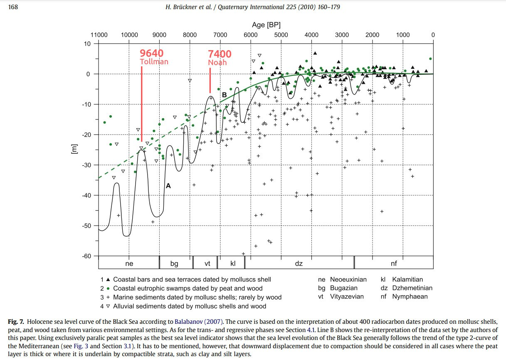
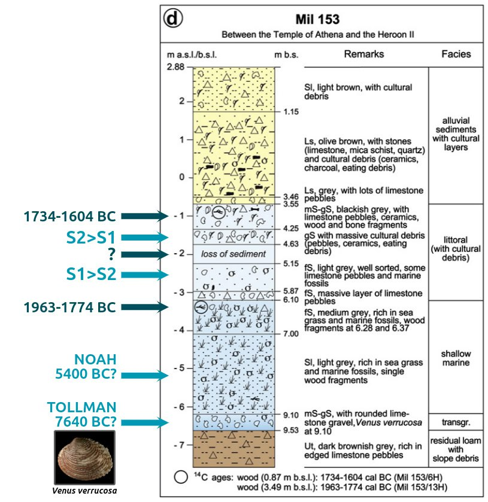
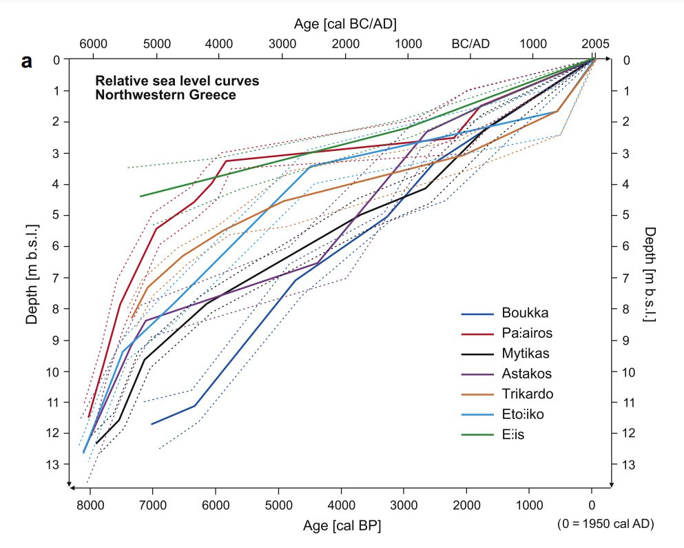

# Water Bodies

One of the issues here is that the Holocene has experienced a dramatic sea level rise, which continued from the end of the Younger Dryas up till around 7000 years ago, and slowed down, but continued to rise, until 4000 years ago. Therefore what we would like to see is evidence of *dramatic* and *rapid* rise in levels of bodies of water such as the Black and Mediterranean Sea to have something to go off of.

## Black Sea Outflow, 6200 BC - 5500 BC

### William Ryan

Apparently the OG Black Sea deluge researcher. He has produced research from 1997 all the way up till very recently. His original thesis was around 5600 BC, which he revised to 6200 BC in 2003.

1997 paper (hard copy here): https://sci-hub.ru/10.1016/s0025-3227(97)00007-8

"influx commencing later at 7150 yr BP and initiated by a cascade of saltwater pouring into a partly-emptied Black Sea lake following the breaching of an intervening barrier."

William Ryan, Black Sea, 2001: https://sci-hub.ru/10.1016/s0025-3227(02)00340-7 (Hard copy in here)

William Ryan, Black Sea, 2003: Catastrophic Flooding of the Black Sea (hard copy in this folder)

"There is a compelling, but not irrefutable, possibility that the Black Sea experienced a catastrophic saltwater flood at 8.4 ky BP."

### Other

Marmara Sea spillover to Black Sea, 8000 YBP (citations 16, 17, 18) https://en.m.wikipedia.org/wiki/Black_Sea_deluge_hypothesis

### EXTREME FLUCTUATIONS OF THE BLACK SEA LEVEL IN NEOEUXINE HOLOCENE AS THE ALTERNATIVE OF CATASTROPHIC FLOOD HYPOTHESIS

What I see here is three events where the Black Sea level rise noticeably outpaced the world sea level rise - 9200 BC, 7100 BC, and 3000 BC. The 9200 BC could potentially be split up into two peaks of 10,300 BC and 8800 BC, and there are potentially two other outpacings around 4800 BC and 1200 BC.

Black Sea levels vs world oceans over 20ka. All colour added by Nobulart. https://annas-archive.org/md5/5b9b93be046fd00c49f44b90aa796682 (hard copy in this folder)

### Late Pleistocene to Holocene paleoenvironmental changes in the NW Black Sea (hard copy here)

Black Sea 25ka reconstructions. The top dotted orange line is original (not added by me).

[1] https://annas-archive.org/md5/edb45e6d05757ef816d96197b6dc350d

## The Holocene sea level story since 7500 BP – Lessons from the Eastern Mediterranean, the Black and the Azov Seas

A meta-analysis of Mediterranean sea levels seems to show a dramatic refilling post 7400 BP, and lesser one around 3700BP. I think factoring out the global sea level rise here is important, however. You'd really want to see indications of refilling that outpace the global sea level rise, which is well documented. The sea level rose up till around 4000 years ago.

Back Sea multiproxy sealevel analysis from the same paper. Massive changes around 7400 and the period of the Tollman impact hypothesis (9640 BP).

What I see above is markers of *above-average* water levels around 8800 BC, 7600 BC, 6000 BC, 3700 BC, and 2000 BC, evidenced by the markers that hover significantly above the trendline.

This reminds me of our Mediterranean sea level discussion between S1 and S2. The various sites got deeper in the north and shallower in the south.

On loss of sediment: I asked GPT: "In the context of this stratigraphic chart, "loss of sediment" refers to a gap in the sedimentary record at that specific depth (around 2 meters below sea level). This could indicate that a portion of the sedimentary sequence was eroded or removed by natural processes such as water flow, wave action, or human activity before subsequent layers were deposited. The missing sediment disrupts the continuous stratigraphic record, potentially creating a time gap that complicates interpretations of the site's geological and archaeological history."

Bruckner, Black sea, 2009: https://sci-hub.ru/10.1016/j.quaint.2008.11.016 (hard copy in this folder)

### Taman Peninsula, Bruckner (Section 5)

"Based on vibracoring it was possible to get samples down to maximum depths of 15–20 m below surface. Therefore, the focus of this study is sea level fluctuations of the past seven millennia."

There is a lengthy analysis of these core layers, each dated. They note a transition from a lagoonal environment into freshwater conditions around 4462 - 4259 BC. Then, a fossilization of this layer by a layer of clayey silt, which was deposited in a lagoonal or shallow marine environment. Aftewards, a return to semi-terrestrial conditions. Then, paralic peat growth of 3363 - 3106 BC which was then ended by lagoonal sediment deposits. From about 3106 BC to 2162 BC, 2m of sediment were deposited, taken to indicate fluvial impact into a lagoon or semi-enclosed marine environment. The last signal of the lagoonal system comes from peat dating to 405-118 BC.

Based on that I see a potential 3900 BC event, 3000 BC event, 2200 BC event, and 400 BC event.

## Kilen Fjord (hard copy in here)

What I see in this paper is two surges in salinity at around 1700 and 500 BC.

"Three shifts in state at Kilen are identified over the study period: a deep, periodically stratified fjord with medium high salinity (and high productivity) between ca 7500-5000 BP, followed by a gradual transition to a shallow benthic system with more oceanic conditions (i.e. higher salinity, lower productivity, slower sedimentary accumulation rate and poorer fossil preservation) after ca 5000 BP and no stratification after ca 4400 BP, and lastly, within this shallow phase, an abrupt shift to brackish conditions around 2000 BP."

https://sci-hub.ru/10.1016/j.quascirev.2013.05.020

## Mayan Chichancanab Lake 5800 BC filling [1]

I see two events in here: 5800 BC event, and an event around 300 BC with similar effects - increase in salinity, and oxygen-18 isotopes in the marine shells, and a fall in CaCO3. I do think this data might need to be normalized somehow for proper relative scaling.

"Classic Maya Civilization. Data from the Lake Chichancanab core supports the following interpretation: From 9200 to 7800 years BP, there was no lake at the coring site as indicated by the absence of aquatic microfossils and the presence of land snails. Beginning at about 7800 years BP, the lake began to fill but the salinity was much higher than today. The lake basin was filled by 7000 years BP" - Department of Geology, University of Florida [1][2]

See `LOCATION-ANALYSIS/north-america/mexico` and `LOCATION-ANALYSIS/carribean` for more analysis on this location.
1. https://www1.ncdc.noaa.gov/pub/data/paleo/slidesets/maya/
	- Above link broken, use this one: https://www.slideshare.net/slideshow/mystery-of-the-maya-collapse/30005650#5
2. https://en.wikipedia.org/wiki/Lake_Chichancanab

## Luotuodun Marine Transgression (hard copy here)

https://www.researchgate.net/publication/225517767_Evidence_for_marine_transgression_between_7500-5400BC_at_the_Luotuodun_Site_in_Yixing_Jiangsu_Province

## Great Basin

"The Great Salt Lake and the Great Salt Lake Desert is the largest salt lake in the western hemisphere and one of the saltiest stretches of water on the planet. The principal rivers flowing into the lake are the Bear, the Weber, and the Jordan. No streams empty from the lake, so the only outlet for water is through evaporation. The lake is eight times saltier than the ocean, which suggests it could have been created from what had been an original volume of sea water eight times greater than today’s lake settling in the area."

"Apparently, the Great Salt Lake is considered to be a remnant of the glacial Lake Bonneville, which covered approximately 50,000 square kilometres during the Pleistocene Epoch (the period that ended about 10,000 years ago). The fascinating point here is that the prehistoric Lake Bonneville was then a large, deep freshwater lake that occupied much of western Utah and parts of Nevada and Idaho, and people at that time fished around these waters.

If it was so recently a freshwater lake covering the current area of the Great Salt Lake (as well as all of the surrounding salt flats), the question has to be asked: where did all that additional salt come from around 10,000 years ago, if not from a huge sea incursion? The standard explanation is that it is due to tiny amounts of mineral salts in freshwater streams accumulating over the millennia. But in that case, how did this ancient lake only start to pick up mineral salt 10,000 years ago? 

There is a further problem for the mineral salt build-up argument. The deposits in Utah are not just any salt – they are sea-salt. The Great Salt Lake has a chemical make-up similar to that of the oceans! The chemical composition of sea water is made up of a solution of salts including chlorine 55 per cent and sodium 31 per cent, by weight of all the dissolved matter. Sea water also contains trace amounts of all the other elements, such as nitrate, phosphate, iron, manganese and gold.  It is also interesting to note that the topology of the eastern part of the Great Basin once acted as a container for a freshwater lake that covered about 50,000 square kilometres (thanks to melting glaciers), which was possibly its maximum capacity before the waters overran the edges of the natural basin. With that surface area, the lake would be just about eight times larger in volume than the current lake. 

Given that the basin floor is relatively flat and that the median depth is normally only 4.5 metres, it appears to confirm that there was eight times the volume of salt water present immediately after the Flood. This calculation seems to confirm the reduction was due to evaporation, leaving water with a salinity approximately eight times that of the Pacific Ocean. 

If we are right, and two tsunami waves did strike deep into the land that is now the United States, where is the evidence of such a relatively recent cataclysmic disaster? How could the various experts have failed to notice such an event? The simple answer is that each set of specialists has indeed noticed the effects, but the whole picture simply has not been pieced together." 

- Condensed from Uriel's Machine, Knight & Lomas (1999)
