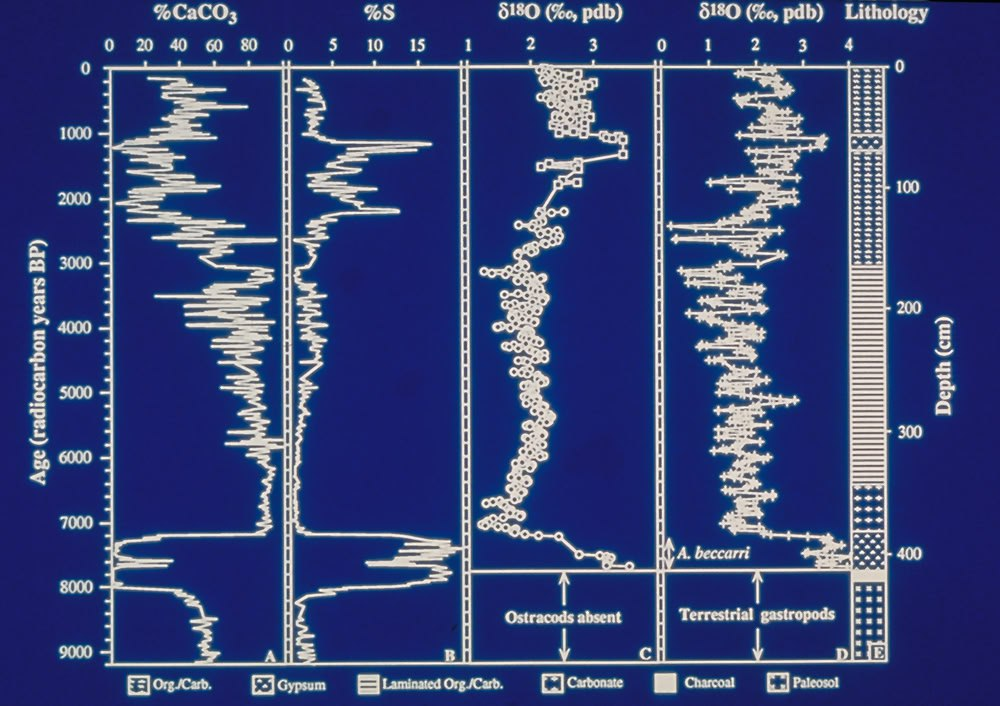
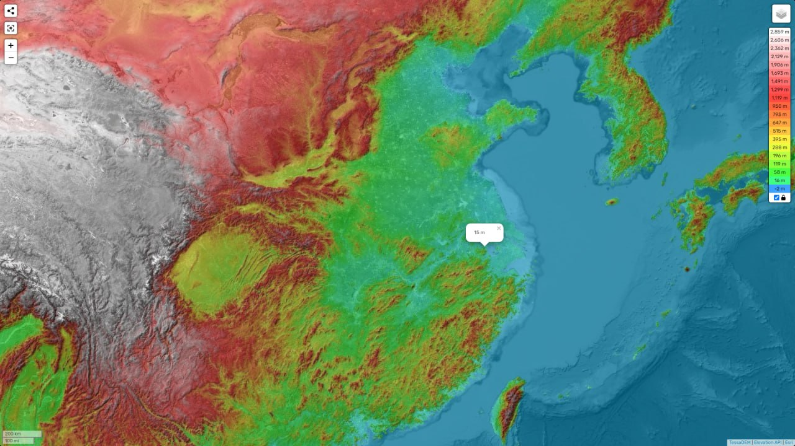
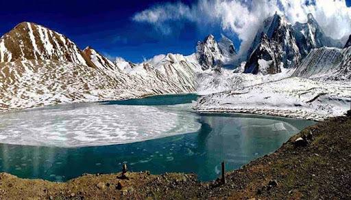

# Water Bodies

One of the issues here is that the Holocene has experienced a dramatic sea level rise, which continued from the end of the Younger Dryas up till around 7000 years ago, and slowed down, but continued to rise, until 4000 years ago. Therefore what we would like to see is evidence of *dramatic* and *rapid* rise in levels of bodies of water such as the Black and Mediterranean Sea to have something to go off of.

## Environmental change in the Limfjord, Denmark (ca 7500e1500 cal yrs BP): a multiproxy study (hard copy in here)

Many interesting charts in this paper.

"Three shifts in state at Kilen are identified over the study period: a deep, periodically stratified fjord with medium high salinity (and high productivity) between ca 7500-5000 BP, followed by a gradual transition to a shallow benthic system with more oceanic conditions (i.e. higher salinity, lower productivity, slower sedimentary accumulation rate and poorer fossil preservation) after ca 5000 BP and no stratification after ca 4400 BP, and lastly, within this shallow phase, an abrupt shift to brackish conditions around 2000 BP."

"In April 2007, a 15 m sedimentary sequence (collected with a
Russian peat sampler as 1 m core sections from two overlapping
boreholes, correlated via physical sedimentary parameters and
coring depth; Lewis, 2011) was retrieved from Kilen from a water
depth of 3.9 m (Fig. 1C). The lithology of each core section was
described using a modified Troels-Smith system (Troels-Smith,
1955; cf. Birks and Birks, 1980), prior to being sliced up into 1 or
2 cm intervals and subsampled for physical sedimentary analyses,
micro- and macrofossil analyses plus sedimentary pigment anal-
ysis."

Two surges in salinity, more than modern surface salinity, from the period of 2700 BC to 100 AD, ending with the "abrupt shift to brackish conditions around 2000 BP":

Totally different salinity curve:

Gaps in foraminifera record around 1200 BC and 2800 BC.

It's not clear how to interpret the salinity because the place actually got more salty than the ocean... it could be that this occurs due to lack of seawater inflows rather than the opposite.

https://sci-hub.ru/10.1016/j.quascirev.2013.05.020

## Mayan Chichancanab Lake 5800 BC filling

I see two events in here: 5800 BC event, and an event around 300 BC with similar effects - increase in salinity, and oxygen-18 isotopes in the marine shells, and a fall in CaCO3. I do think this data might need to be normalized somehow for proper relative scaling.

"Classic Maya Civilization. Data from the Lake Chichancanab core supports the following interpretation: From 9200 to 7800 years BP, there was no lake at the coring site as indicated by the absence of aquatic microfossils and the presence of land snails. Beginning at about 7800 years BP, the lake began to fill but the salinity was much higher than today. The lake basin was filled by 7000 years BP" - Department of Geology, University of Florida [1][2]

See `LOCATION-ANALYSIS/north-america/mexico` and `LOCATION-ANALYSIS/carribean` for more analysis on this location.
1. https://www1.ncdc.noaa.gov/pub/data/paleo/slidesets/maya/
	- Above link broken, use this one: https://www.slideshare.net/slideshow/mystery-of-the-maya-collapse/30005650#5
	- Slides also in `LITERATURE/webb-rhoda`
2. https://en.wikipedia.org/wiki/Lake_Chichancanab

## Luotuodun Marine Transgression (hard copy here) 7500-5400 BC

https://www.researchgate.net/publication/225517767_Evidence_for_marine_transgression_between_7500-5400BC_at_the_Luotuodun_Site_in_Yixing_Jiangsu_Province

## Caspian Sea

The Caspian Sea. "In the low-lying lands to the east of Mount Ararat lies the largest landlocked body of water on the planet. We looked up the facts about this giant lake and were hardly surprised when we found that it is also a salt-water lake, containing salmon, sturgeon and herring as well as other marine animals such as porpoises and seals. The question has to be asked: how does a giant landlocked, seawater lake come to exist so deep inside a continental land-mass, and how did large sea mammals get there? The nearest connection to the oceans is 800 kilometres south, in the Persian Gulf. Could it be that this is another remnant of a giant continental ‘rock-pool’ left by the comet Flood? Is it not possible that the oceanic animal life in this lake was carried there by a wave of unimaginable proportions? We could find no explanation from the experts. The region to the north was once covered in salt water, while the Aral Sea 480 km further east is also a saltwater lake."

- Uriel's Machine

## Lake Sevan (Armenia)

Well looky here. A triple conjunction with our dates of 7400 BP, 3700 BP and 500 AD.

[1] https://annas-archive.org/md5/d5a62f2696f8ffef7dbb15a5a26b049a

## Latvian lake 6500 - 5400 BC

An account of the first formation of a lake with fish in it. https://sci-hub.ru/10.1177/0959683616683255

## Himalayas Gurudongmar Salt lake

This lake that is frozen all year has a secret that no one has found a solution for. This lake is on the plateau next to the Kanchengyao mountain range. It is the source of the Teesta river. However, the secret it holds is that there is a spot in it that stays unfrozen. There surely is a religious angle to it from Buddhism. The story circulated is that a Buddhist Padmasambhava gave this place a blessing. He is believed to have had tantric qualities as well. However, it is still unknown how this one place is untouched even by the harshest of colds.

## Sahara ancient megalake

The Sahara has always held mysteries in my mind, with stories like theses:

https://www.si.edu/stories/ancient-megalake-discovered-beneath-sahara-desert

https://en.m.wikipedia.org/wiki/Sahara_pump_theory

This is an elevation map. I've highlighted the region they've shown in red in the first pic. I've marked the other areas of interest (due to their apparent deluge evidence) in the second pic.

## Lake Bonneville [1]

Lake Bonneville would have been a puddle of the Pacific Ocean left trapped in Utah after the displacement.

The salt flats, where trapped salt water evaporated leaving the salt behind.

https://www.visitutah.com/articles/bonneville-salt-flats-planning-guide

"During the Early Cambrian [...], western Utah was covered by a shallow sea. "

https://geology.utah.gov/map-pub/survey-notes/glad-you-asked/trilobites-and-cambrian-utah/

## Pole Movement and Sea Levels...

Pole Movement and Sea Levels (1978). Several interesting numbers: a 5,600 year cycle, a 177m sea level rise, and the longitudes 60°W and 120°E - one degree off of the ECDO Euler. [1] https://t.co/7rsdKhI4bu [2] https://t.co/P3MWyLsyO7 https://t.co/fZooOiXQYe

## Citations

1. Craig Stone