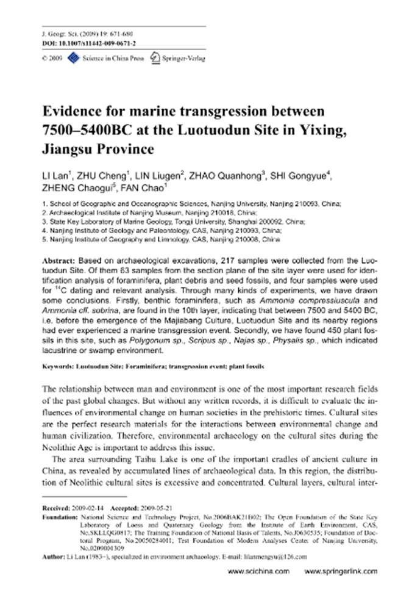

# Water Bodies

One of the issues here is that the Holocene has experienced a dramatic sea level rise, which continued from the end of the Younger Dryas up till around 7000 years ago, and slowed down, but continued to rise, until 4000 years ago. Therefore what we would like to see is evidence of *dramatic* and *rapid* rise in levels of bodies of water such as the Black and Mediterranean Sea to have something to go off of.

### Taman Peninsula, Bruckner (Section 5)

"Based on vibracoring it was possible to get samples down to maximum depths of 15–20 m below surface. Therefore, the focus of this study is sea level fluctuations of the past seven millennia."

There is a lengthy analysis of these core layers, each dated. They note a transition from a lagoonal environment into freshwater conditions around 4462 - 4259 BC. Then, a fossilization of this layer by a layer of clayey silt, which was deposited in a lagoonal or shallow marine environment. Aftewards, a return to semi-terrestrial conditions. Then, paralic peat growth of 3363 - 3106 BC which was then ended by lagoonal sediment deposits. From about 3106 BC to 2162 BC, 2m of sediment were deposited, taken to indicate fluvial impact into a lagoon or semi-enclosed marine environment. The last signal of the lagoonal system comes from peat dating to 405-118 BC.

Based on that I see a potential 3900 BC event, 3000 BC event, 2200 BC event, and 400 BC event.

## Kilen Fjord (hard copy in here)

What I see in this paper is two surges in salinity at around 1700 and 500 BC.

"Three shifts in state at Kilen are identified over the study period: a deep, periodically stratified fjord with medium high salinity (and high productivity) between ca 7500-5000 BP, followed by a gradual transition to a shallow benthic system with more oceanic conditions (i.e. higher salinity, lower productivity, slower sedimentary accumulation rate and poorer fossil preservation) after ca 5000 BP and no stratification after ca 4400 BP, and lastly, within this shallow phase, an abrupt shift to brackish conditions around 2000 BP."

https://sci-hub.ru/10.1016/j.quascirev.2013.05.020

## Mayan Chichancanab Lake 5800 BC filling

I see two events in here: 5800 BC event, and an event around 300 BC with similar effects - increase in salinity, and oxygen-18 isotopes in the marine shells, and a fall in CaCO3. I do think this data might need to be normalized somehow for proper relative scaling.

"Classic Maya Civilization. Data from the Lake Chichancanab core supports the following interpretation: From 9200 to 7800 years BP, there was no lake at the coring site as indicated by the absence of aquatic microfossils and the presence of land snails. Beginning at about 7800 years BP, the lake began to fill but the salinity was much higher than today. The lake basin was filled by 7000 years BP" - Department of Geology, University of Florida [1][2]

See `LOCATION-ANALYSIS/north-america/mexico` and `LOCATION-ANALYSIS/carribean` for more analysis on this location.
1. https://www1.ncdc.noaa.gov/pub/data/paleo/slidesets/maya/
	- Above link broken, use this one: https://www.slideshare.net/slideshow/mystery-of-the-maya-collapse/30005650#5
	- Slides also in `LITERATURE/webb-rhoda`
2. https://en.wikipedia.org/wiki/Lake_Chichancanab

## Luotuodun Marine Transgression (hard copy here)

https://www.researchgate.net/publication/225517767_Evidence_for_marine_transgression_between_7500-5400BC_at_the_Luotuodun_Site_in_Yixing_Jiangsu_Province

## Great Basin

"The Great Salt Lake and the Great Salt Lake Desert is the largest salt lake in the western hemisphere and one of the saltiest stretches of water on the planet. The principal rivers flowing into the lake are the Bear, the Weber, and the Jordan. No streams empty from the lake, so the only outlet for water is through evaporation. The lake is eight times saltier than the ocean, which suggests it could have been created from what had been an original volume of sea water eight times greater than today’s lake settling in the area."

"Apparently, the Great Salt Lake is considered to be a remnant of the glacial Lake Bonneville, which covered approximately 50,000 square kilometres during the Pleistocene Epoch (the period that ended about 10,000 years ago). The fascinating point here is that the prehistoric Lake Bonneville was then a large, deep freshwater lake that occupied much of western Utah and parts of Nevada and Idaho, and people at that time fished around these waters.

If it was so recently a freshwater lake covering the current area of the Great Salt Lake (as well as all of the surrounding salt flats), the question has to be asked: where did all that additional salt come from around 10,000 years ago, if not from a huge sea incursion? The standard explanation is that it is due to tiny amounts of mineral salts in freshwater streams accumulating over the millennia. But in that case, how did this ancient lake only start to pick up mineral salt 10,000 years ago? 

There is a further problem for the mineral salt build-up argument. The deposits in Utah are not just any salt – they are sea-salt. The Great Salt Lake has a chemical make-up similar to that of the oceans! The chemical composition of sea water is made up of a solution of salts including chlorine 55 per cent and sodium 31 per cent, by weight of all the dissolved matter. Sea water also contains trace amounts of all the other elements, such as nitrate, phosphate, iron, manganese and gold.  It is also interesting to note that the topology of the eastern part of the Great Basin once acted as a container for a freshwater lake that covered about 50,000 square kilometres (thanks to melting glaciers), which was possibly its maximum capacity before the waters overran the edges of the natural basin. With that surface area, the lake would be just about eight times larger in volume than the current lake. 

Given that the basin floor is relatively flat and that the median depth is normally only 4.5 metres, it appears to confirm that there was eight times the volume of salt water present immediately after the Flood. This calculation seems to confirm the reduction was due to evaporation, leaving water with a salinity approximately eight times that of the Pacific Ocean. 

If we are right, and two tsunami waves did strike deep into the land that is now the United States, where is the evidence of such a relatively recent cataclysmic disaster? How could the various experts have failed to notice such an event? The simple answer is that each set of specialists has indeed noticed the effects, but the whole picture simply has not been pieced together." 

- Condensed from Uriel's Machine, Knight & Lomas (1999)

## Caspian Sea

The Caspian Sea. "In the low-lying lands to the east of Mount Ararat lies the largest landlocked body of water on the planet. We looked up the facts about this giant lake and were hardly surprised when we found that it is also a salt-water lake, containing salmon, sturgeon and herring as well as other marine animals such as porpoises and seals. The question has to be asked: how does a giant landlocked, seawater lake come to exist so deep inside a continental land-mass, and how did large sea mammals get there? The nearest connection to the oceans is 800 kilometres south, in the Persian Gulf. Could it be that this is another remnant of a giant continental ‘rock-pool’ left by the comet Flood? Is it not possible that the oceanic animal life in this lake was carried there by a wave of unimaginable proportions? We could find no explanation from the experts. The region to the north was once covered in salt water, while the Aral Sea 480 km further east is also a saltwater lake."

- Uriel's Machine

## Lake Sevan (Armenia)

Well looky here. A triple conjunction with our dates of 7400 BP, 3700 BP and 500 AD.

[1] https://annas-archive.org/md5/d5a62f2696f8ffef7dbb15a5a26b049a

## Latvian lake 6500 - 5400 BC

An account of the first formation of a lake with fish in it. https://sci-hub.ru/10.1177/0959683616683255

## Himalayas Gurudongmar Salt lake

This lake that is frozen all year has a secret that no one has found a solution for. This lake is on the plateau next to the Kanchengyao mountain range. It is the source of the Teesta river. However, the secret it holds is that there is a spot in it that stays unfrozen. There surely is a religious angle to it from Buddhism. The story circulated is that a Buddhist Padmasambhava gave this place a blessing. He is believed to have had tantric qualities as well. However, it is still unknown how this one place is untouched even by the harshest of colds.

## Sahara ancient megalake

The Sahara has always held mysteries in my mind, with stories like theses:

https://www.si.edu/stories/ancient-megalake-discovered-beneath-sahara-desert

https://en.m.wikipedia.org/wiki/Sahara_pump_theory

This is an elevation map. I've highlighted the region they've shown in red in the first pic. I've marked the other areas of interest (due to their apparent deluge evidence) in the second pic.

## Lake Bonneville [1]

Lake Bonneville would have been a puddle of the Pacific Ocean left trapped in Utah after the displacement.

The salt flats, where trapped salt water evaporated leaving the salt behind.

https://www.visitutah.com/articles/bonneville-salt-flats-planning-guide

"During the Early Cambrian [...], western Utah was covered by a shallow sea. "

https://geology.utah.gov/map-pub/survey-notes/glad-you-asked/trilobites-and-cambrian-utah/

## Pole Movement and Sea Levels...

Pole Movement and Sea Levels (1978). Several interesting numbers: a 5,600 year cycle, a 177m sea level rise, and the longitudes 60°W and 120°E - one degree off of the ECDO Euler. [1] https://t.co/7rsdKhI4bu [2] https://t.co/P3MWyLsyO7 https://t.co/fZooOiXQYe

## Citations

1. Craig Stone