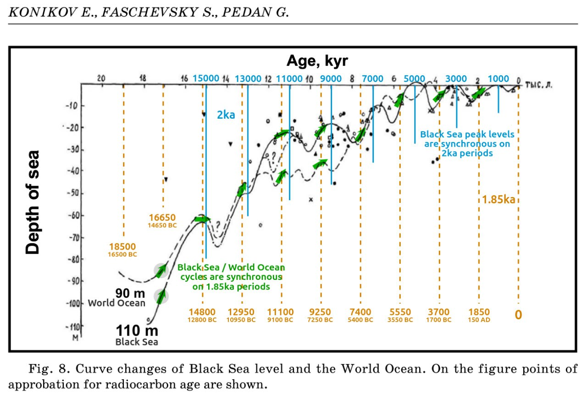
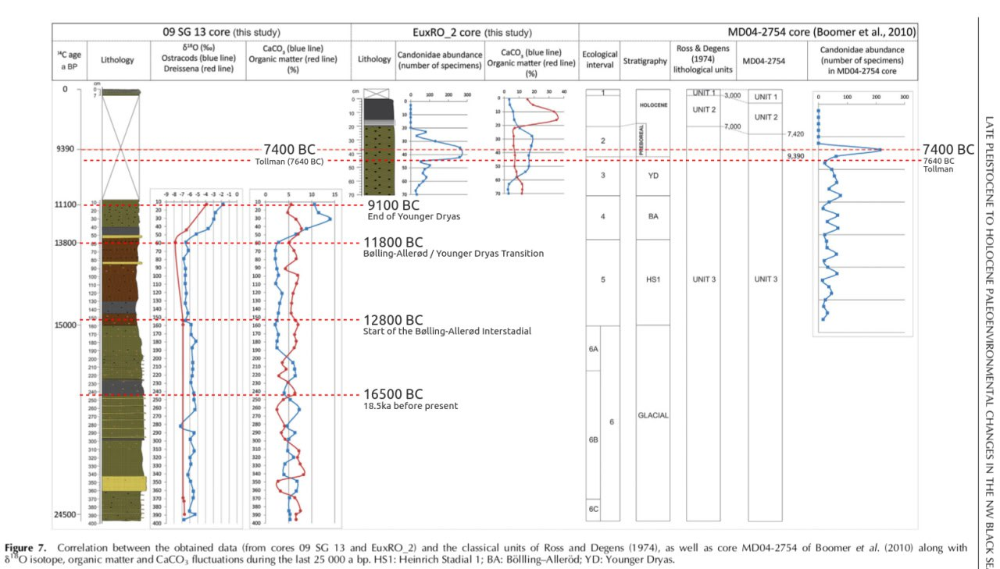
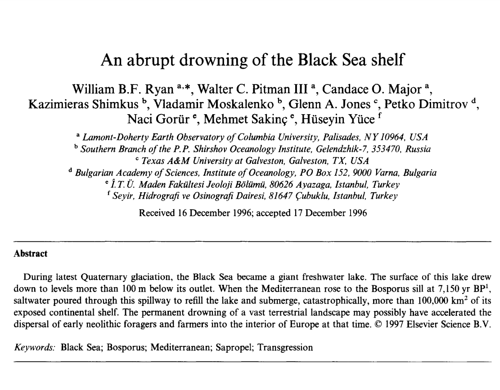
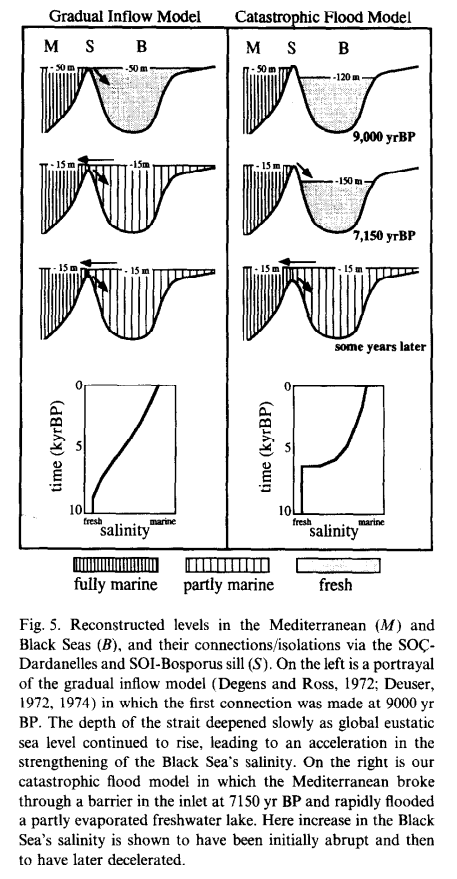

# Black Sea Outflow, 6200 BC - 5500 BC

## William Ryan

Apparently the OG Black Sea deluge researcher. He has produced research from 1997 all the way up till very recently. His original thesis was around 5600 BC, which he revised to 6200 BC in 2003.

1997 paper (hard copy here): https://sci-hub.ru/10.1016/s0025-3227(97)00007-8

"influx commencing later at 7150 yr BP and initiated by a cascade of saltwater pouring into a partly-emptied Black Sea lake following the breaching of an intervening barrier."

William Ryan, Black Sea, 2001: https://sci-hub.ru/10.1016/s0025-3227(02)00340-7 (Hard copy in here)

William Ryan, Black Sea, 2003: Catastrophic Flooding of the Black Sea (hard copy in this folder)

"There is a compelling, but not irrefutable, possibility that the Black Sea experienced a catastrophic saltwater flood at 8.4 ky BP."

## Other

Marmara Sea spillover to Black Sea, 8000 YBP (citations 16, 17, 18) https://en.m.wikipedia.org/wiki/Black_Sea_deluge_hypothesis

## EXTREME FLUCTUATIONS OF THE BLACK SEA LEVEL IN NEOEUXINE HOLOCENE AS THE ALTERNATIVE OF CATASTROPHIC FLOOD HYPOTHESIS

What I see here is three events where the Black Sea level rise noticeably outpaced the world sea level rise - 9200 BC, 7100 BC, and 3000 BC. The 9200 BC could potentially be split up into two peaks of 10,300 BC and 8800 BC, and there are potentially two other outpacings around 4800 BC and 1200 BC.

Black Sea levels vs world oceans over 20ka. All colour added by Nobulart. https://annas-archive.org/md5/5b9b93be046fd00c49f44b90aa796682 (hard copy in this folder)

## Late Pleistocene to Holocene paleoenvironmental changes in the NW Black Sea (hard copy here)

Black Sea 25ka reconstructions. The top dotted orange line is original (not added by me).

[1] https://annas-archive.org/md5/edb45e6d05757ef816d96197b6dc350d

## An Abrupt Drowning of the...

An Abrupt Drowning of the Black Sea Shelf ±7150 BP (Proximal to the Noahic Deluge). "The most widely-accepted hypothesis, based on data from the deep basin floor sediments, holds that post-glacial inflow of Mediterranean water into the Black Sea’s isolated freshwater lake began… https://t.co/cfkdocYvdm https://t.co/TFNNJrID8Q

