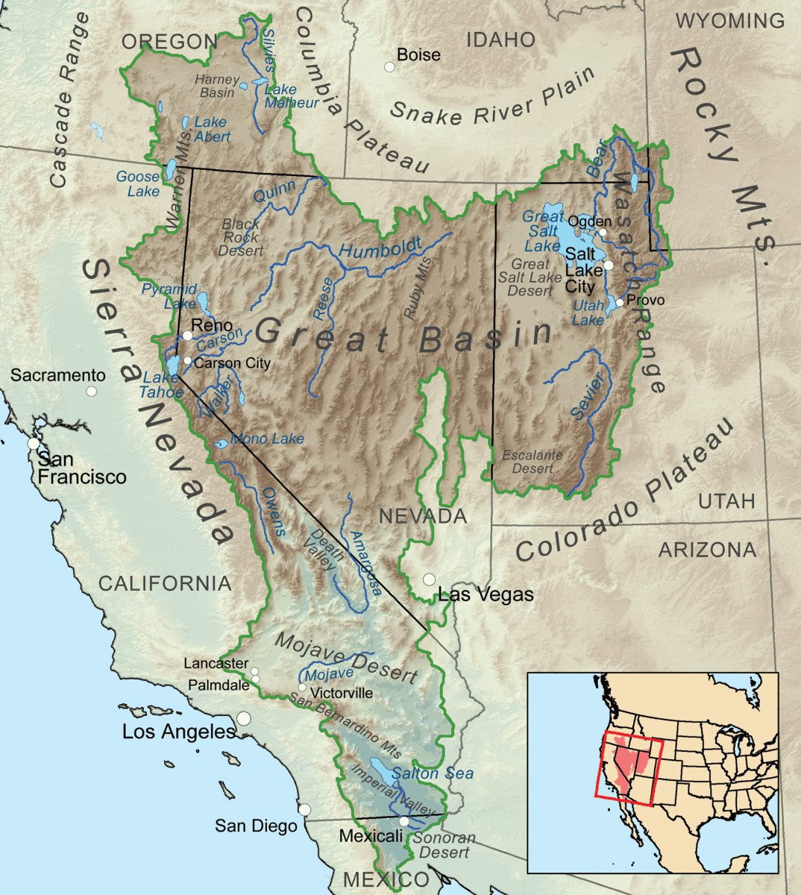

# Great Basin

## Great Basin

"The Great Salt Lake and the Great Salt Lake Desert is the largest salt lake in the western hemisphere and one of the saltiest stretches of water on the planet. The principal rivers flowing into the lake are the Bear, the Weber, and the Jordan. No streams empty from the lake, so the only outlet for water is through evaporation. The lake is eight times saltier than the ocean, which suggests it could have been created from what had been an original volume of sea water eight times greater than today’s lake settling in the area."

"Apparently, the Great Salt Lake is considered to be a remnant of the glacial Lake Bonneville, which covered approximately 50,000 square kilometres during the Pleistocene Epoch (the period that ended about 10,000 years ago). The fascinating point here is that the prehistoric Lake Bonneville was then a large, deep freshwater lake that occupied much of western Utah and parts of Nevada and Idaho, and people at that time fished around these waters.

If it was so recently a freshwater lake covering the current area of the Great Salt Lake (as well as all of the surrounding salt flats), the question has to be asked: where did all that additional salt come from around 10,000 years ago, if not from a huge sea incursion? The standard explanation is that it is due to tiny amounts of mineral salts in freshwater streams accumulating over the millennia. But in that case, how did this ancient lake only start to pick up mineral salt 10,000 years ago? 

There is a further problem for the mineral salt build-up argument. The deposits in Utah are not just any salt – they are sea-salt. The Great Salt Lake has a chemical make-up similar to that of the oceans! The chemical composition of sea water is made up of a solution of salts including chlorine 55 per cent and sodium 31 per cent, by weight of all the dissolved matter. Sea water also contains trace amounts of all the other elements, such as nitrate, phosphate, iron, manganese and gold.  It is also interesting to note that the topology of the eastern part of the Great Basin once acted as a container for a freshwater lake that covered about 50,000 square kilometres (thanks to melting glaciers), which was possibly its maximum capacity before the waters overran the edges of the natural basin. With that surface area, the lake would be just about eight times larger in volume than the current lake. 

Given that the basin floor is relatively flat and that the median depth is normally only 4.5 metres, it appears to confirm that there was eight times the volume of salt water present immediately after the Flood. This calculation seems to confirm the reduction was due to evaporation, leaving water with a salinity approximately eight times that of the Pacific Ocean. 

If we are right, and two tsunami waves did strike deep into the land that is now the United States, where is the evidence of such a relatively recent cataclysmic disaster? How could the various experts have failed to notice such an event? The simple answer is that each set of specialists has indeed noticed the effects, but the whole picture simply has not been pieced together." 

- Condensed from Uriel's Machine, Knight & Lomas (1999)