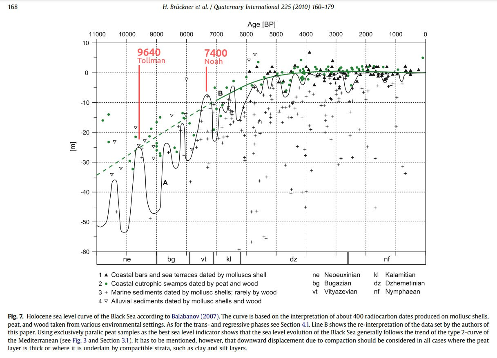

# Mediterranean

## The Holocene sea level story since 7500 BP – Lessons from the Eastern Mediterranean, the Black and the Azov Seas (hard copy here)

A meta-analysis of Mediterranean sea levels seems to show a dramatic refilling post 7400 BP, and lesser one around 3700BP. I think factoring out the global sea level rise here is important, however. You'd really want to see indications of refilling that outpace the global sea level rise, which is well documented. The sea level rose up till around 4000 years ago.

Back Sea multiproxy sealevel analysis from the same paper. Massive changes around 7400 and the period of the Tollman impact hypothesis (9640 BP).

What I see above is markers of *above-average* water levels around 8800 BC, 7700 BC, 6000 BC, 3700 BC, and 2000 BC, evidenced by the markers that hover significantly above the trendline. Not sure how the wiggly trendline was created; just a line of best fit through the various markers?

This reminds me of our Mediterranean sea level discussion between S1 and S2. The various sites got deeper in the north and shallower in the south.

On loss of sediment: I asked GPT: "In the context of this stratigraphic chart, "loss of sediment" refers to a gap in the sedimentary record at that specific depth (around 2 meters below sea level). This could indicate that a portion of the sedimentary sequence was eroded or removed by natural processes such as water flow, wave action, or human activity before subsequent layers were deposited. The missing sediment disrupts the continuous stratigraphic record, potentially creating a time gap that complicates interpretations of the site's geological and archaeological history."

Bruckner, Black sea, 2009: https://sci-hub.ru/10.1016/j.quaint.2008.11.016

### Kuban River Plain, Taman Peninsula (Black Sea) cores, Russia, Bruckner (Section 5)

"Based on vibracoring it was possible to get samples down to maximum depths of 15–20 m below surface. Therefore, the focus of this study is sea level fluctuations of the past seven millennia."

There is a lengthy analysis of these core layers, each dated (pg 171).
- They note a transition from a lagoonal environment into freshwater conditions around 4462 - 4259 BC. Then, a fossilization of this layer by a layer of clayey silt, which was deposited in a lagoonal or shallow marine environment.
- Aftewards, a return to semi-terrestrial conditions.
- Then, paralic peat growth of 3363 - 3106 BC which was then ended by lagoonal sediment deposits.
- From about 3106 BC to 2162 BC, 2m of sediment were deposited, taken to indicate fluvial impact into a lagoon or semi-enclosed marine environment.
- The last signal of the lagoonal system comes from peat dating to 405-118 BC.

Major biomass deposit layers:
- 3106-2462 BC
- 4259-3363 BC

Seems like the layers from 2000 BC - 400 BC must have been lost.

## Sediment layers

This is a cross-section of the Mediterranean. Note the 1km thick layer of salt and other evaporates in pink (the Messinian Evaporates) which were left behind when the sea "evaporated" prior to being dramatically refilled during the Zanclean megaflood.

[1] https://www.researchgate.net/publication/228836049_Regional_seismic_interpretation_of_the_hydrocarbon_prospectivity_of_offshore_Syria (hard copy in here)

## Zanclean flood

"The Zanclean flood or Zanclean deluge is theorized to have refilled the Mediterranean Sea 5.33 million years ago.[1] This flooding ended the Messinian salinity crisis and reconnected the Mediterranean Sea to the Atlantic Ocean, although it is possible that even before the flood there were partial connections to the Atlantic Ocean."

"According to this model, water from the Atlantic Ocean refilled the dried-up basin through the modern-day Strait of Gibraltar. Ninety percent of the Mediterranean Basin flooding occurred abruptly during a period estimated to have been between several months and two years, following low water discharges that could have lasted for several thousand years.[3] Sea level rise in the basin may have reached rates at times greater than ten metres per day (thirty feet per day). Based on the erosion features preserved until modern times under the Pliocene sediment, Garcia-Castellanos et al. estimate that water rushed down a drop of more than 1,000 metres (3,000 ft) with a maximum discharge of about 100 million cubic metres per second (3.5 billion cubic feet per second), about 1,000 times that of the present-day Amazon River. Studies of the underground structures at the Gibraltar Strait show that the flooding channel descended gradually toward the bottom of the basin rather than forming a steep waterfall."

https://en.wikipedia.org/wiki/Zanclean_flood

## Younger Dryas Impact: "Out of Eden, the Anthropocene, and the last Younger-Dryas extinction" (hard copy here)

https://theworldwideflood.com/2022/01/12/out-of-eden-the-anthropocene-and-the-last-younger-dryas-extinction/

https://www.maajournal.com/index.php/maa/article/view/1009/918