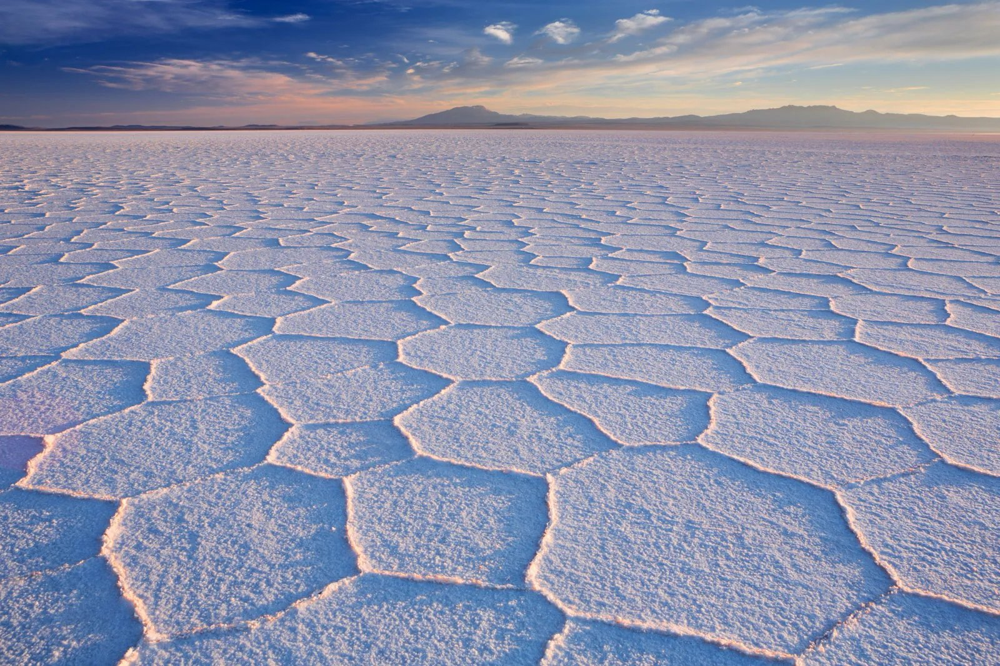
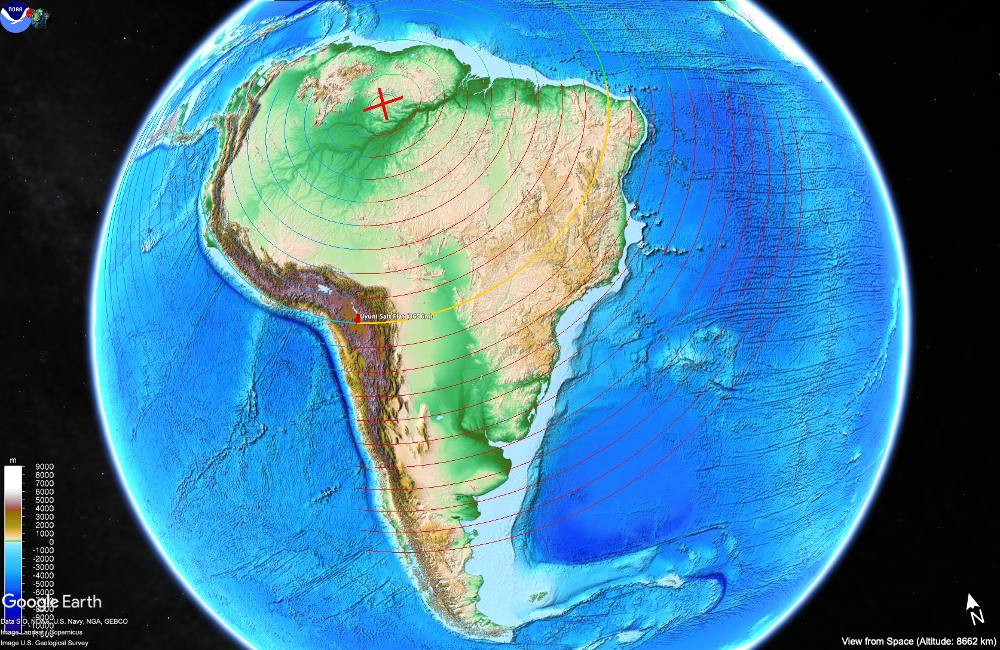
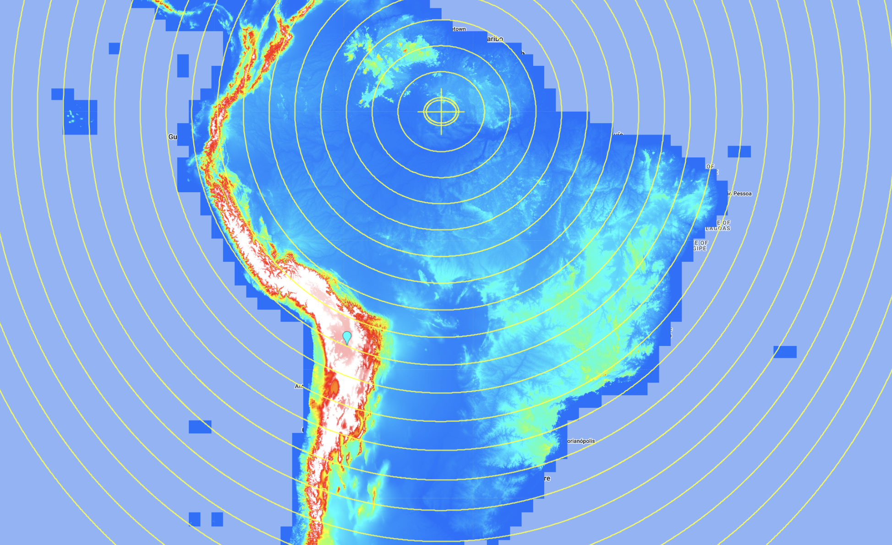
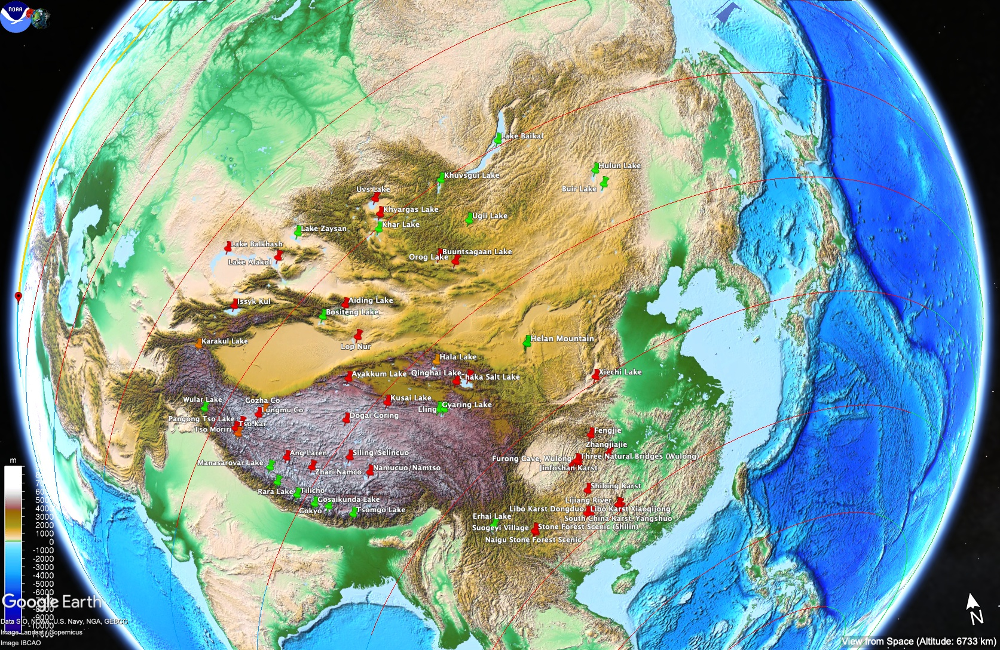

# Saline Water Bodies

## Uyuni Salt Flat (3656m)

Coords (-20, -67.3). Supposedly part of a large former saline lake in the Altiplano of Bolivia - Lake Tauca.

Viz from -500m to 4000m:

Significant ocean isn't directly on the rotation path, but as you can see, the land in front of it on the rotation path is a flat plain offering little resistance for water. It wouldn't take much of an extra jolt to splash the water above the Andes. Alternatively, it may have been inundated on a potential quick rotation from S2 back to S1.

## Asia Saltwater Lakes

Saltwater lakes in red, freshwater lakes in green, and brackish lakes in orange.

