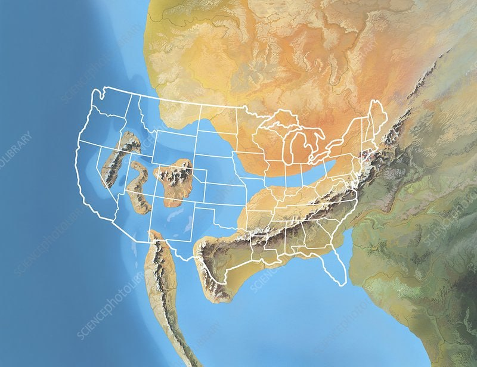
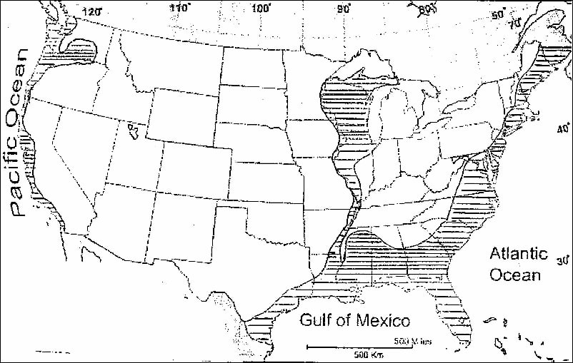
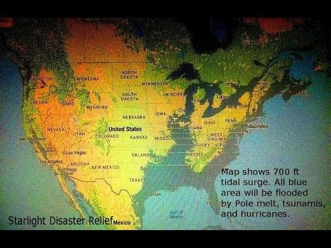

# Water flow structures

## English channel megafloods

Beneath the water of the English Channel lies evidence of two megaflood events.

[1] Catastrophic flooding origin of shelf valley systems in the English Channel, Gupta et al (2007)
https://nature.com/articles/nature06018

## Rolling hills of the Palouse [2]

"While the majority of scholars support the wind-borne origin of the Palouse loess formations, the minority position advocating for a water-laid origin is supported by substantial geomorphological and sedimentological evidence. The presence of buried paleosols, alluvial loesses, and hydrological features like perched water tables provide compelling arguments for reconsidering the role of water in the formation of these distinctive landscapes." [1]

Spectacular. After many hours now of going through megaflood literature and looking at hundreds of erosion and accretion photos, I'd say that that is pretty much without a doubt the result of alluvial accretion and erosion by water.

Another pic. It seems fairly well accepted that this entire area in WA was deluged (albeit that the uniformitarians insist that the water came from ice lakes breaking out). The entire state bears the marks of water.

## Palouse Falls

Here is a park called Palouse Falls, you can see what looks like multiple washes or perhaps different strata layers that resisted the water in different ways?

https://lidarportal.dnr.wa.gov/#46.65966:-118.23071:16

https://parks.wa.gov/find-parks/state-parks/palouse-falls-state-park-heritage-site

## Taklamakan Desert, China

May just be sand dunes. Coords (40, 86.3).

*"These look very much like the work of the wind to me."* [2]

## Himalayas: This is in agreement with...

This is in agreement with the ECDO moment of inertia relative to the water. Video coming soon. https://t.co/HEYaKVeWss

## Newgrange: Those look a lot like...

Those look a lot like mega current ripples to the North and West of Newgrange, running coast to coast. Anyone know of a good LiDAR source for Ireland? https://t.co/MRKJkKWMAl

## The scorn of heretics. Red...

The scorn of heretics. Red line is 50km. https://t.co/1m6CwwyqJU

## @BrightInsight6 definitely spotted these.
https://t.co/Jg9fbPr0Ly

definitely spotted these. https://t.co/Jg9fbPr0Ly

## do you know what these...

do you know what these are? https://t.co/OmVGmBDwNi

## Pakistan Mega-flow structures?

## How Geologists Discovered and Mapped a Great Seaway (North America)

https://www.youtube.com/watch?v=UCPnUAAOuDg

That reminds me of the stories I've heard of sea shells being found on the top of dessert buttes in the south western US.  Sorta like this:

https://www.desertusa.com/desert-california/seashells-in-desert.html

I think they call it the Permian Sea

The Permian Basin. It’s a very oil rich area. Lots and lots of drilling

Curiously, if the pivot took place the way it’s being modeled, the water would invade the US from the west and probably leave the east with more landmass. Which is what this photo shows.

Yeah, if I remember right, that is what a few other sources suggest as well.  Here is one of them:

https://www.forbes.com/sites/jimdobson/2017/06/10/the-shocking-doomsday-maps-of-the-world-and-the-billionaire-escape-plans/

I think this B&W one is as close as I can find for the original infamous "Navy Map", the color one is who knows what...

Here is an assortment: https://www.bibliotecapleyades.net/profecias/esp_profecia_mapas.htm

https://www.geographicus.com/blog/gordon-michael-scallions-doomsday-maps.html (crazy stuff, been around for decades)

https://www.youtube.com/watch?v=u5m65EPHLg

## An Anomalous Breccia in Mauritania (West Africa) Potential Evidence for an Impact-generated Tsunami

Hard copy of 2003.pdf here.

## The Eye of Mexico

The Eye of Mexico. 800km NNW of Mexico City, 1000m above sea level, near a formation similar to the Richat Structure, lie at least three ancient cities destroyed by an overflow of water and mud. Massive walls have been found, but they are covered with a layer of deposited earth 60ft thick containing human skeletons and the tusks of mammoths: 

"The indications are that there were many massive structures in the fallen city, and that they were of a class of architecture not to be found elsewhere in Mexico. ...the city in question had a population of at least 50,000. All the inhabitants of the cities were killed, as well as all the animals. Skeletons of humans and animals are strewn all through the debris, from a depth of three feet from the surface to a depth of sixty feet deep where the largest of the cities stood." - Nicholas Leon, National Museum of Mexico, American Antiquarian (1903)

[1] https://archive.org/details/sim_american-antiquarian-and-oriental-journal_november-december-1903_25_6/page/394/mode/2up

Hard copy of mexico.m4v here (removed because >100 MB).

## Citations

1. ScholarAI
2. Craig Stone