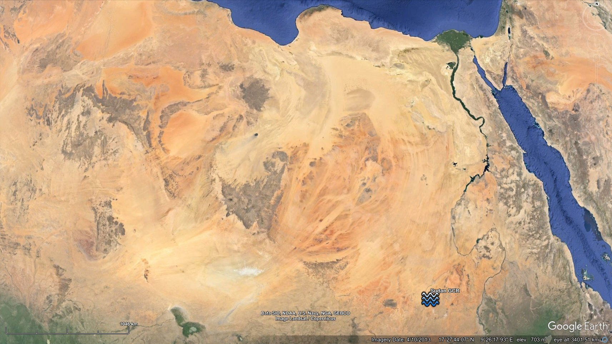

# Water flow structures

Have some in North Sudan, Altai mountains (Russia), France, Argentina, and Chile.

## English channel megafloods

Beneath the water of the English Channel lies evidence of two megaflood events.

[1] Catastrophic flooding origin of shelf valley systems in the English Channel, Gupta et al (2007)
https://nature.com/articles/nature06018

## Rolling hills of the Palouse [2]

"While the majority of scholars support the wind-borne origin of the Palouse loess formations, the minority position advocating for a water-laid origin is supported by substantial geomorphological and sedimentological evidence. The presence of buried paleosols, alluvial loesses, and hydrological features like perched water tables provide compelling arguments for reconsidering the role of water in the formation of these distinctive landscapes." [1]

Spectacular. After many hours now of going through megaflood literature and looking at hundreds of erosion and accretion photos, I'd say that that is pretty much without a doubt the result of alluvial accretion and erosion by water.

Another pic. It seems fairly well accepted that this entire area in WA was deluged (albeit that the uniformitarians insist that the water came from ice lakes breaking out). The entire state bears the marks of water.

## Palouse Falls

Here is a park called Palouse Falls, you can see what looks like multiple washes or perhaps different strata layers that resisted the water in different ways?

https://lidarportal.dnr.wa.gov/#46.65966:-118.23071:16

https://parks.wa.gov/find-parks/state-parks/palouse-falls-state-park-heritage-site

## Nebraska

In Nebraska, some 400km northeast of Pike's Peak is an area of more than 16,000 square miles of what appear to be mega current ripples, averaging 1.6km between peaks, and 50-60m depth (30km sample). These are of similar size to those seen in Sudan and Mauritania.

See `img/nebraska.m4v`.

https://maps.app.goo.gl/qXphUr5inUsEAGja8

The Loup River lies to the southeast of the Nebraska megaripples, and can be clearly seen as the downstream drainage basin from the sand hills when viewed on a digital elevation map. In Channel Patterns and Terraces of the Loup Rivers in Nebraska (1964) we find observations of the Elba Terrace, a 120 foot thick floodplain alluvial deposit laid down around or after the YDB (with two lesser, later ones laid on top of it nearer to the river's present course).

https://pubs.usgs.gov/pp/0422d/report.pdf

## France MCR [2]

Contrast enhanced elevation data [1,2]. Current ripple period is ±500m. Amplitude is 5-7m. Total area ±2,500 square kilometres. Red marker is Versailleaux for reference. The intervening land between the morphology location and the ocean to both the north and the south rises little more than 450m elevation above sea level [3]. How could a sheet flow from a glacial lake bursting have produced morphology on this scale in this terrain? The water would have had to have been >1km deep, and not pooled, but moving. For reference, lake Missoula is estimated to have been 600m deep, and its catastrophic outflows are presumed to have created the Channeled Scablands' 60m-period giant current ripples under a 50m deep water flow. ECDO Europe detail for reference [4]

1. https://code.earthengine.google.com/9a58abb11419602f54e625808666feb7
2. see above
3. https://maps.app.goo.gl/6BDqkjcwCDwNV6hZ9
4. https://theethicalskeptic.com/2024/05/23/master-exothermic-core-mantle-decoupling-dzhanibekov-oscillation-theory/

Note the the standing waves in the flow on the right side of the Niagara Falls image in the sheet flow leading up to the drop [1], and compare to the French ripples [2]. The Niagara current ripples can also be clearly seen to be "standing" in this drone footage [3]. Laboratory and computational fluid model observations of the turbulent development of counter-flow vortices within laminar flows [4,5,6] - the current ripple builders. The mechanism by which this (and other) large-scale ripple morphologies come about, I suspect. [7]

4. https://researchgate.net/profile/Bharat-Bhushan-21/publication/46380838_Shark-Skin_Surfaces_for_Fluid-Drag_Reduction_in_Turbulent_Flow_A_Review
5. https://researchgate.net/profile/Saber-Abdelaal/publication/315819318_Breaching_of_Coastal_Barriers_under_Extreme_Storm_Surges_and_Implications_for_Groundwater_Contamination_Improvement_and_Extension_of_the_XBeach_Model_to_Account_for_New_Physical_Processes
6. https://x.com/nobulart/status/1813868832643051690

## Sudan [2]

If megafloods were all the result of outflows from glacial lakes, then what are [these bad boys](https://maps.app.goo.gl/oxieyw9w9C6P2Evz6) doing 15 degrees north of the equator in Sudan? They look like GCR's [Giant Current Ripples (https://en.wikipedia.org/wiki/Giant_current_ripples)] with an average 555m between troughs, and heights of 10m. They do not appear to be sand dunes - they're too shallow and they've remained static for at least the last 40 years according to available imagery. 

Using the GCR chord length [equation](https://pubs.geoscienceworld.org/gsa/books/book/275/chapter-abstract/3795280/Paleohydrology-and-Sedimentology-of-Lake-Missoula) to determine water depth based on ripple size, [I arrive at a water depth of 1,200m](https://chatgpt.com/share/6c38d048-e4fa-4e39-911d-bce8caf0eef4). I used a 10km long sample to determine average slope (0.0018) and chord length (555m).

The Sahara looks like one of the largest megafloodplains on the planet, with obvious flows thousands of kilometers wide running to the south and the west.

ChatGPT GCR speed deduction: *"Could definitely be correct. The water from the med would likely reach Sudan during the latter half of the rotation, during which time the movement will be decelerating. The water velocity would start to synchronize with the crustal rotation at this point and many flows would be deep but relatively slow moving."* [1]

## Altai Mountains Russia

The Altai Mountains in Siberia are a overflowing with megaflood evidence.

https://en.wikipedia.org/wiki/Giant_current_ripples

### Taklamakan Desert, China

May just be sand dunes. Coords (40, 86.3).

*"These look very much like the work of the wind to me."* [2]

## Drake Passage [2]

In Chile & Argentina are found Mega Current Ripples (500m period, 10m amplitude), an abundance of salt pan deposits, and what looks like at least two large rills which have been eroded by the northeast to southwest flow during the transition from State 1 to State 2.

## Citations

1. ScholarAI
2. Craig Stone