# Mega Current Ripples

## Nebraska

In Nebraska, some 400km northeast of Pike's Peak is an area of more than 16,000 square miles of what appear to be mega current ripples, averaging 1.6km between peaks, and 50-60m depth (30km sample). These are of similar size to those seen in Sudan and Mauritania.

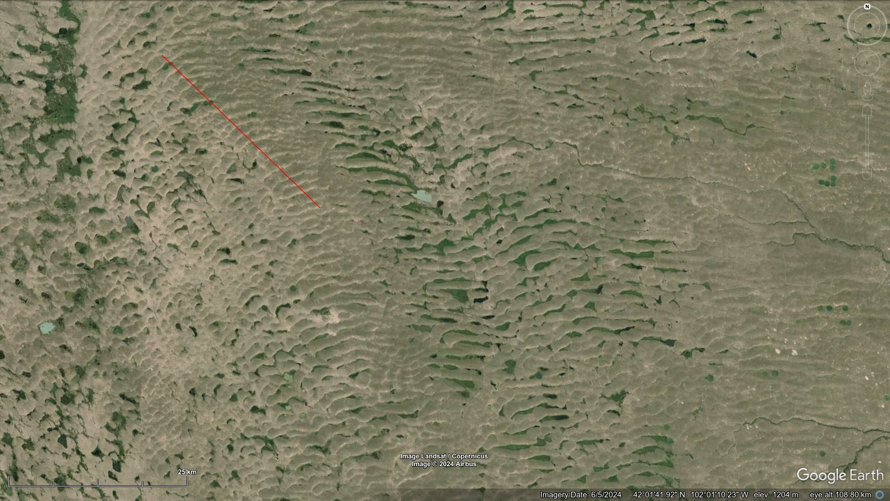

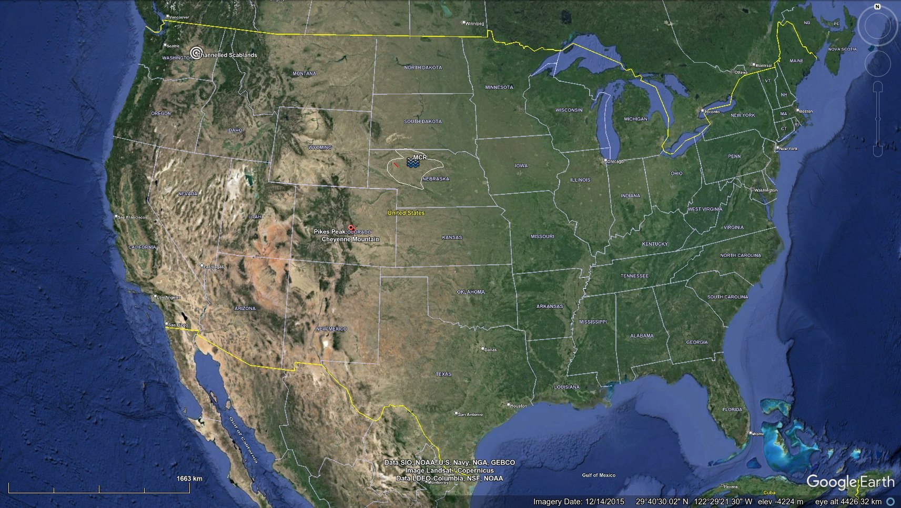

Bringing some sense of scale to the Nebraska mega-ripple morphology. Red line is 30km. https://t.co/4rR2RRbeYq

See `img/nebraska.m4v`.

https://maps.app.goo.gl/qXphUr5inUsEAGja8

The Loup River lies to the southeast of the Nebraska megaripples, and can be clearly seen as the downstream drainage basin from the sand hills when viewed on a digital elevation map. In Channel Patterns and Terraces of the Loup Rivers in Nebraska (1964) we find observations of the Elba Terrace, a 120 foot thick floodplain alluvial deposit laid down around or after the YDB (with two lesser, later ones laid on top of it nearer to the river's present course).

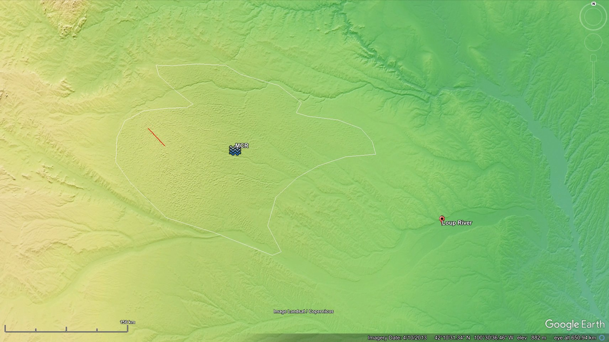
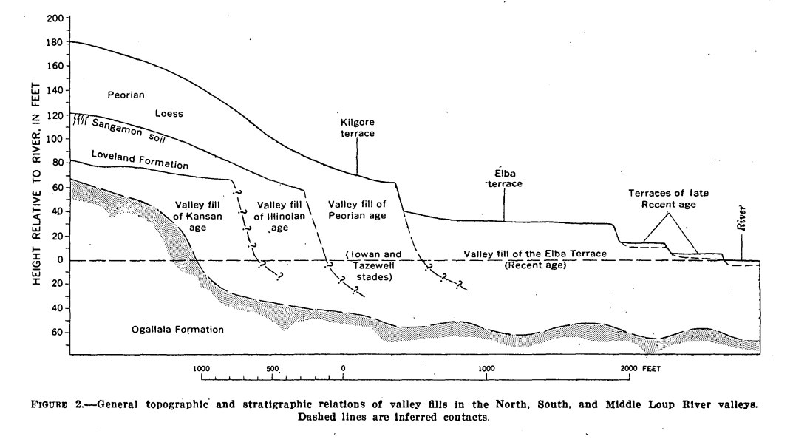
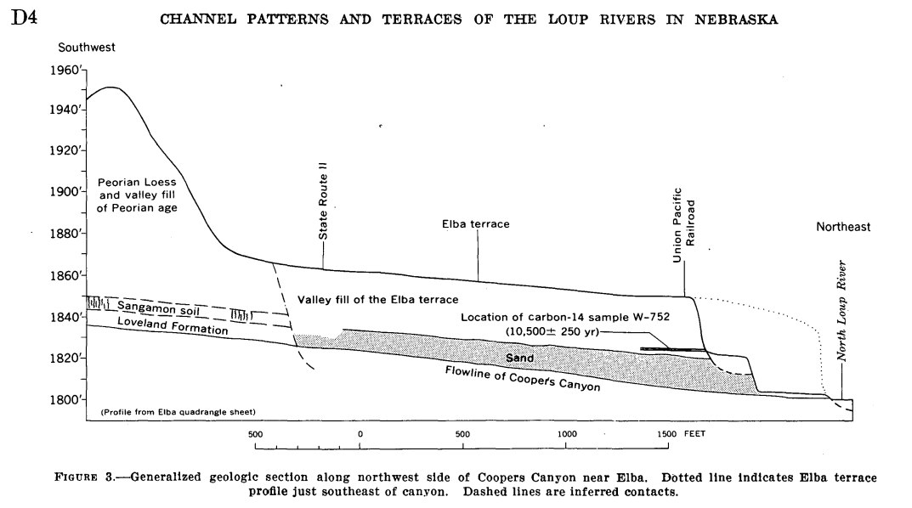

https://pubs.usgs.gov/pp/0422d/report.pdf

### The scale of erosion and...

The scale of erosion and alluvial deposition seen in the northern Nebraska sand hills would require sufficient rainfall to saturate the sandy ground: this is a whopping 240mm (9.5 inches) per hour, in an area that receives less than 700mm per year. Rain did not do this. [1]… https://t.co/IAWYTchKKE

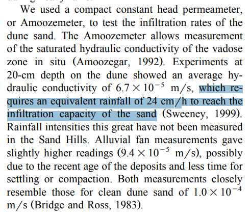

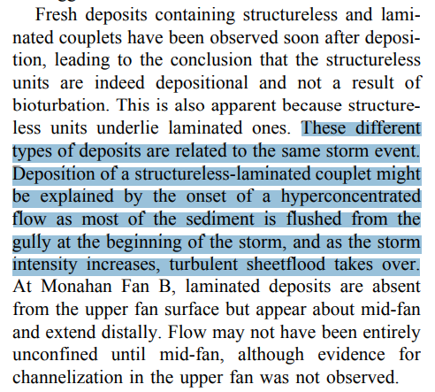

### The Loup River lies to...

The Loup River lies to the southeast of the Nebraska megaripples, and can be clearly seen as the downstream drainage basin from the sand hills when viewed on a digital elevation map. In Channel Patterns and Terraces of the Loup Rivers in Nebraska (1964) we find observations of… https://t.co/E5sOV9VIwN https://t.co/N26W03DeUd

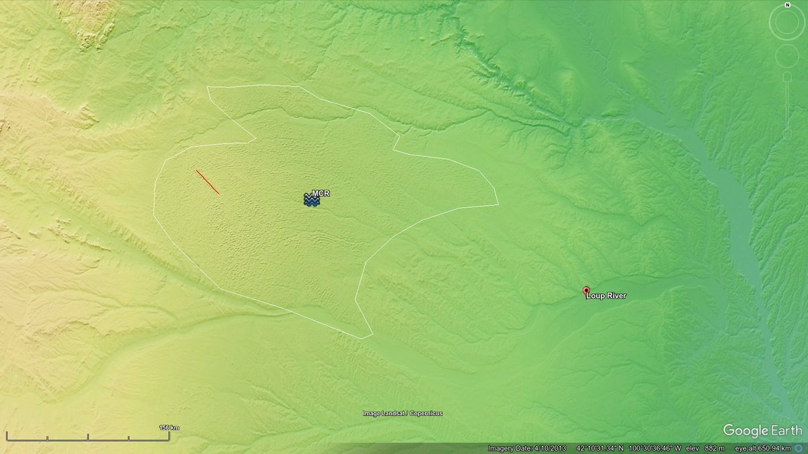

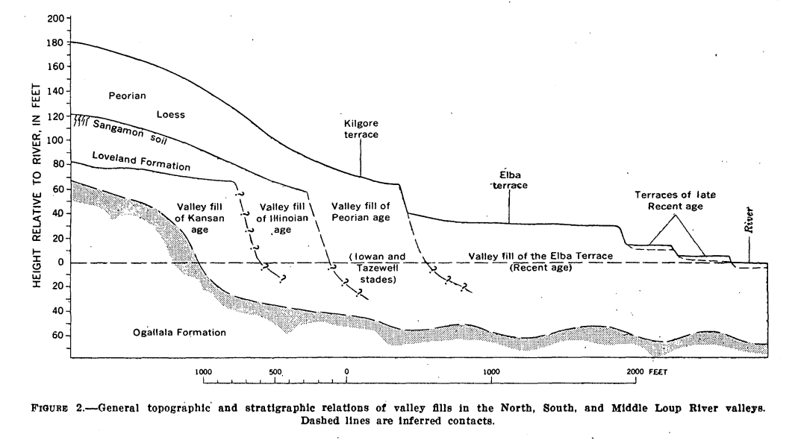

## Altai Mountains Russia

The Altai Mountains in Siberia are a overflowing with megaflood evidence.

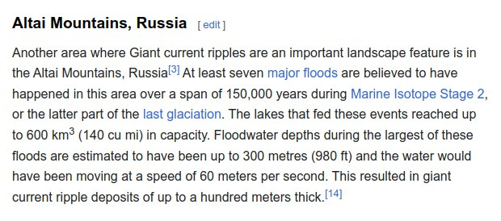
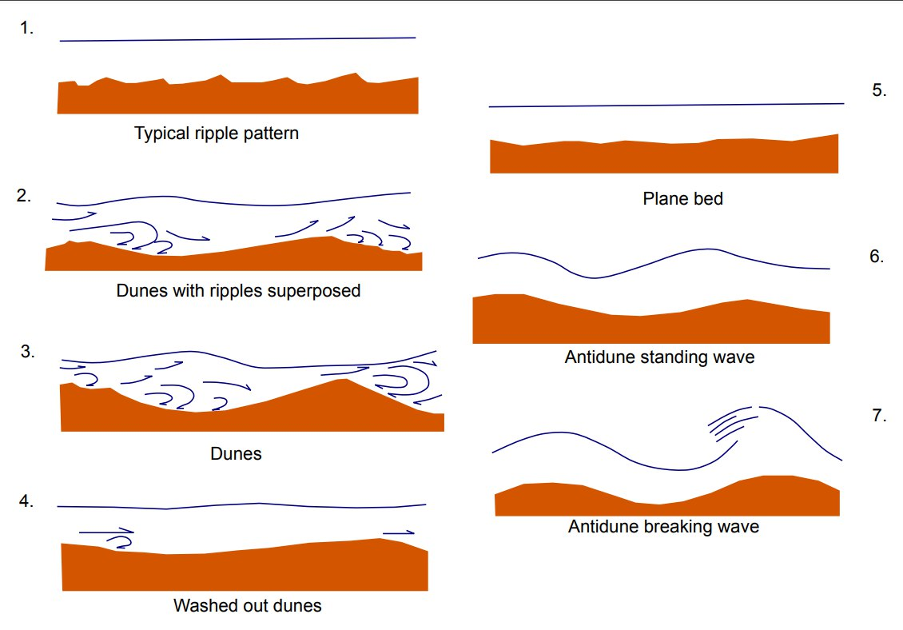
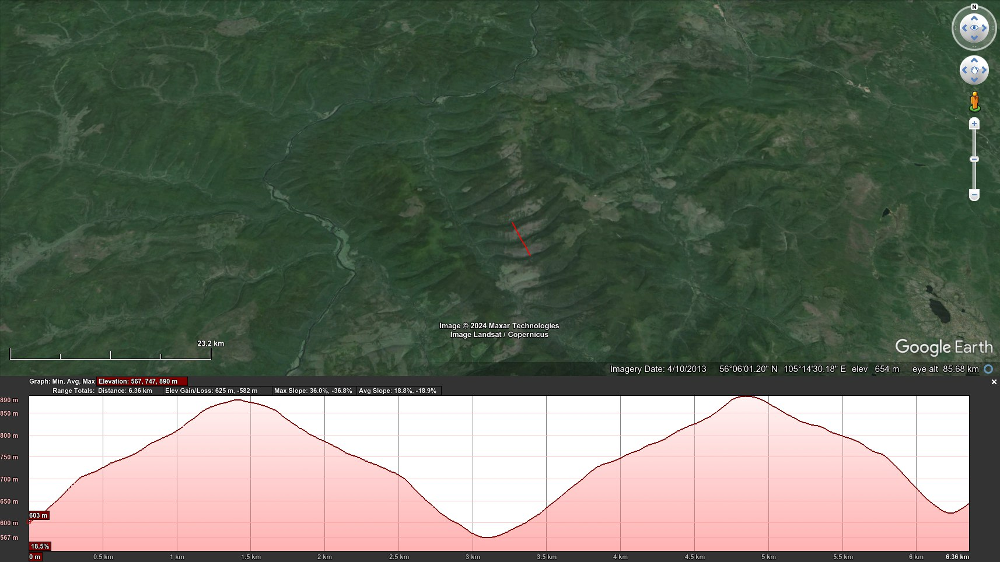
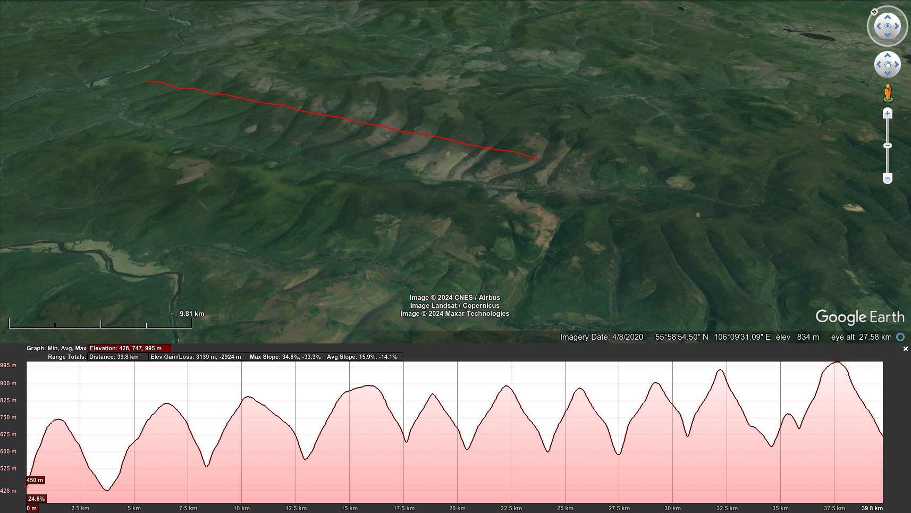

https://en.wikipedia.org/wiki/Giant_current_ripples

## Mauritania: Mega Current Ripples? [1]...

Mauritania: Mega Current Ripples? [1] For visual comparison: The largest sand dunes in the world, in terms of width from crest to crest, are most likely those located in the Badain Jaran Desert in China. These dunes span up to 3 kilometers from one crest to another. [2][3]… https://t.co/xXGx39tH1U

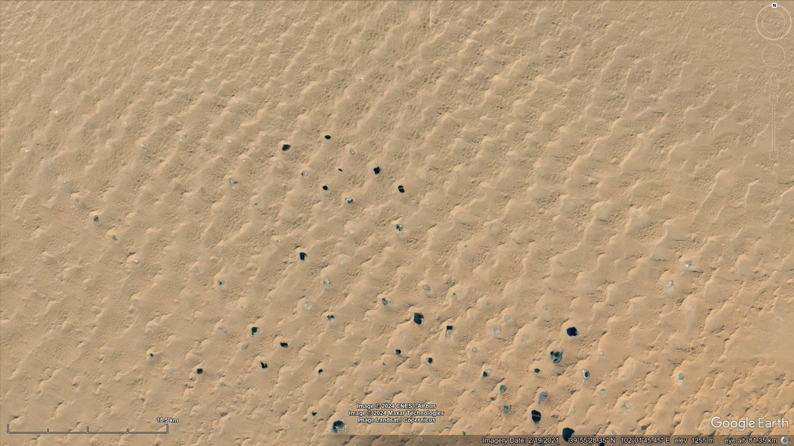

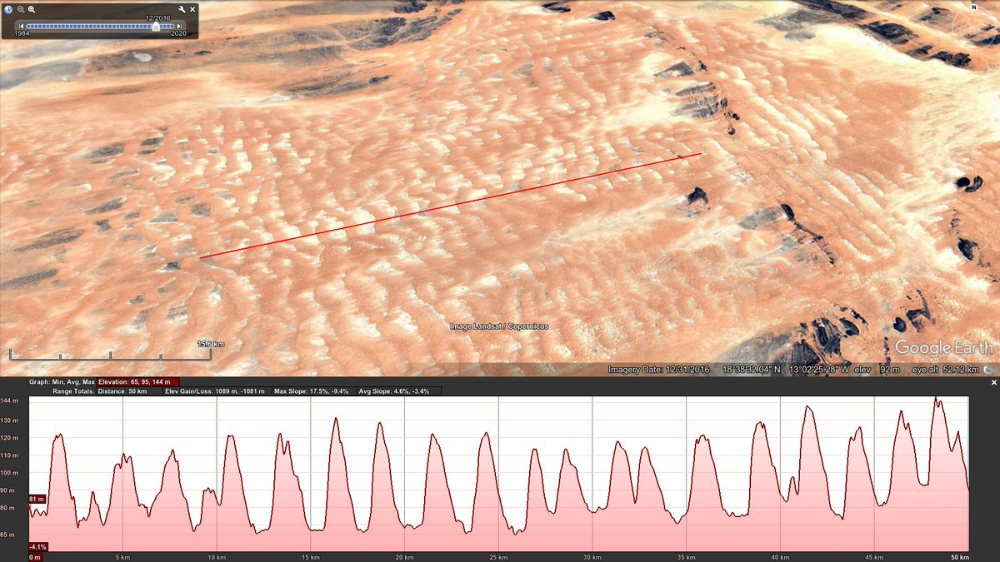

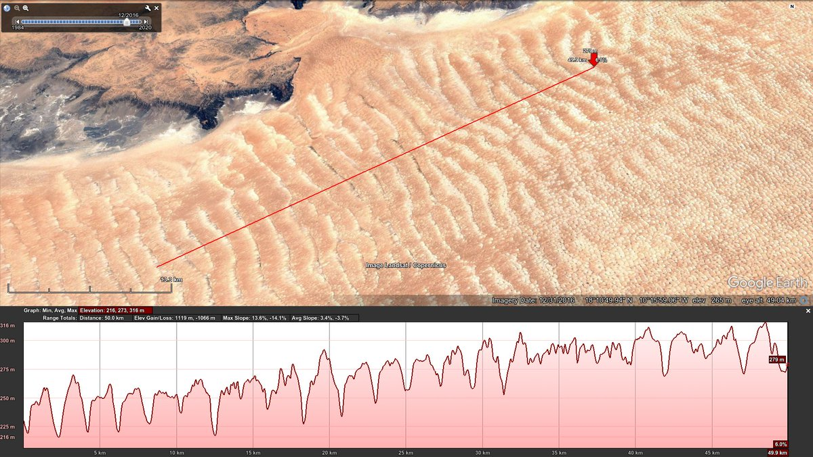

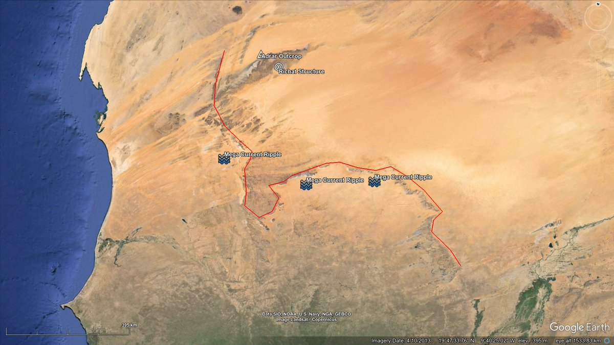