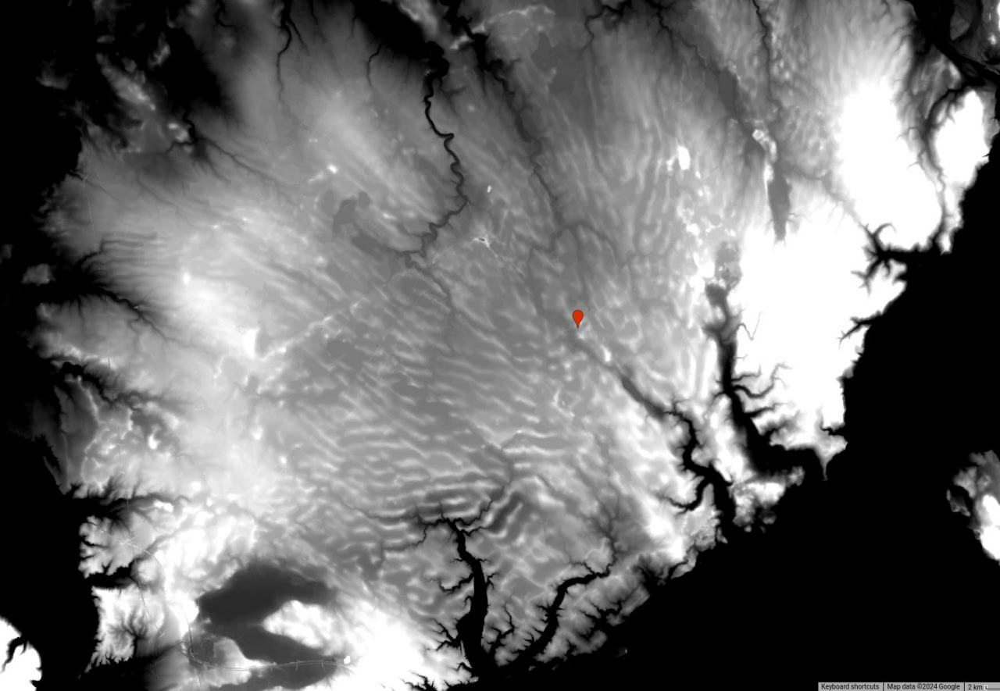
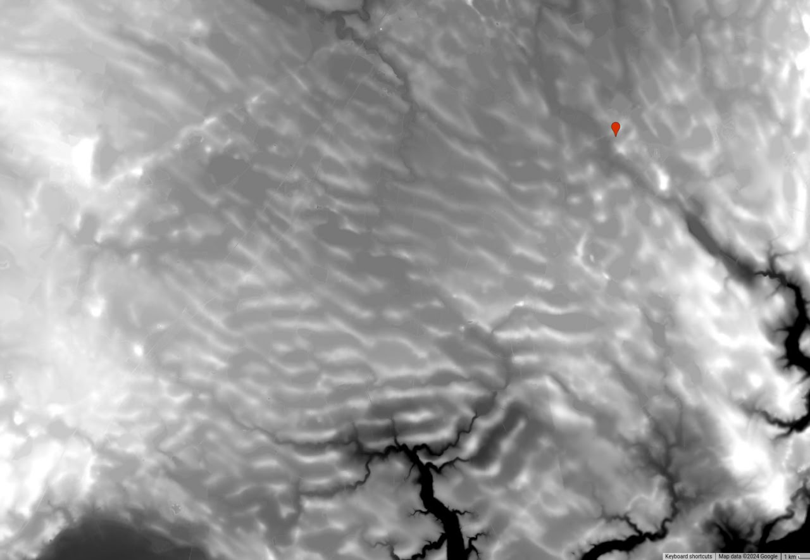
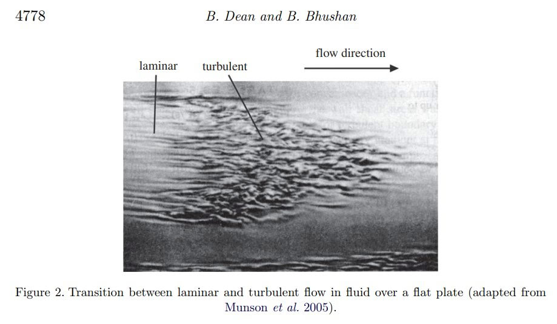
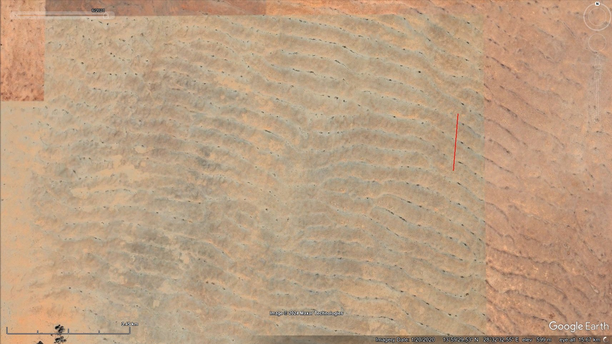
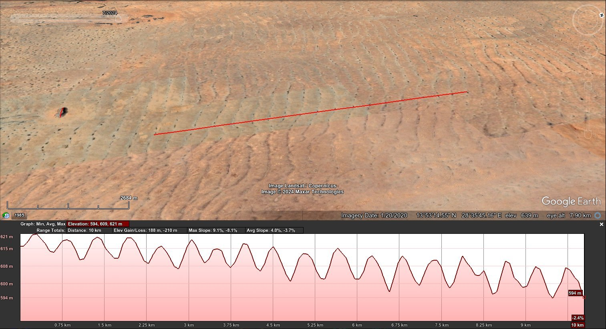
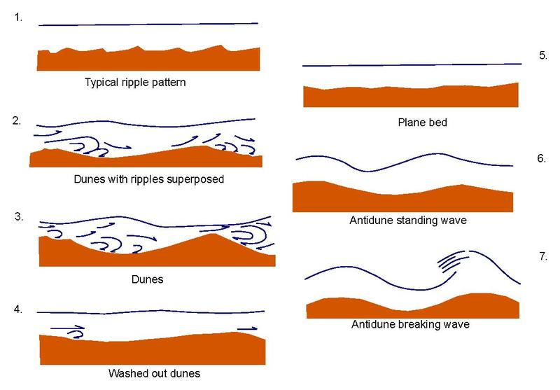
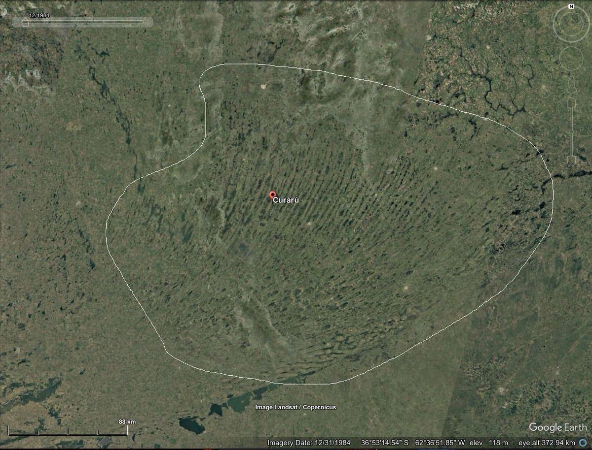
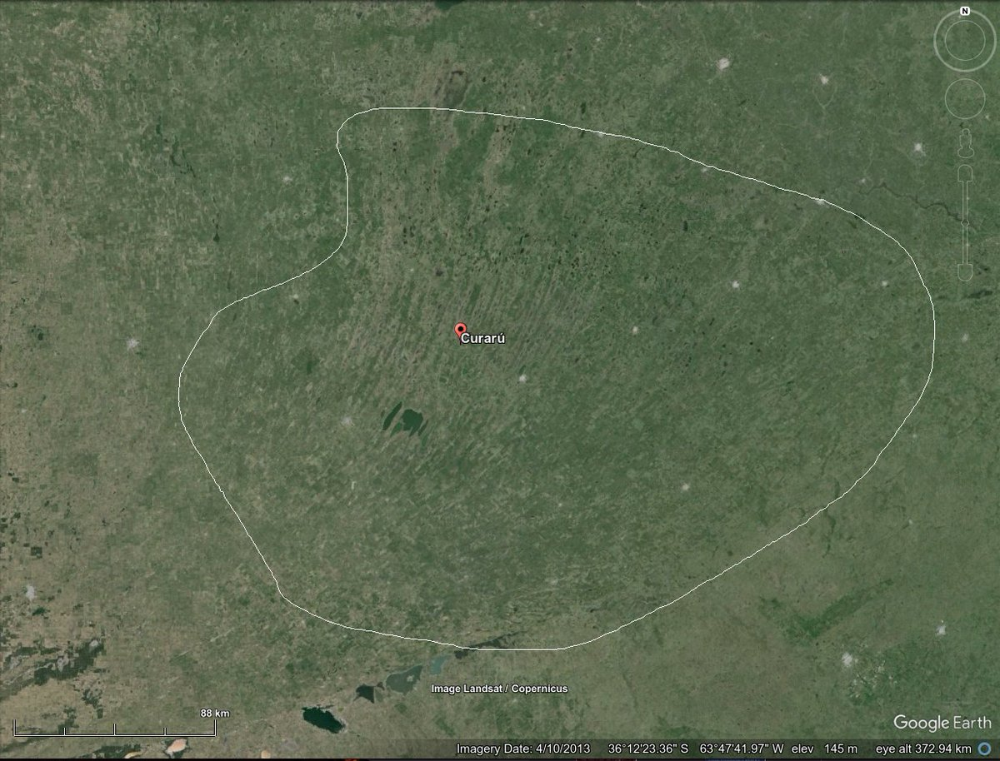
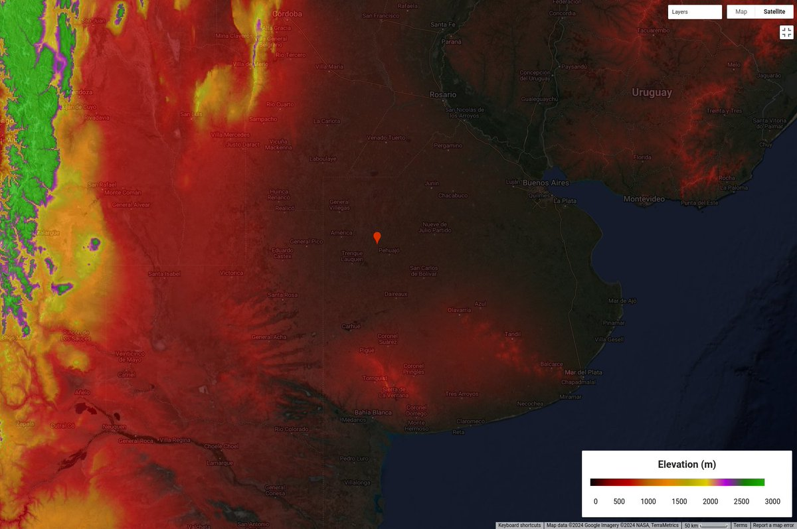
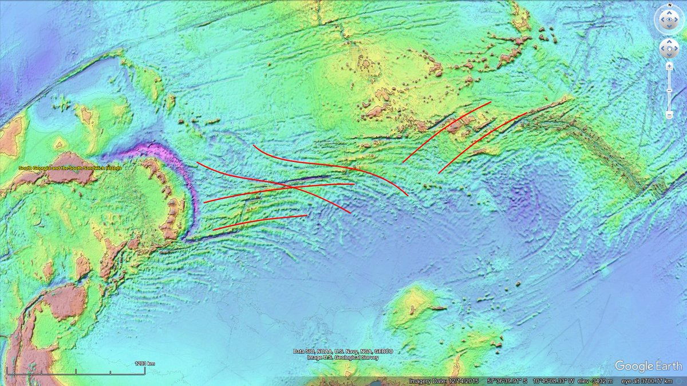

# Mega Current Ripples

## Nebraska

In Nebraska, some 400km northeast of Pike's Peak is an area of more than 16,000 square miles of what appear to be mega current ripples, averaging 1.6km between peaks, and 50-60m depth (30km sample). These are of similar size to those seen in Sudan and Mauritania.

Bringing some sense of scale to the Nebraska mega-ripple morphology. Red line is 30km. https://t.co/4rR2RRbeYq

See `img/nebraska.m4v`.

https://maps.app.goo.gl/qXphUr5inUsEAGja8

The Loup River lies to the southeast of the Nebraska megaripples, and can be clearly seen as the downstream drainage basin from the sand hills when viewed on a digital elevation map. In Channel Patterns and Terraces of the Loup Rivers in Nebraska (1964) we find observations of the Elba Terrace, a 120 foot thick floodplain alluvial deposit laid down around or after the YDB (with two lesser, later ones laid on top of it nearer to the river's present course).

https://pubs.usgs.gov/pp/0422d/report.pdf

### The scale of erosion and...

The scale of erosion and alluvial deposition seen in the northern Nebraska sand hills would require sufficient rainfall to saturate the sandy ground: this is a whopping 240mm (9.5 inches) per hour, in an area that receives less than 700mm per year. Rain did not do this. [1]… https://t.co/IAWYTchKKE

### The Loup River lies to...

The Loup River lies to the southeast of the Nebraska megaripples, and can be clearly seen as the downstream drainage basin from the sand hills when viewed on a digital elevation map. In Channel Patterns and Terraces of the Loup Rivers in Nebraska (1964) we find observations of… https://t.co/E5sOV9VIwN https://t.co/N26W03DeUd

## France MCR [2]

Contrast enhanced elevation data [1,2]. Current ripple period is ±500m. Amplitude is 5-7m. Total area ±2,500 square kilometres. Red marker is Versailleaux for reference. The intervening land between the morphology location and the ocean to both the north and the south rises little more than 450m elevation above sea level [3]. How could a sheet flow from a glacial lake bursting have produced morphology on this scale in this terrain? The water would have had to have been >1km deep, and not pooled, but moving. For reference, lake Missoula is estimated to have been 600m deep, and its catastrophic outflows are presumed to have created the Channeled Scablands' 60m-period giant current ripples under a 50m deep water flow. ECDO Europe detail for reference [4]

1. https://code.earthengine.google.com/9a58abb11419602f54e625808666feb7
2. see above
3. https://maps.app.goo.gl/6BDqkjcwCDwNV6hZ9
4. https://theethicalskeptic.com/2024/05/23/master-exothermic-core-mantle-decoupling-dzhanibekov-oscillation-theory/

Note the the standing waves in the flow on the right side of the Niagara Falls image in the sheet flow leading up to the drop [1], and compare to the French ripples [2]. The Niagara current ripples can also be clearly seen to be "standing" in this drone footage [3]. Laboratory and computational fluid model observations of the turbulent development of counter-flow vortices within laminar flows [4,5,6] - the current ripple builders. The mechanism by which this (and other) large-scale ripple morphologies come about, I suspect. [7]

4. https://researchgate.net/profile/Bharat-Bhushan-21/publication/46380838_Shark-Skin_Surfaces_for_Fluid-Drag_Reduction_in_Turbulent_Flow_A_Review
5. https://researchgate.net/profile/Saber-Abdelaal/publication/315819318_Breaching_of_Coastal_Barriers_under_Extreme_Storm_Surges_and_Implications_for_Groundwater_Contamination_Improvement_and_Extension_of_the_XBeach_Model_to_Account_for_New_Physical_Processes
6. https://x.com/nobulart/status/1813868832643051690

## Sudan [2]

If megafloods were all the result of outflows from glacial lakes, then what are [these bad boys](https://maps.app.goo.gl/oxieyw9w9C6P2Evz6) doing 15 degrees north of the equator in Sudan? They look like GCR's [Giant Current Ripples (https://en.wikipedia.org/wiki/Giant_current_ripples)] with an average 555m between troughs, and heights of 10m. They do not appear to be sand dunes - they're too shallow and they've remained static for at least the last 40 years according to available imagery. 

Using the GCR chord length [equation](https://pubs.geoscienceworld.org/gsa/books/book/275/chapter-abstract/3795280/Paleohydrology-and-Sedimentology-of-Lake-Missoula) to determine water depth based on ripple size, [I arrive at a water depth of 1,200m](https://chatgpt.com/share/6c38d048-e4fa-4e39-911d-bce8caf0eef4). I used a 10km long sample to determine average slope (0.0018) and chord length (555m).

If these are GCR's, then they may be the largest found to date. They dwarf those seen in the Channeled Scablands by a factor of 10 on the chord length.

The Sahara looks like one of the largest megafloodplains on the planet, with obvious flows thousands of kilometers wide running to the south and the west.

ChatGPT GCR speed deduction: *"Could definitely be correct. The water from the med would likely reach Sudan during the latter half of the rotation, during which time the movement will be decelerating. The water velocity would start to synchronize with the crustal rotation at this point and many flows would be deep but relatively slow moving."* [1]

### The exposed portion of this...

The exposed portion of this rock (a little further south) is 700m wide and 50m high. Note what appears to be a teardrop form to the south of the obstruction. Quite reminiscent of flow evidence most clearly seen on Mars. [1] https://t.co/8MMrYI9qoU [2] https://t.co/ISrwrsbq4D https://t.co/DuJL0oQCRX

### Many more a little further...

Many more a little further south. Width ~700m. Height ~10m. Not the slightest apparent movement since 1984 in the historical imagery. Profiles are a good fit for antidune breaking wave GCR's. [1] https://t.co/YAP73G4dmY [2] https://t.co/Rx18Olwg7w https://t.co/iYH1aqPpML

## Altai Mountains Russia

The Altai Mountains in Siberia are a overflowing with megaflood evidence.

https://en.wikipedia.org/wiki/Giant_current_ripples

## Drake Passage [2]

In Chile & Argentina are found Mega Current Ripples (500m period, 10m amplitude), an abundance of salt pan deposits, and what looks like at least two large rills which have been eroded by the northeast to southwest flow during the transition from State 1 to State 2.

### In Argentina there are 20,000...

In Argentina there are 20,000 square miles of interesting ripple morphology (period: 3-4km, amplitude: unknown) [1] which is all but completely hidden in the most recent satellite images [2] as it has become largely obscured by human activity. The features lie in a shallow basin… https://t.co/rPHNhmQE9u

See img/1813610702960984473-XdLlI_j64VEHtmKh.mp4.

### The "fault lines" to the...

The "fault lines" to the southeast of the Scotia Ridge are curved and running at inclined angles to the straight mid-Atlantic ridge fault lines. Could they perhaps be flow morphology? Further to the east can be seen ripple-like morphology which also looks suspiciously like the… https://t.co/CiVsMrT45S

## Mauritania: Mega Current Ripples? [1]...

Mauritania: Mega Current Ripples? [1] For visual comparison: The largest sand dunes in the world, in terms of width from crest to crest, are most likely those located in the Badain Jaran Desert in China. These dunes span up to 3 kilometers from one crest to another. [2][3]… https://t.co/xXGx39tH1U

