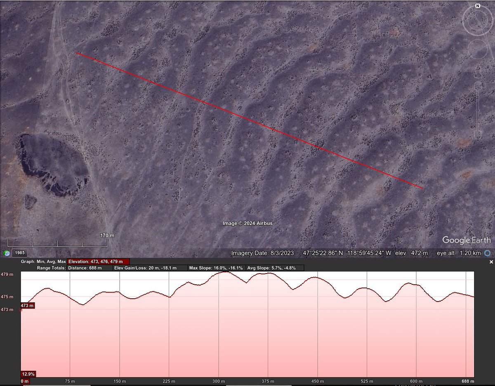
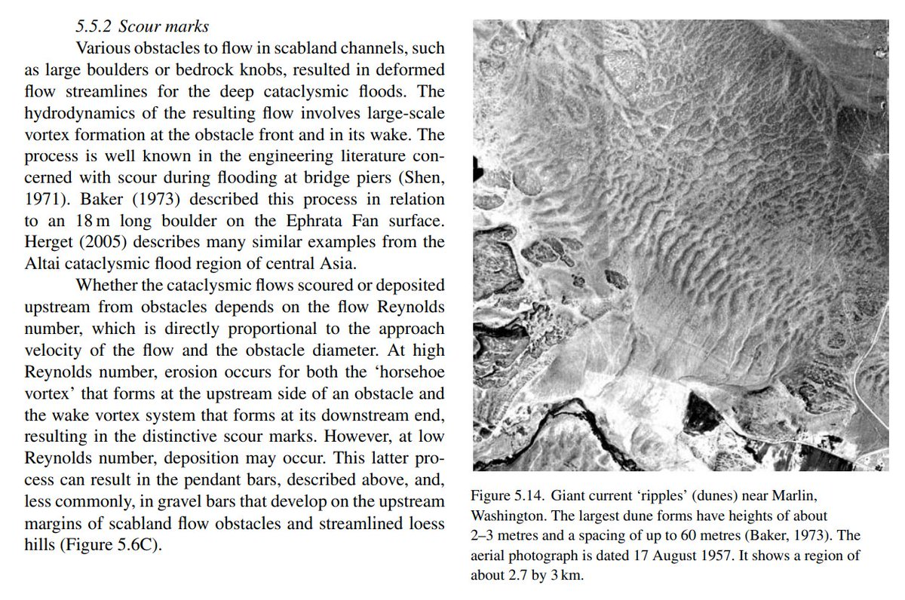
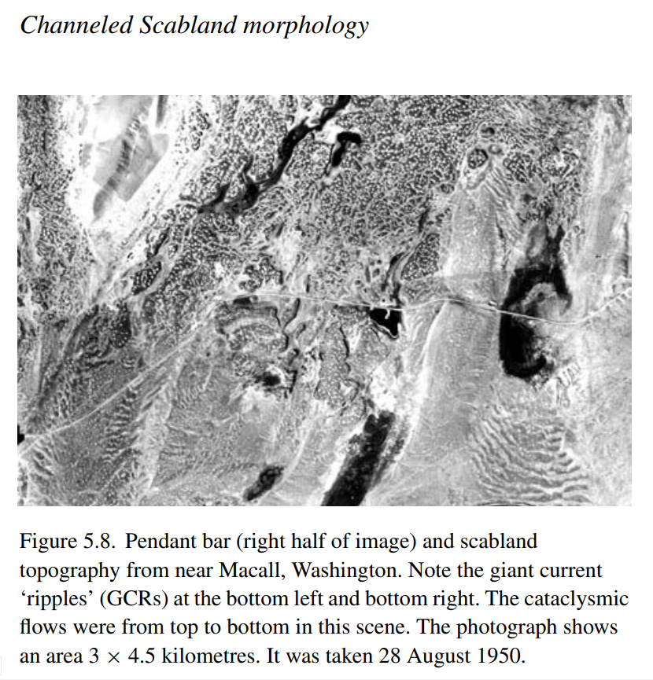
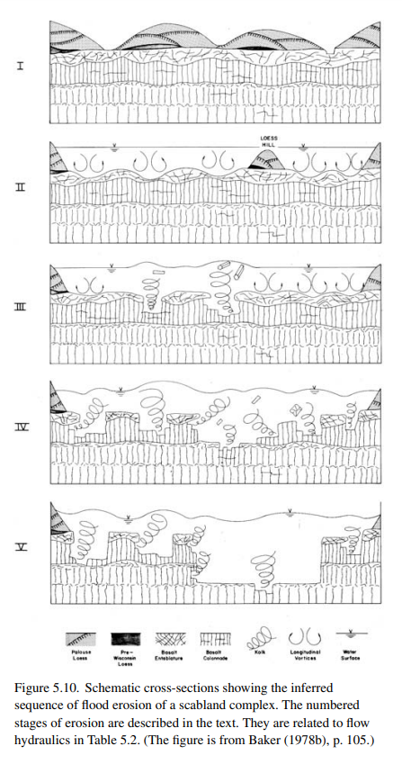
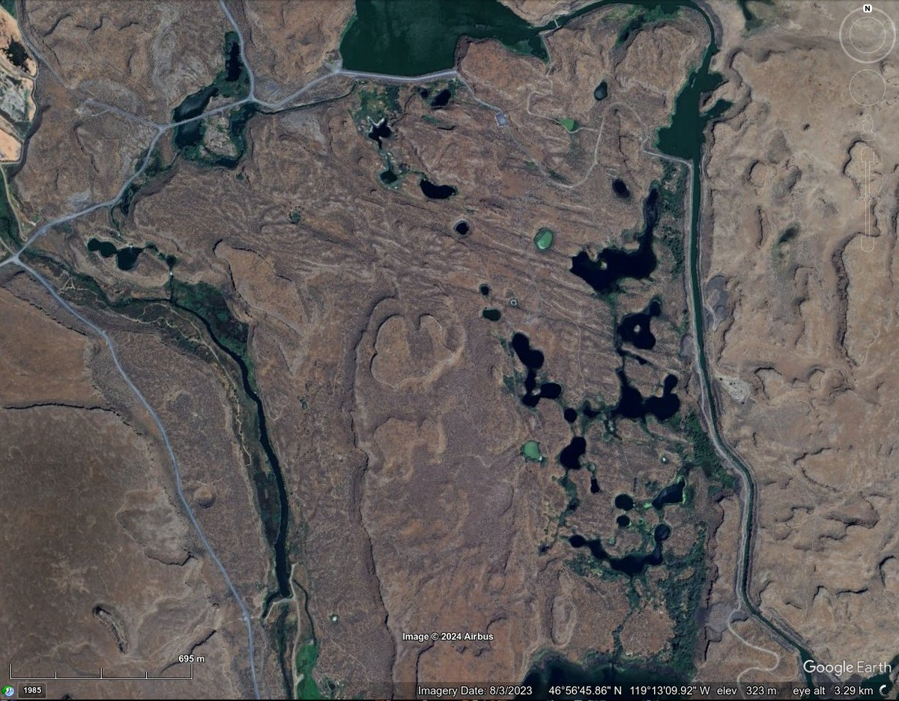
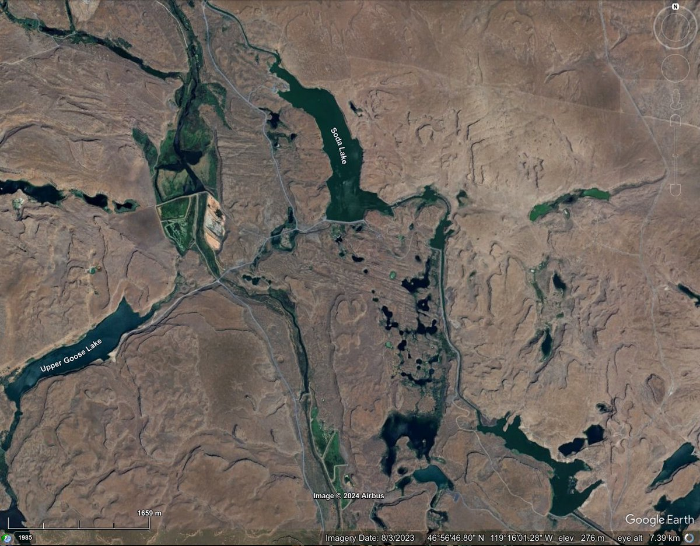
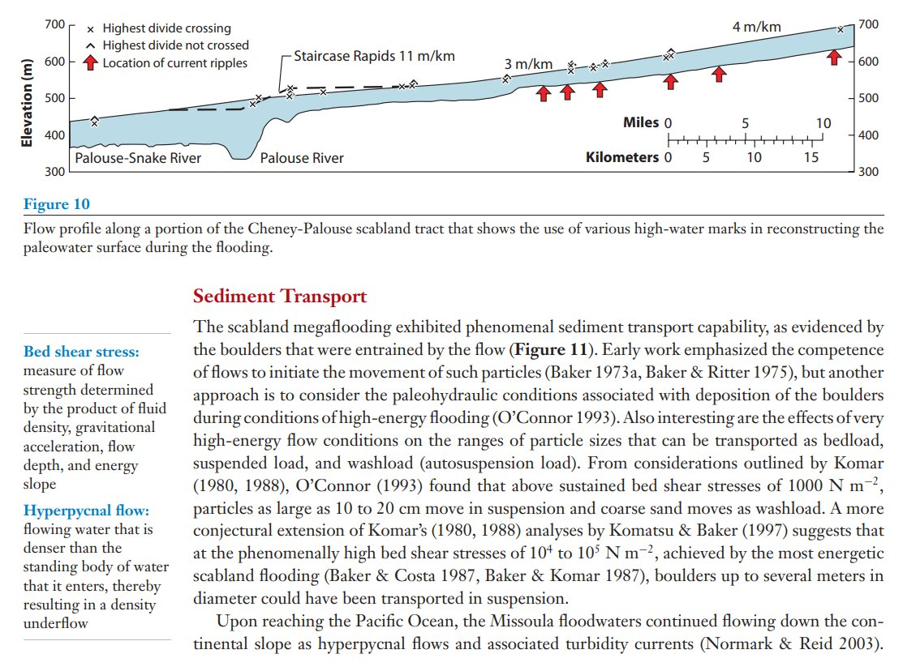
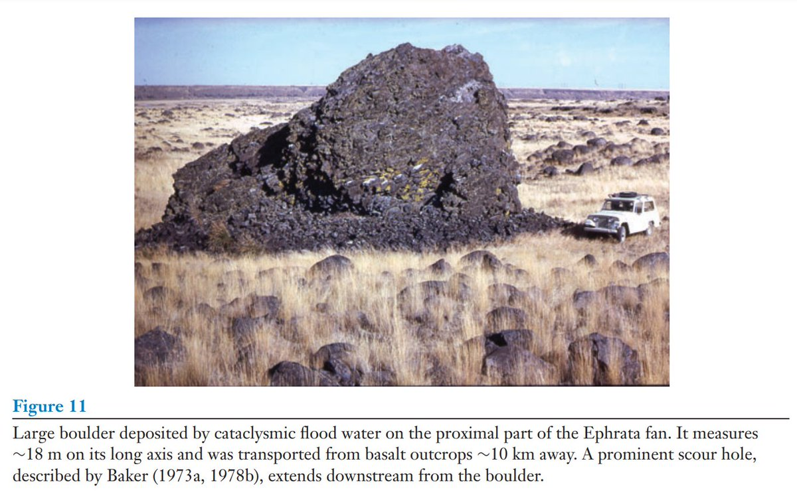

# Chanelled Scablands

## These GCR's (Giant Current Ripples)...

These GCR's (Giant Current Ripples) in the Channelled Scabland (WA) are up to 60m wide, and stand 2m tall. 47°25'25.18" N 118°59'41.73" W https://t.co/3GAGFvDHDN https://t.co/lSn5Yl2b8A

## Massive flows. The terracing would...

Massive flows. The terracing would seem to suggest changes in flow direction between erosion events. Seiche action perhaps. Illustrations from Megaflooding on Earth and Mars || Channeled Scabland morphology (2009) https://t.co/ucsrkslXiz https://t.co/U06AIWdhCM

## Highwater marks indicate water depths...

Highwater marks indicate water depths of up to 50m in the Channelled Scablands megaflood. https://t.co/dpBkvqwYns https://t.co/PvZhDjgzCc

