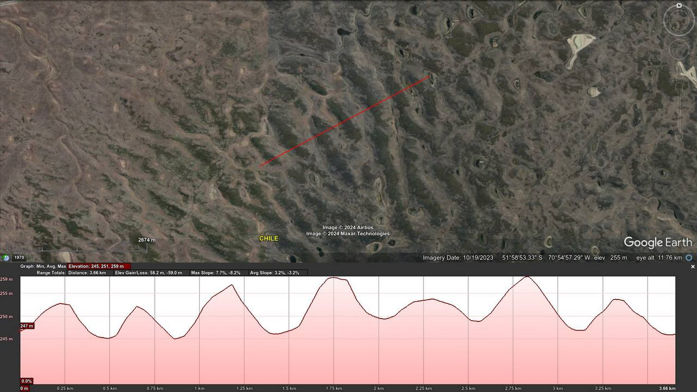

# South America MCR

## Drake Passage [1]

In Chile & Argentina are found Mega Current Ripples (500m period, 10m amplitude), an abundance of salt pan deposits, and what looks like at least two large rills which have been eroded by the northeast to southwest flow during the transition from State 1 to State 2.

### In Argentina there are 20,000...

In Argentina there are 20,000 square miles of interesting ripple morphology (period: 3-4km, amplitude: unknown) [1] which is all but completely hidden in the most recent satellite images [2] as it has become largely obscured by human activity. The features lie in a shallow basin… https://t.co/rPHNhmQE9u

See img/1813610702960984473-XdLlI_j64VEHtmKh.mp4.

### The "fault lines" to the...

The "fault lines" to the southeast of the Scotia Ridge are curved and running at inclined angles to the straight mid-Atlantic ridge fault lines. Could they perhaps be flow morphology? Further to the east can be seen ripple-like morphology which also looks suspiciously like the… https://t.co/CiVsMrT45S

## Citations

1. Craig Stone