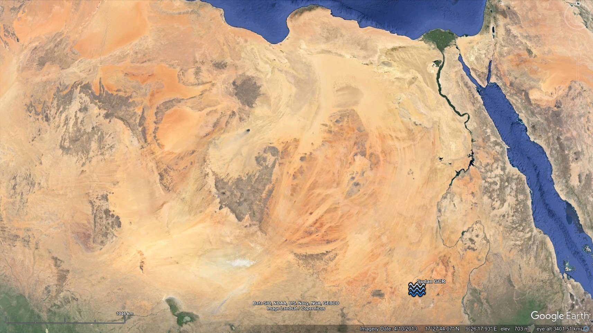
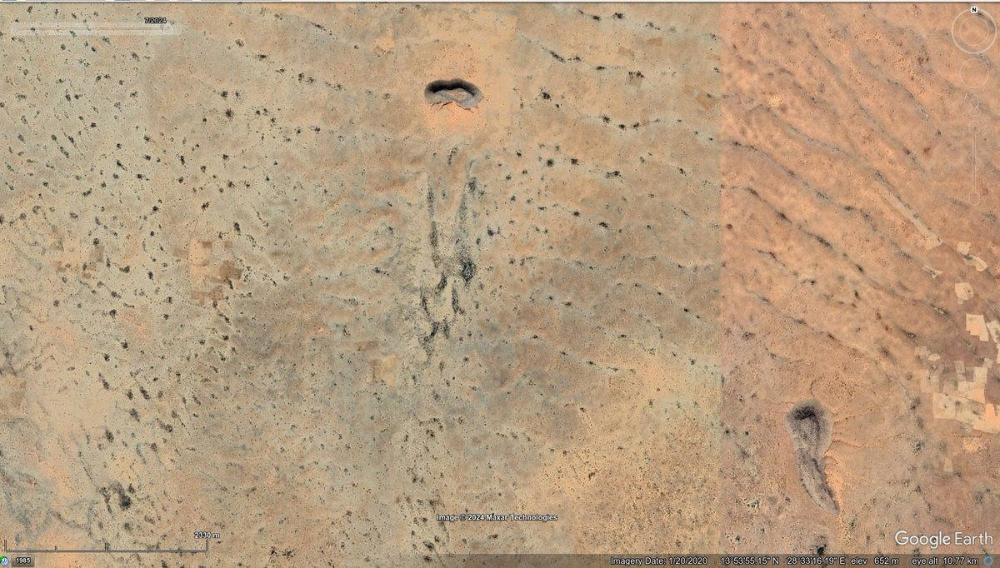
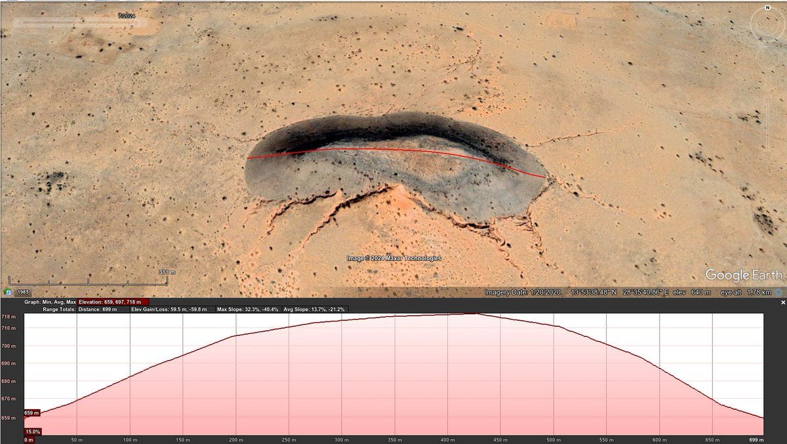
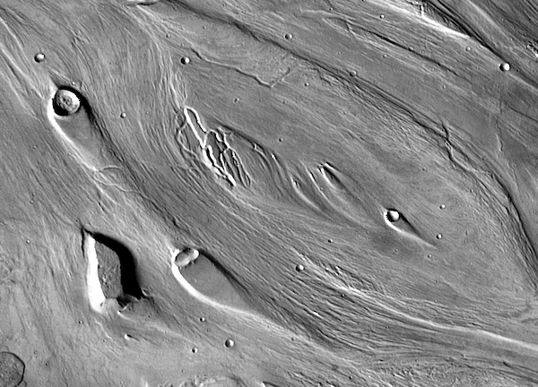
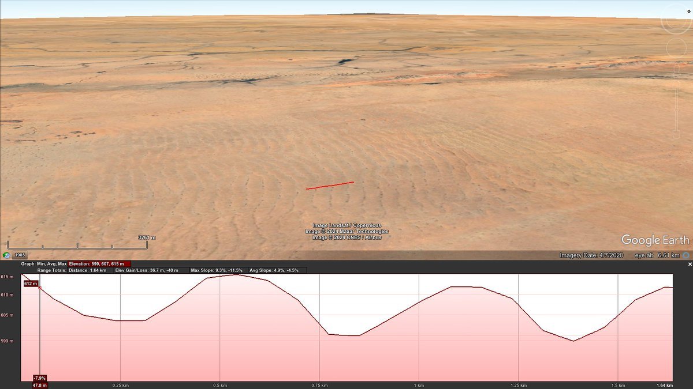
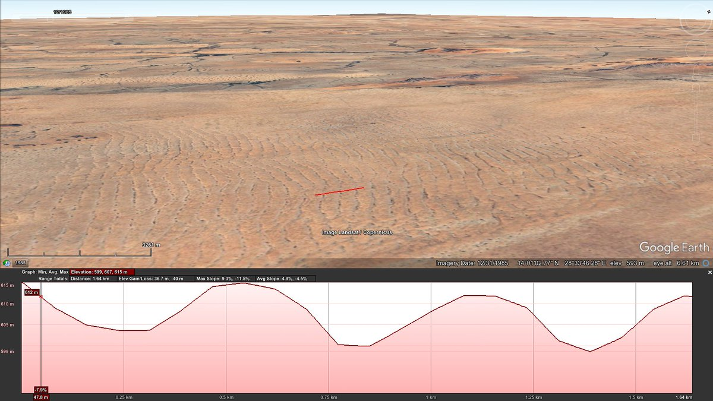
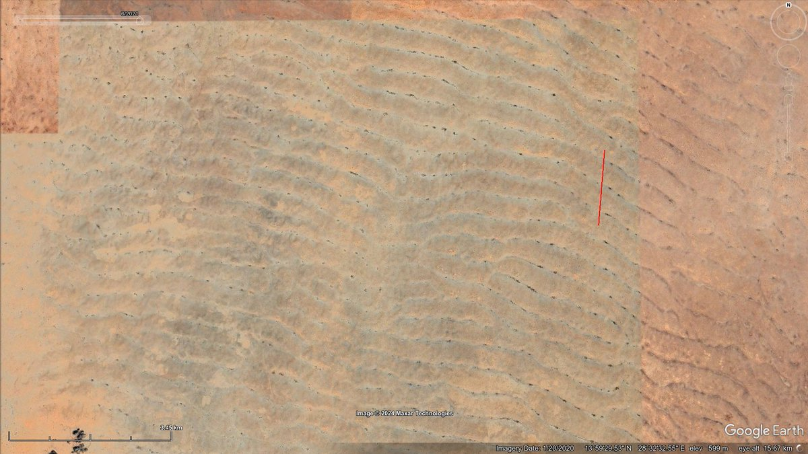
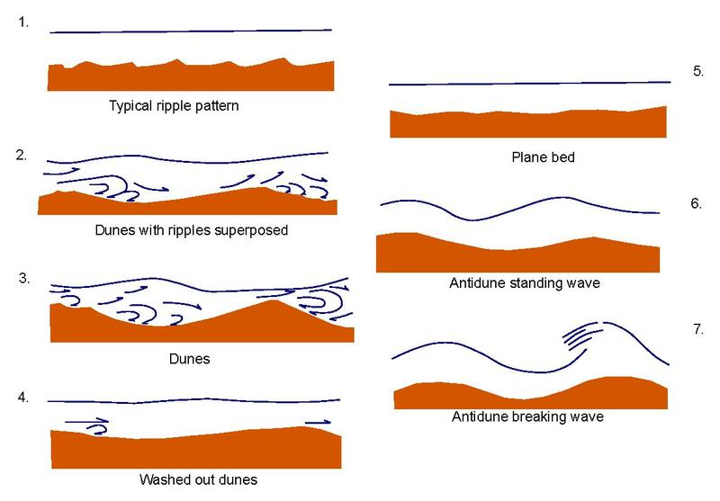

# Sudan MCR

## Sudan [1]

If megafloods were all the result of outflows from glacial lakes, then what are [these bad boys](https://maps.app.goo.gl/oxieyw9w9C6P2Evz6) doing 15 degrees north of the equator in Sudan? They look like GCR's [Giant Current Ripples (https://en.wikipedia.org/wiki/Giant_current_ripples)] with an average 555m between troughs, and heights of 10m. They do not appear to be sand dunes - they're too shallow and they've remained static for at least the last 40 years according to available imagery. 

Using the GCR chord length [equation](https://pubs.geoscienceworld.org/gsa/books/book/275/chapter-abstract/3795280/Paleohydrology-and-Sedimentology-of-Lake-Missoula) to determine water depth based on ripple size, [I arrive at a water depth of 1,200m](https://chatgpt.com/share/6c38d048-e4fa-4e39-911d-bce8caf0eef4). I used a 10km long sample to determine average slope (0.0018) and chord length (555m).

If these are GCR's, then they may be the largest found to date. They dwarf those seen in the Channeled Scablands by a factor of 10 on the chord length.

The Sahara looks like one of the largest megafloodplains on the planet, with obvious flows thousands of kilometers wide running to the south and the west.

ChatGPT GCR speed deduction: *"Could definitely be correct. The water from the med would likely reach Sudan during the latter half of the rotation, during which time the movement will be decelerating. The water velocity would start to synchronize with the crustal rotation at this point and many flows would be deep but relatively slow moving."* [1]

### The exposed portion of this...

The exposed portion of this rock (a little further south) is 700m wide and 50m high. Note what appears to be a teardrop form to the south of the obstruction. Quite reminiscent of flow evidence most clearly seen on Mars. [1] https://t.co/8MMrYI9qoU [2] https://t.co/ISrwrsbq4D https://t.co/DuJL0oQCRX

### Many more a little further...

Many more a little further south. Width ~700m. Height ~10m. Not the slightest apparent movement since 1984 in the historical imagery. Profiles are a good fit for antidune breaking wave GCR's. [1] https://t.co/YAP73G4dmY [2] https://t.co/Rx18Olwg7w https://t.co/iYH1aqPpML

## Citations

1. Craig Stone