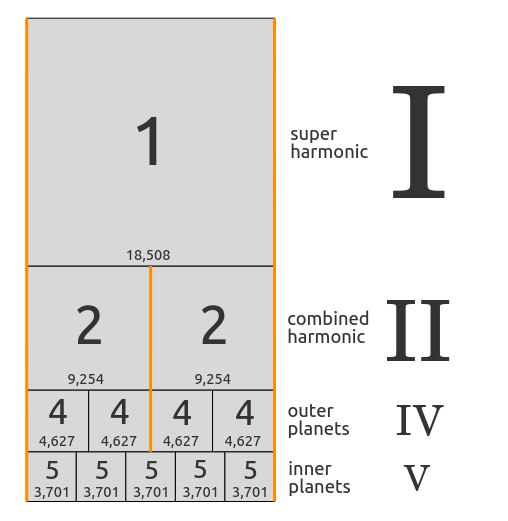
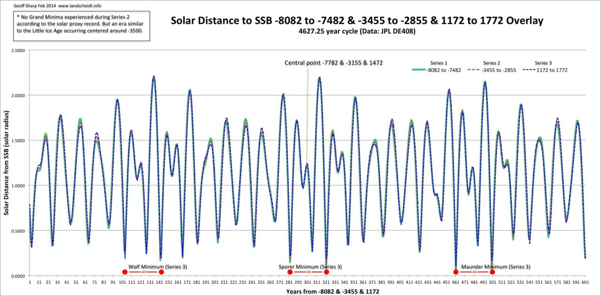
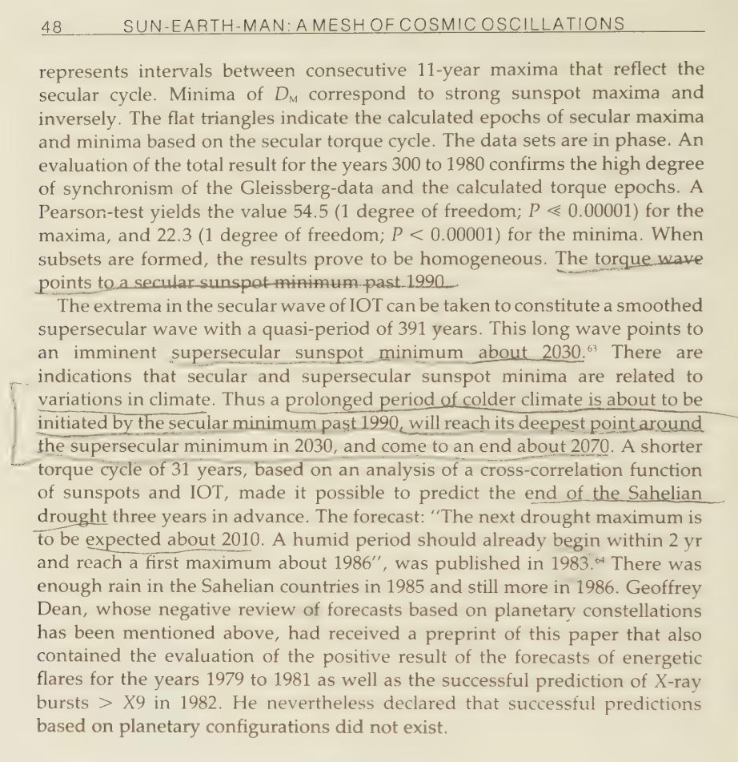
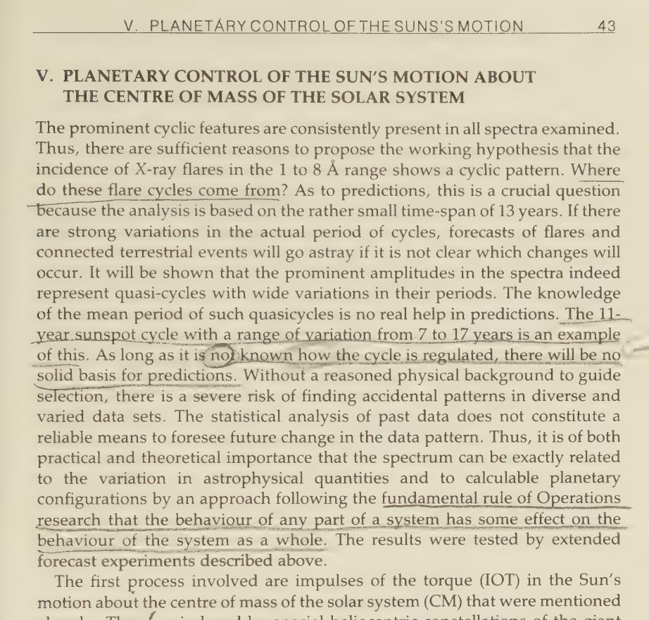
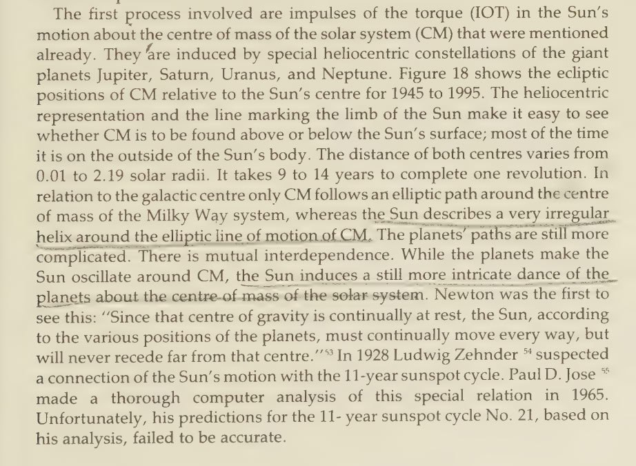
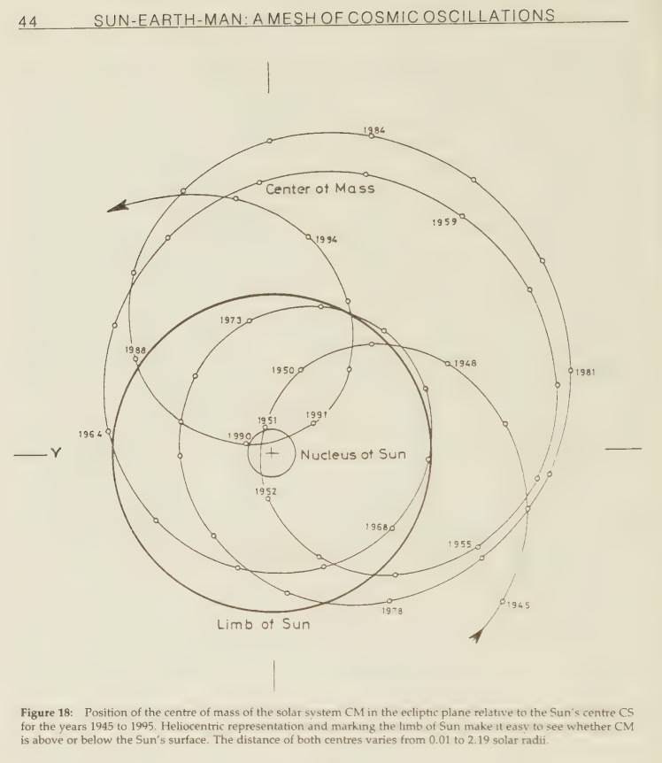

# Solar System

This folder is for evidence from the surrounding solar system that points to potential ECDO events.

## Contents

`encke-comet` contains info about a comet which may be the trigger for the impending ECDO.

# Analysis

## Harmonics [1]

Music of the Spheres. The resonance between the inner and the outer planets is governed by the greater mass. It is the gas giants which established and continue to enforce the fifth harmonic. This system is probably old beyond our wildest imaginings to have achieved this degree of order.
[1] https://nobulart.com/musica-vitae-et-mortis/

## Gas giant harmonic [1]

The JUNS Orbital Cycle (Jupiter-Uranus-Neptune-Saturn) has a grand period of 4,627 years before all four repeat their dance. The 4/5 harmonic of this period is 3701.6 years. If we look back through time, we find something quite remarkable every 3700 years, going back not to the YDB, but one more cycle to the start of the Bølling–Allerød Interstadial 14.8ky before the present. Four cycles over almost 15,000 years. The Swedish varved-clay proxy dated to the start of the Younger Dryas suggests a possible half-wave subcycle as well.
1. https://landshceidt.info
2. https://en.wikipedia.org/wiki/B%C3%B8lling%E2%80%93Aller%C3%B8d_Interstadial
3. See `EVIDENCE/physical-material/land-soil-earth` for varved clay date info.

## Gas giant harmonic compared with ice data

The gas giant harmonic may align well with bond event and ice core-temperature data. Check `physical-material/ice` for that analysis.

## Sun-Earth-Man, Theodor Landscheidt [1]

A prediction from 1988, based in planetary and solar harmonics: "The extrema in the secular wave of IOT [Impulses of Torque on the sun from the gas giants] can be taken to constitute a smoothed supersecular wave with a quasi-period of 391 years. This long wave points to indications that secular and supersecular sunspot minima are related to variations in climate. Thus a prolonged period of colder climate is about to be initiated by the secular minimum past 1990, will reach its deepest point around the supersecular minimum in 2030, and come to an end about 2070." - Sun-Earth-Man, Theodor Landscheidt (1988)

In the heliophysics community Landscheidt's name is well known - there was (and still is) a great deal of support to name this minimum the Landscheidt Minimum. His work complements that of Alexander Chizhevsky, Nicola Scarfetta, Geoff Sharp and Carl Smith. Collectively they have pretty much conclusively identified the relationship between climate cycles (and many other things) and the movements of the gas giants. Their work remains pretty well hidden to this day as it would destroy AGW in an open debate.

And heliobiology, which was Chizhevsky's preferred area - the physical and behavioral effects of solar and cosmic cycles on living things.

[1] https://archive.org/details/sunearthmanmesho0000land

These planetary lulls occurring 40 years apart every 4627 years may be the two moments that the decoupling occurs.

## Astronomical chronology - 3700

"Among the artifacts that can most readily be dated by astronomical techniques are depictions of the positions of the celestial bodies at a particular time. Since the motions of the celestial bodies are all at different periods, it takes many centuries for all the planets plus the Sun and the Moon, to reach the same positions in the signs of the Zodiac. For a configuration accurate to ±15° (that is, within a single sign) the positions of these seven bodies will only return to the same configuration once in about 3700 years."

Ninth century diagram of the positions of the seven planets on 18 March 816.

https://en.wikipedia.org/wiki/Astronomical_chronology

## Grand solar minimum

We have at least a dozen papers predicting the GSM. To the best of my knowledge, Landscheidt stands alone in using planetary harmonics for his prediction (suggesting that the bottom of the minimum starts with the lull in 2030 and ends with the one in 2070. [1]

https://electroverse.co/11-scientific-predictions-for-the-upcoming-grand-solar-minimum/

## Chatelain's Constant of Nineveh

Linked to the Great Year.

1. https://divinecosmos.com/books-free-online/the-shift-of-the-ages/74-the-shift-of-the-ages-chapter-18-the-nineveh-constant-celestial-harmonics/

2. Canonical System https://www.mercurialpathways.com/post/canonical-numbers

3. https://earthmatrix.com/platonic/nineveh.htm 

4.  https://www.cosmic-core.org/free/article-254-geometry-of-the-solar-system-part-1-geometric-patterns-of-planets/

If you divide 18,508 by 24,998, you get 9254/12499 (simplified). 24,998 is a special number for Pluto:

## Citations

1. [Craig Stone](https://nobulart.com)

# TODO

Around 3700 years?

3,700 years fits very neatly 7 times into the Great Year (The precession of the equinoxes).