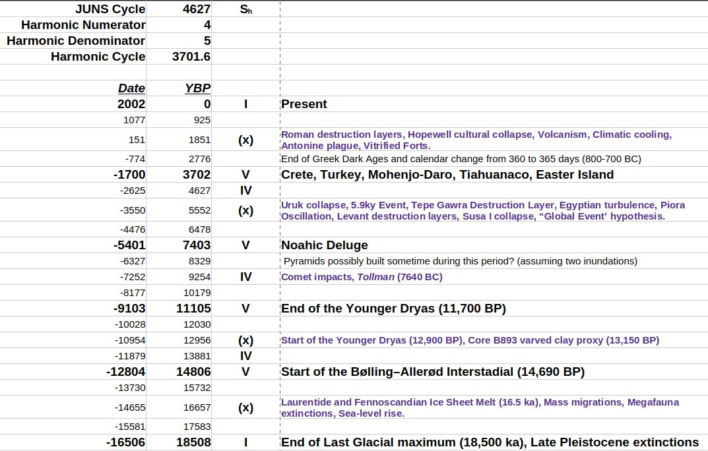
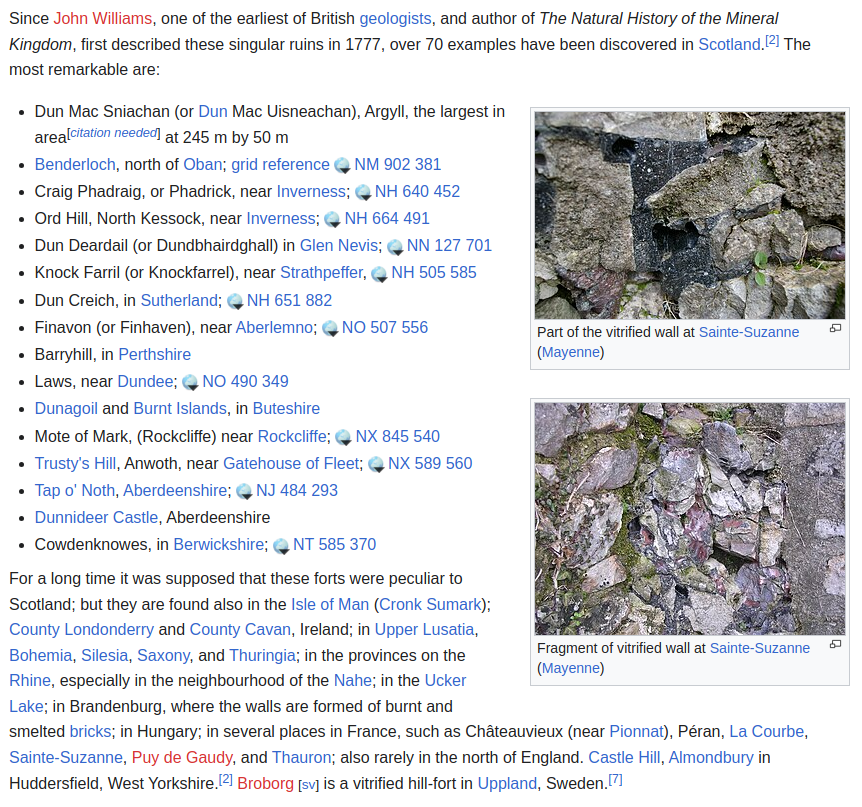
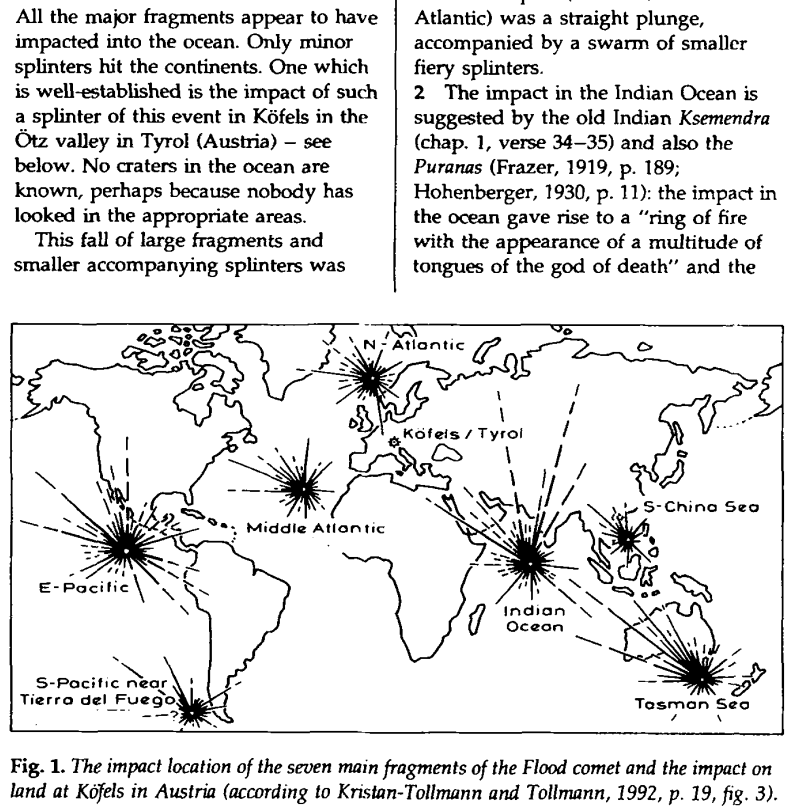
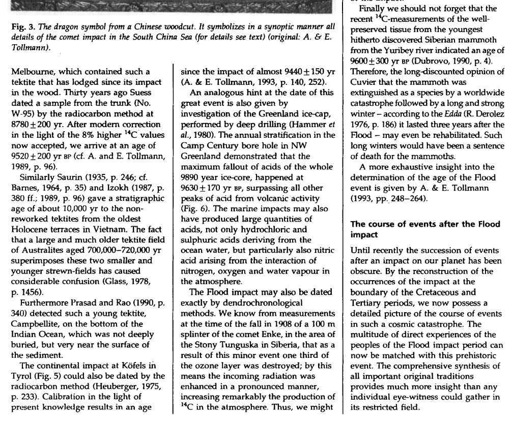
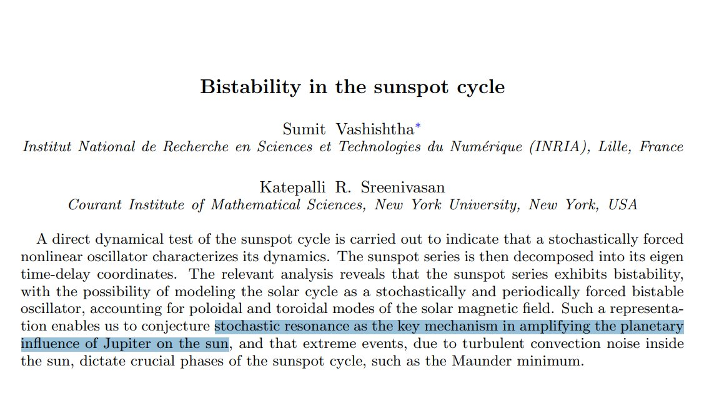

# Solar System

This folder is for evidence from the surrounding solar system that points to potential ECDO events.

## Contents

`encke-comet` contains info about a comet which may be the trigger for the impending ECDO.

# Analysis

## Astronomical chronology - 3700

"Among the artifacts that can most readily be dated by astronomical techniques are depictions of the positions of the celestial bodies at a particular time. Since the motions of the celestial bodies are all at different periods, it takes many centuries for all the planets plus the Sun and the Moon, to reach the same positions in the signs of the Zodiac. For a configuration accurate to ±15° (that is, within a single sign) the positions of these seven bodies will only return to the same configuration once in about 3700 years."

Ninth century diagram of the positions of the seven planets on 18 March 816.

https://en.wikipedia.org/wiki/Astronomical_chronology

## Grand solar minimum

We have at least a dozen papers predicting the GSM. To the best of my knowledge, Landscheidt stands alone in using planetary harmonics for his prediction (suggesting that the bottom of the minimum starts with the lull in 2030 and ends with the one in 2070. [1]

https://electroverse.co/11-scientific-predictions-for-the-upcoming-grand-solar-minimum/

## Chatelain's Constant of Nineveh

Linked to the Great Year.

1. https://divinecosmos.com/books-free-online/the-shift-of-the-ages/74-the-shift-of-the-ages-chapter-18-the-nineveh-constant-celestial-harmonics/

2. Canonical System https://www.mercurialpathways.com/post/canonical-numbers

3. https://earthmatrix.com/platonic/nineveh.htm 

4.  https://www.cosmic-core.org/free/article-254-geometry-of-the-solar-system-part-1-geometric-patterns-of-planets/

If you divide 18,508 by 24,998, you get 9254/12499 (simplified). 24,998 is a special number for Pluto:

## 2963 BC Planetary positions

Interesting, The gas giants form the square in 2963 BC, same pattern bad weather comes and the same pattern as now just in a different part of the sky.

## As an interesting note, the... [1]

As an interesting note, the 4627 and 4285 cycle synchronise every 115,000 years, which matches Earth's eccentricity cycle (110-120ka) and the pattern of glacial / interglacial periods (115ka).

## I've been looking at the...

I've been looking at the intermediate 10th harmonic (1,850 years). Could there be something here... ekpyrosis? These periods are marked with purple text in the harmonic timeline. [1] https://t.co/5o0tO7L9Ry [2] https://t.co/CcUjOiMFab [3] https://t.co/ws9qUXnMt0 [4]… https://t.co/2M48omVAOz

## Published 11 June 2024. h/t...

Published 11 June 2024. h/t to for finding this. https://t.co/XdxYWRHOWy https://t.co/TM736l3PvG

## Citations

1. Craig Stone

# TODO

Around 3700 years?

3,700 years fits very neatly 7 times into the Great Year (The precession of the equinoxes).

Geoff Sharp convo about 2400 solar cycle: https://judithcurry.com/2016/09/20/impact-of-the-2400-yr-solar-cycle-on-climate-and-human-societies/