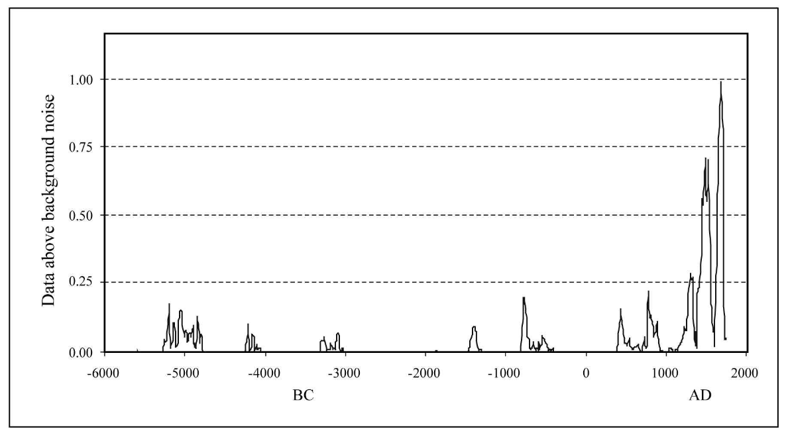

# Comet Impacts

- Bruce Masse
	- Mentions Ioannis Liritzis
- Tollmann Bolide hypothesis

## Tsunami Chronology supporting Late Holocene Impacts

Hard copy in this folder.

## Martin Gray: Cosmic and cometary induced cataclysms - 9500, 7640, 3150 and 1198 BC

https://www.knowth.com/sacred-geography-1.htm