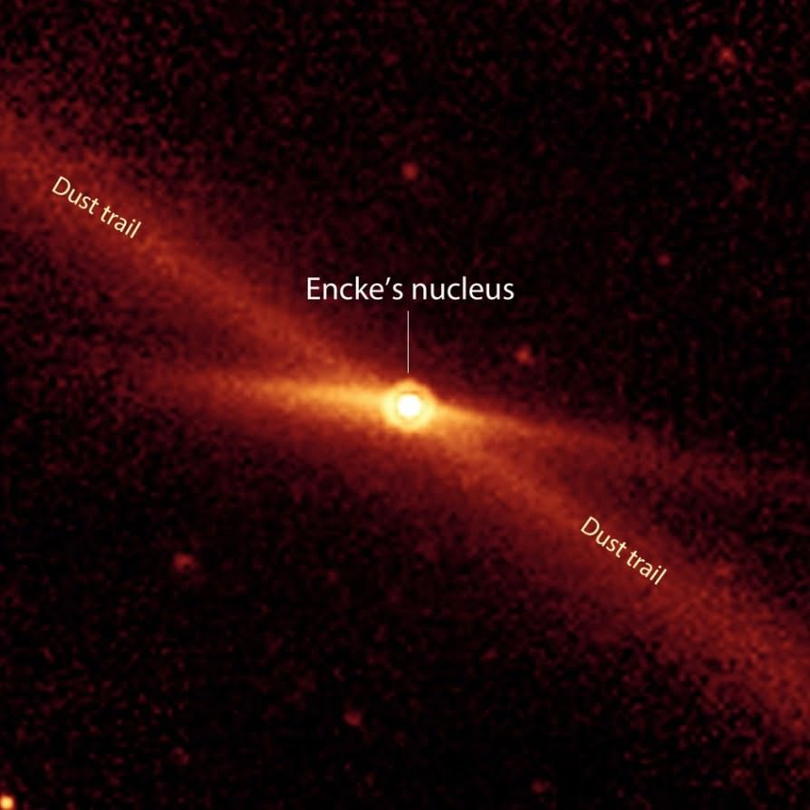
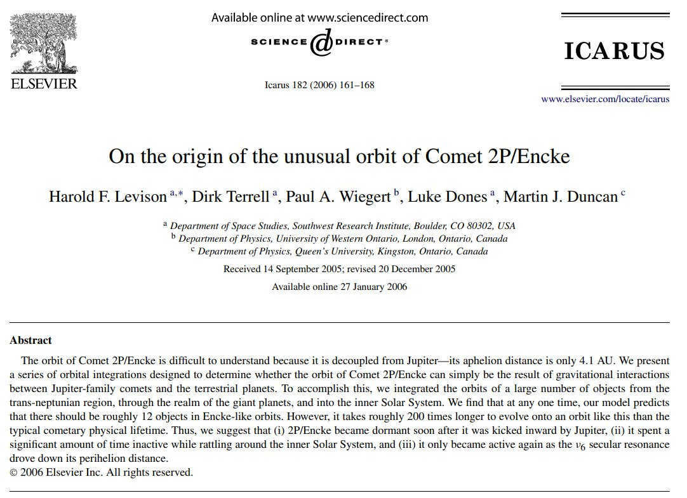
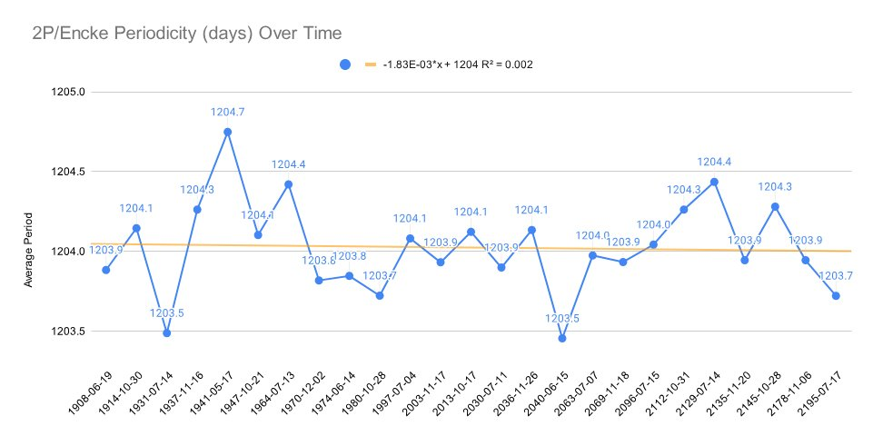
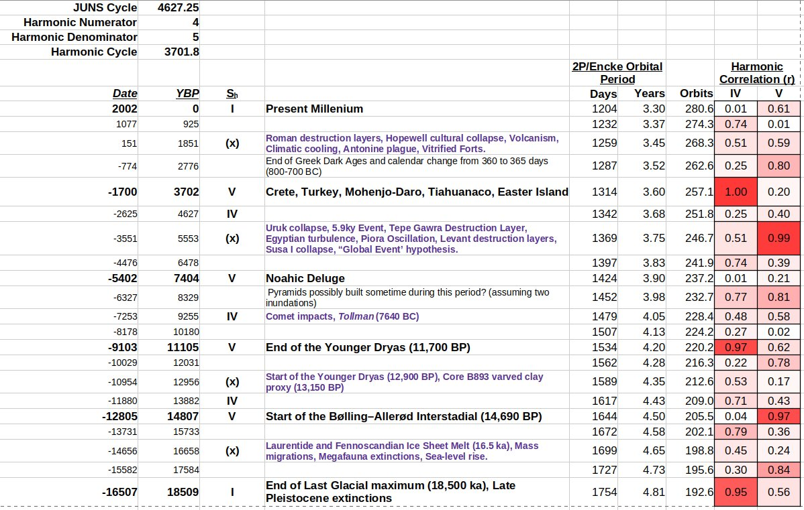
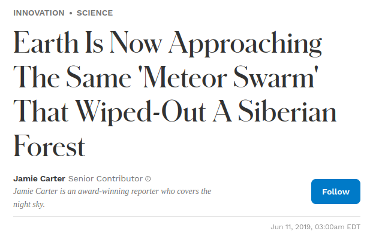
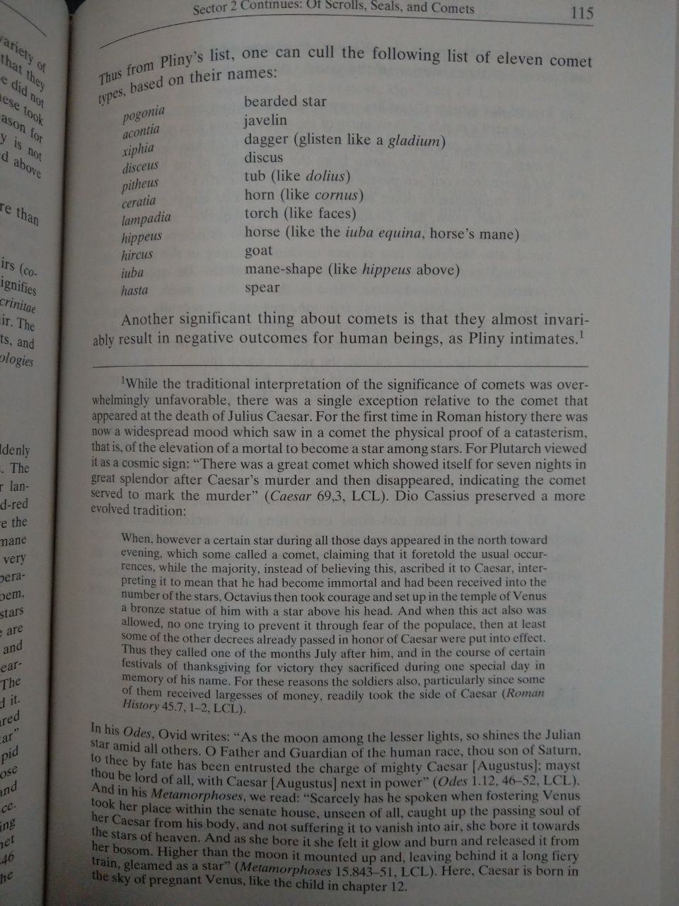

# Comets

## 2P/Encke and the Younger Dryas...

2P/Encke and the Younger Dryas appear once again, summarised from Our Cometary Environment (1996) by Napier &amp; Clube[1]: Whipple and Kresak hypothesized that 2P/Encke was originally a much larger object, which fragmented and supplied the material for the zodiacal cloud. Clube and… https://t.co/63KuGQRYkf

## "The periodic Comet 2P/Encke is...

"The periodic Comet 2P/Encke is one of the most mysterious and befuddling objects in the Solar System. 2P/Encke is a bright, low-inclination comet on an orbit with a surprisingly small aphelion distance (Q) of only 4.1 AU. As such, although similar to Jupiter-family comets (JFCs,… https://t.co/2lKVc802yA

## "Earth passes relatively close to...

"Earth passes relatively close to the Taurid swarm twice per year. The events produce the Beta Taurids meteor shower from June 5 to July 18, and then the North and South Taurids meteor showers in late October. These aren’t going to be dangerous events in 2019, but Earth’s… https://t.co/SOe3wb4nmo

## A brown dwarf discovered 30 years ago is actually twins circling each other

https://abcnews.go.com/Weird/wireStory/brown-dwarf-discovered-30-years-ago-twins-circling-114854724

## Ancient Comet Excerpt

Now you are talking! The ancients were highly descriptive in their labeling of comets. Embellished with all sorts of symbolism and meaning.

## Tree Ring Comet Evidence

https://youtu.be/Is3w6lnnAiw

## Taurids

The Taurids (https://nobulart.com/the-taurids)
"Between 3 and 15 November each year, the Earth runs through a meteor stream coming from a small area in the constellation of Taurus the bull. The Beta Taurids come in between 24 June and 6 July with a sharp peak on 30 June each year. The orbits of these daytime Taurids match those of the southern Taurids closely. This unique complex of debris is undoubtedly the greatest collision hazard facing the Earth at the present time. It is likely that hundreds of thousands of bodies, each capable of yielding a multi-megaton explosion on Earth, are orbiting within the stream." - The Cosmic Winter (1990)
https://nobulart.com/the-taurids/