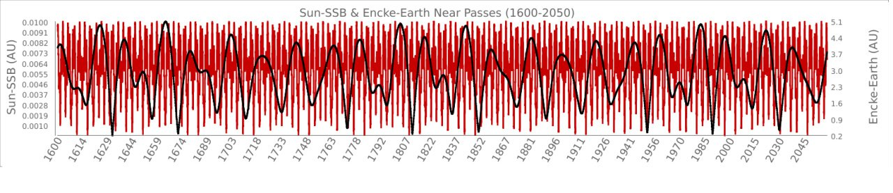
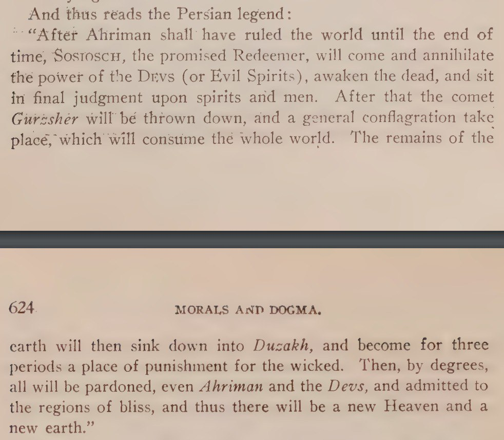

# Encke Comet

2P/Encke and the Younger Dryas, summarised from Our Cometary Environment (1996) by Napier & Clube[1]: Whipple and Kresak hypothesized that 2P/Encke was originally a much larger object, which fragmented and supplied the material for the zodiacal cloud. Clube and Napier suggested that a large progenitor comet entered the solar system around 20,000 years ago, fragmenting into 2P/Encke, the associated asteroids, the Taurid streams, and the zodiacal cloud, connecting this event to the end of the last ice age about 11,000 years ago.

2P/Encke plays a key role in the Taurid complex (TC), a collection of meteors and asteroids located between the inner planets. It is tied to four meteor streams, most notably the Taurids, known for bright fireballs in November, and the Beta Taurids, a daytime meteor shower peaking around June 30. A large, displaced dust trail has been detected along 2P/Encke's orbit, and several Apollo asteroids have similar trajectories.

[1] https://sci-hub.ru/10.1088/0034-4885/60/3/001

## Analysis [1]

"The periodic Comet 2P/Encke is one of the most mysterious and befuddling objects in the Solar System. 2P/Encke is a bright, low-inclination comet on an orbit with a surprisingly small aphelion distance (Q) of only 4.1 AU. As such, although similar to Jupiter-family comets (JFCs, comets with Tisserand parameters with respect to Jupiter, T , between 2 and 3; see Levison, 1996) in other respects, 2P/Encke is dynamically decoupled from Jupiter... We found that only 1 out of ∼11,000 initially transneptunian objects will evolve onto an Encke-like orbit... Our results seem to suggest that non-gravitational forces are required to make 2P/Encke." - On the origin of the unusual orbit of Comet 2P/Encke, Levison et al. (2006)[1]

As comets go Encke is quite unique in that its orbit does not appear to be perturbed by Jupiter. It's orbital period is observed to be decaying by ~2.38 hours per orbit - presently 1,204 days(3.3 years) per orbit.[2][3]

I did a simple regression of the orbital period back through 18.5ky (assuming that its orbital decay has been unperturbed and linear). Numbers in the last two columns in bold indicate the correlation coefficient between Encke's orbital period and the IV an V planetary harmonics respectively. Values closer to 1 would be periods during which Encke's visits would have been more likely to synchronize with planetary harmonics. Correlations >0.75 are highlighted in shades of red.[4]

Encke-IV-V orbital harmonic correlation over 18.5ka.

1. https://sci-hub.ru/10.1016/j.icarus.2005.12.016
2. https://ssd.jpl.nasa.gov/horizons/
3. https://nobulart.com/comets-and-dragons

## Encke near-Earth passes [1]

Encke's near-earth passes (red lines) and Sun-SSB distance (black line), 1600-2050. Note the frequent 3.3-year pairing of near passes.

The full Encke dataset looks like this. I filtered only the closest passes in the first chart.

## Encke [1]

The Tunguska Event happened June 1908 when 2P/Encke was near to us. Encke always near passes us in June or October.

JPL have 2P/Encke at closest approach to Earth on July 12, 2030.

## Tracking previous encounters

We cannot calculate comets back more than a couple of thousand years. Their orbits are too heavily perturbed by the gas giants for reliable long term ephemeris calculations. [1]

## Meteor Swarm

The main timeline for the earth w/ regards to the impacts are on 2032 and 2036 - mid of next decade. These are because we will be passing through the midst of the remnants of Encke then. Right through the middle of the pie.

https://www.forbes.com/sites/jamiecartereurope/2019/06/11/earth-is-now-approaching-the-same-meteor-swarm-that-wiped-out-a-siberian-forest/

Here they mention that it appears we pass through Encke's original dust trail approximately every 2.5ka. Note that their anchor date is 500AD - the period mentioned in the "six forests" video above.

See `Our cometary environment.pdf`.

## Pike = Encke?

## Citations

1. [Craig Stone](https://nobulart.com)