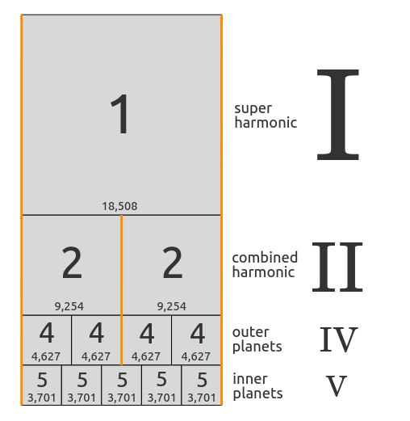
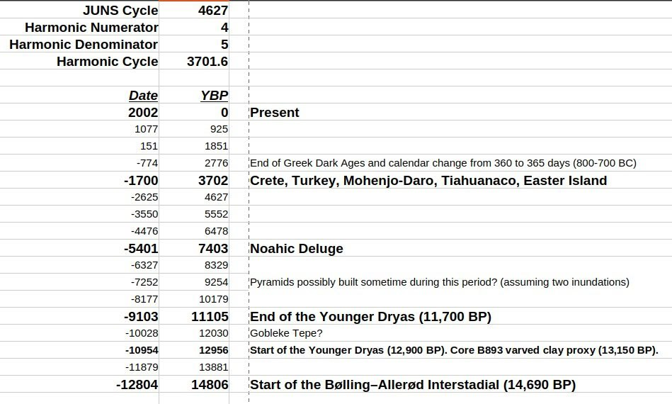
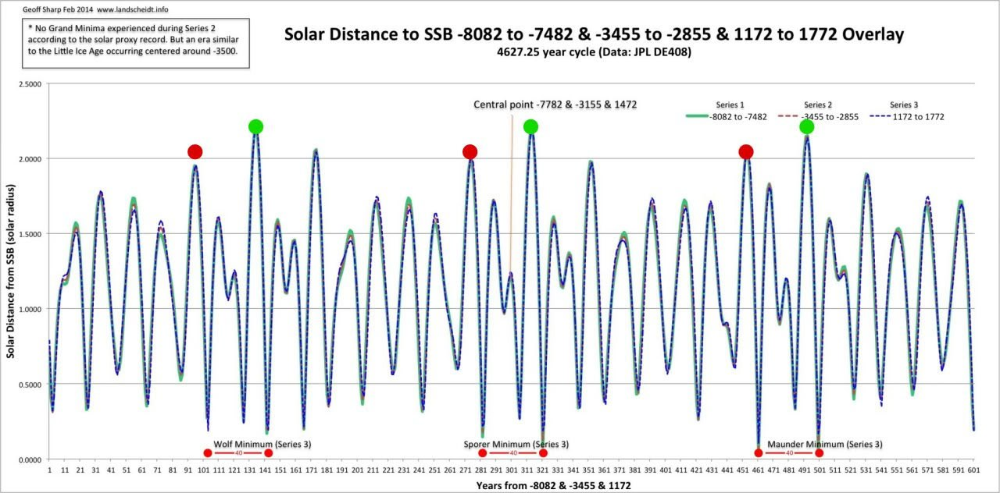
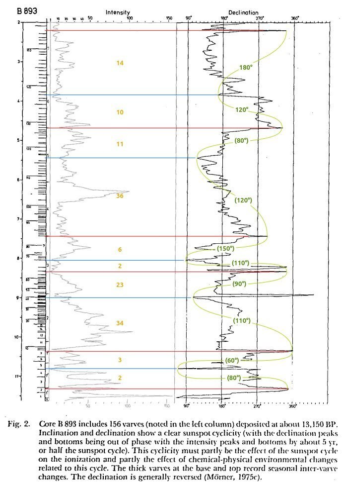

# Gas Giant Harmonic

## Harmonics [1]

Music of the Spheres. The resonance between the inner and the outer planets is governed by the greater mass. It is the gas giants which established and continue to enforce the fifth harmonic. This system is probably old beyond our wildest imaginings to have achieved this degree of order.

1. https://nobulart.com/musica-vitae-et-mortis/

## Gas giant harmonic [1]

The JUNS Orbital Cycle (Jupiter-Uranus-Neptune-Saturn) has a grand period of 4,627 years before all four repeat their dance. The 4/5 harmonic of this period is 3701.6 years. If we look back through time, we find something quite remarkable every 3700 years, going back not to the YDB, but one more cycle to the start of the Bølling–Allerød Interstadial 14.8ky before the present. Four cycles over almost 15,000 years. The Swedish varved-clay proxy dated to the start of the Younger Dryas suggests a possible half-wave subcycle as well.
1. https://landshceidt.info
2. https://en.wikipedia.org/wiki/B%C3%B8lling%E2%80%93Aller%C3%B8d_Interstadial
3. See `EVIDENCE/physical-material/land-soil-earth` for varved clay date info.

## Gas giant harmonic compared with ice data

The gas giant harmonic may align well with bond event and ice core-temperature data. Check `physical-material/ice` for that analysis.

## Citations

1. [Craig Stone](https://nobulart.com)