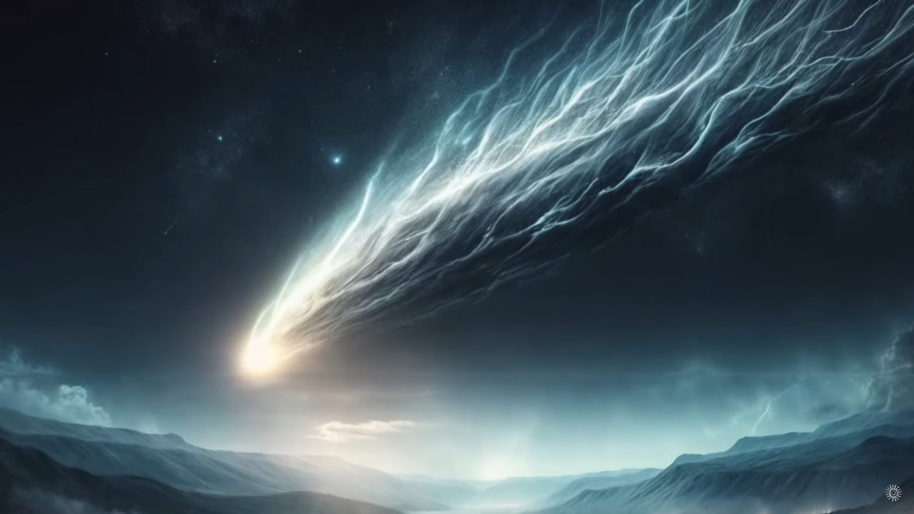
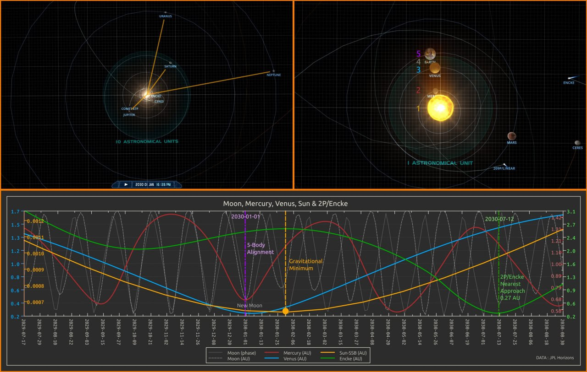

# Micronova

## Eye of Horus

[1/3] Is the Eye of Horus a depiction of Venus with a tail - the feathered serpent? Excellent episode from @tboltsproject https://youtu.be/RpvdEkAUXnQ

[2/3] Could a micronova event produce such a phenomena as Venus with a tail? Don't look up: "On January 7, 2014, the Sun emitted a giant solar flare. On that very day, Jupiter, Earth and Venus lined up in a triple planetary conjunction, just as proposed in the models of Wilson and Salvador, and as predicted by Scafetta. We thought this event came as a very nice and simple confirmation of our claims [that planetary harmonics affect solar activity]."
- Planetary Influence of the Sun and the Earth, and a Modern Book-Burning (2015), Nils-Axel Mörner (1938-2020).
[1] https://researchgate.net/publication/286457754_Planetary_Influence_on_the_Sun_and_the_Earth_and_a_Modern_Book-Burning
[2] https://digitalcommons.usf.edu/cgi/viewcontent.cgi?article=2363&context=ijs

[3/3] Is a micronova-type event more likely during certain configurations of our solar system? "As the outer planets approach  balanced opposition in the first few days of January 2030, the Sun traverses close to the solar system barycenter, and the Earth, Moon, Venus, Mercury and the Sun will fall into alignment. 2P/Encke and the Beta taurids will be nearing Earth sometime in June and continuing through until late July, with the comet's nearest approach (0.27AU) expected near 12/13 July 2030."
[1] https://x.com/nobulart/status/1835362052853923940

