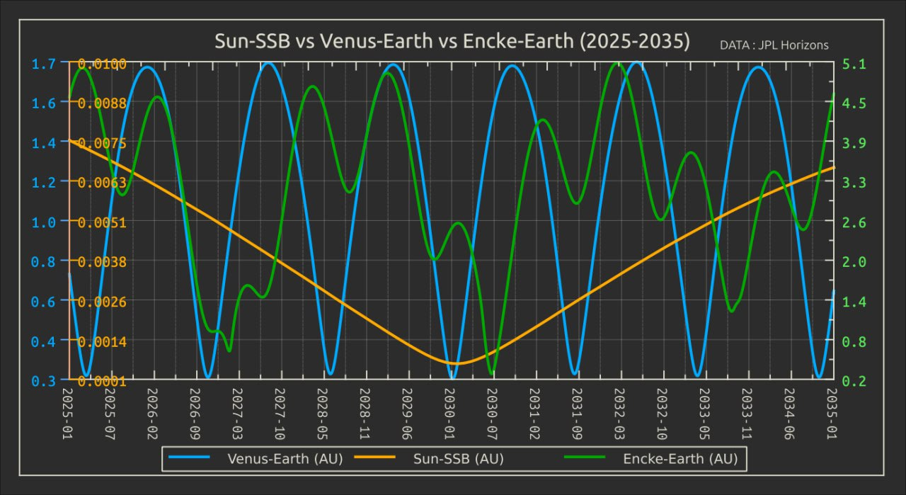
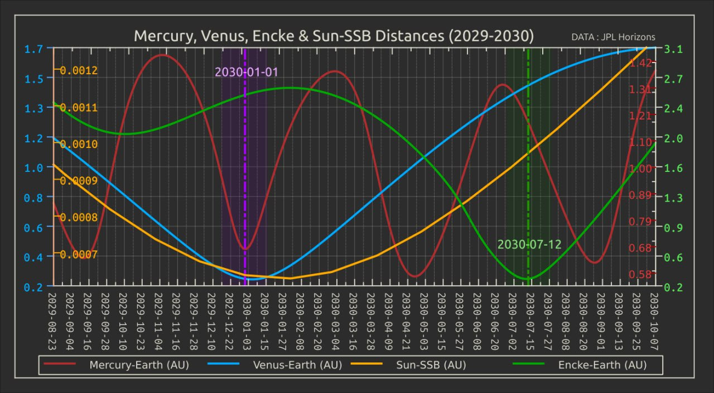
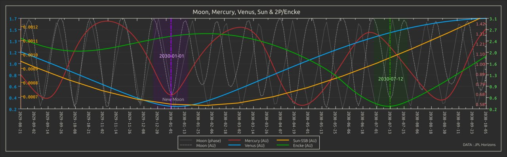
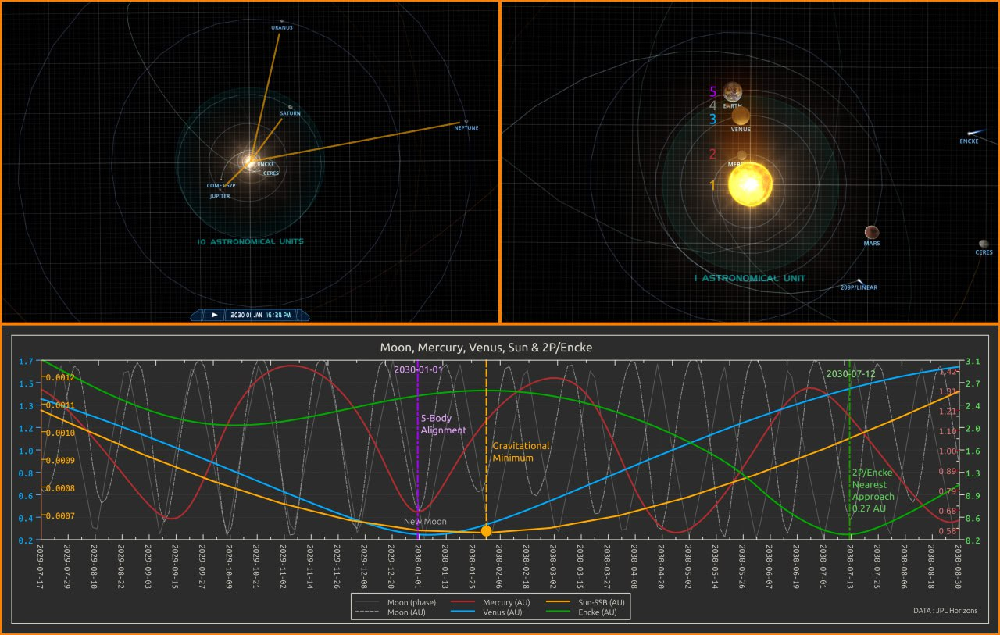
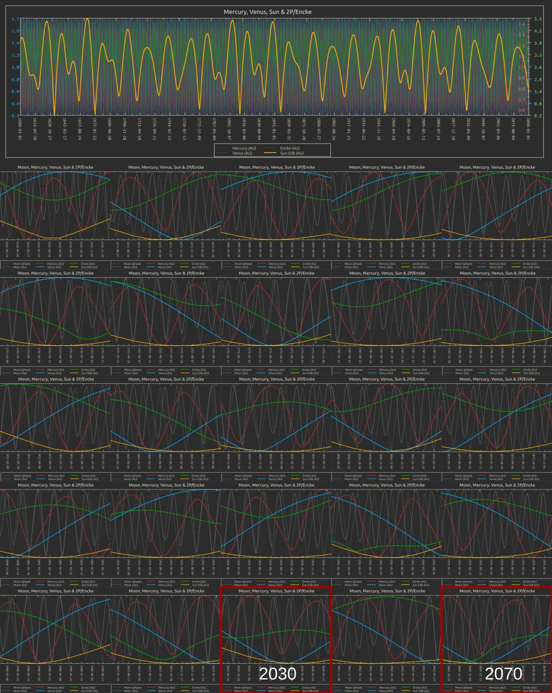
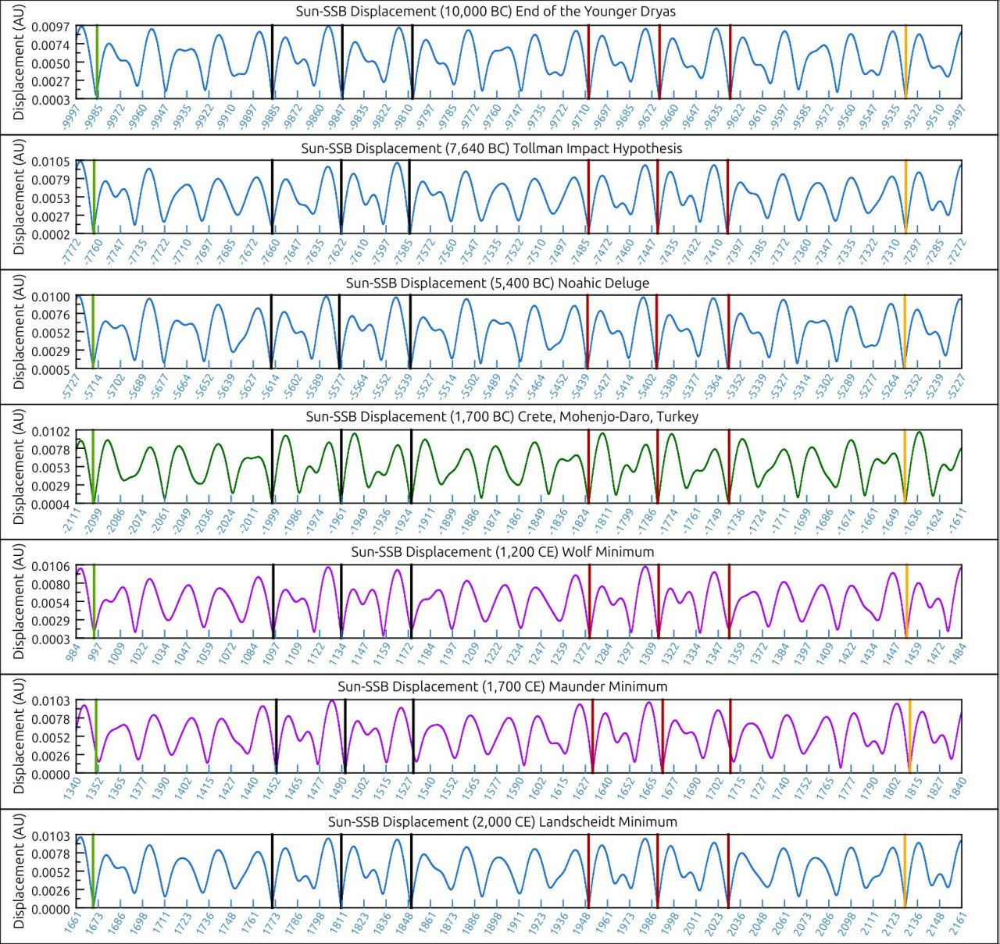
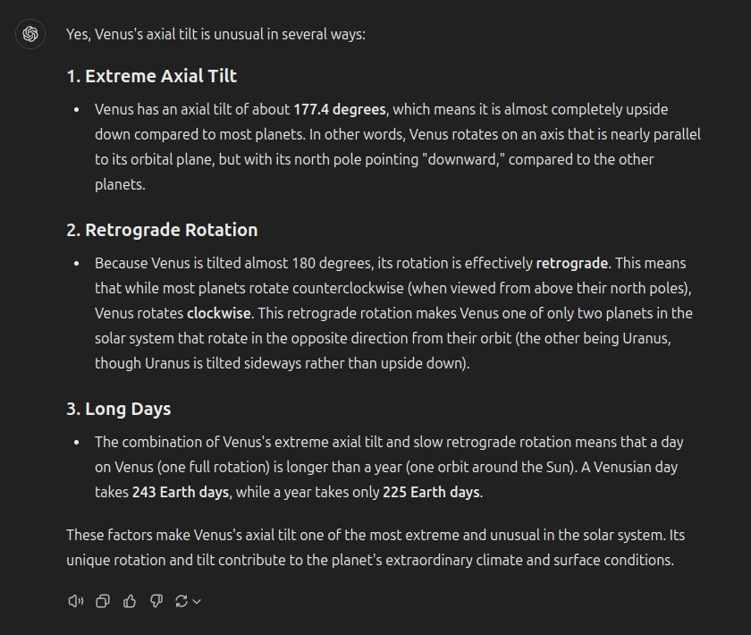

# Small Planet (Mercury, Venus, Moon) Alignment [1]

A new date of great interest. Early January-February 2030. Those who have read The Perfect Storm (https://nobulart.com/the-perfect-storm) will recall that my focus in that article was upon inner planet alignments at the times of "interesting" events. My working theory was that inner planetary alignments establish an electromagnetic bridge - a path of least resistance for solar emanations. As Encke is on it's approach for the near-Earth pass around 30 June 2030 (it may already be visible in the sky by January) there will be a conjunction of Earth-Moon-Venus-Mercury-Sun. The time of the Sun-SSB minimum is Jan-Feb 2030, when Jupiter, Uranus, Neptune and Saturn are in balanced opposition. The importance of Venus in ancient time-keeping and catastrophic prediction described in Uriel's Machine brought this to my attention.

## Venus/Mercury/Moon + SSB

Venus' distance from us, Encke's distance from us and the Solar-SSB minimum plotted over the next ten years.

Added Mercury. 1st January 2030

Added both the Moon's distance from us and its phase angle . Closest approach in its orbit is on the first. New moon is just a couple of days later, so it will already be lying between us and the Sun by the 1st. Definitely a 5-body alignment during the gravitational minimum on the 1st January.

Note how rapidly the comet approaches us. The gap is closed from  2.6 AU on the 1st Jan down to 0.27 AU on the 13th July, covering roughly 350 million km. My rough calc puts the average at around 65,000 km/h.

I wonder whether there is a relationship between the direction of solar eruptions and the net gravitational effect of the planets on the Sun when the eruptions occur. Are a statistically higher proportion of flares directed towards the greatest mass (Jupiter)? If so, then this brings up some questions about what might happen if a flare occurred while the effects of the giants are neutralized and we're all sitting in a neat line on one side of the sun.

Earth, Moon, Venus, Mercury, Sun & Comet 2P/Encke (2029/2030). As the outer planets approach balanced opposition in the first few days of January 2030, the Sun traverses close to the solar system barycenter, and the Earth, Moon, Venus, Mercury and the Sun will fall into alignment. 2P/Encke and the Beta taurids will be nearing Earth sometime in June and continuing through until late July, with the comet's nearest approach (0.27AU) expected near 12/13 July 2030. The chart illustrates the Sun-SSB distance (gold), Earth-Moon distance and phase (grey), Earth-Venus distance (blue) Earth-Mercury distance (red) and Earth-Encke distance (green) from  late 2029 through late 2030. Sources:
1. https://ssd.jpl.nasa.gov/horizons/
2. https://solarsystemscope.com
3. https://en.wikipedia.org/wiki/Beta_Taurids

There is no precedent for the 5-body 2030 alignment in the set that I have (1600-2090). The only close match is the date which Theodor Landscheidt singled out as the end point for this grand solar minimum - 2070 - with only the Moon being 90 degrees out of phase at that time. I've included details for 25 of the gravitational lower inflections in the set, including minor ones.

This raises the question - do Earth, Venus, Mercury and the Sun always align during this particular pair of gravitational minimums in the cycle? We cannot calculate it, but its likely considering the 4/5 outer/inner planet harmonic, that they they similarly aligned twice (40 years apart) during the remarkably similar patterns around 10,000BC, 7640BC and 5400BC.

## Small-planet historical orbit calculation [1]

So far as I'm aware its currently impossible, and its rooted in the n-body problem - we cannot accurately calculate the gravitational effects of 3 or more bodies upon one another in a system.

The further back or forward in time we look, the greater the error becomes. Jupiter is the main problem because it exerts a noticeable effect on every object in the system.

## Venus facts

## Citations

1. [Craig Stone](https://nobulart.com)