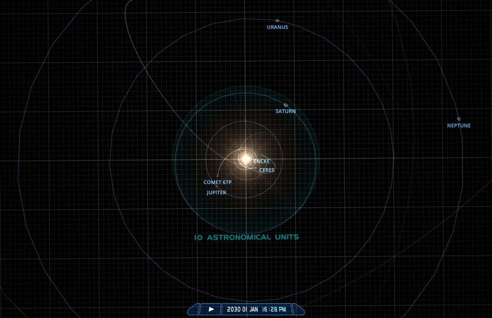
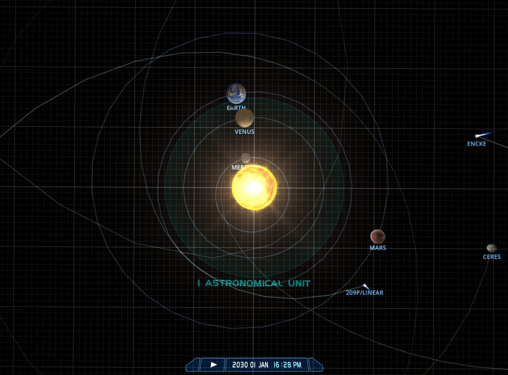
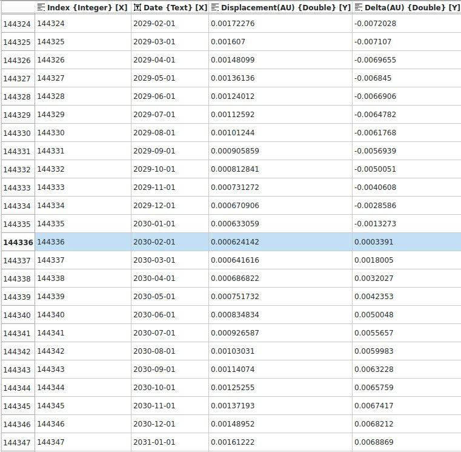

# Small Planet (Mercury, Venus) Alignment [1]

A new date of great interest. Early January-February 2030. Those who have read The Perfect Storm (https://nobulart.com/the-perfect-storm) will recall that my focus in that article was upon inner planet alignments at the times of "interesting" events. My working theory was that inner planetary alignments establish an electromagnetic bridge - a path of least resistance for solar emanations. As Encke is on it's approach for the near-Earth pass around 30 June 2030 (it may already be visible in the sky by January) there will be a conjunction of Earth-Moon-Venus-Mercury-Sun. The time of the Sun-SSB minimum is Jan-Feb 2030, when Jupiter, Uranus, Neptune and Saturn are in balanced opposition. The importance of Venus in ancient time-keeping and catastrophic prediction described in Uriel's Machine brought this to my attention.

## Citations

1. [Craig Stone](https://nobulart.com)