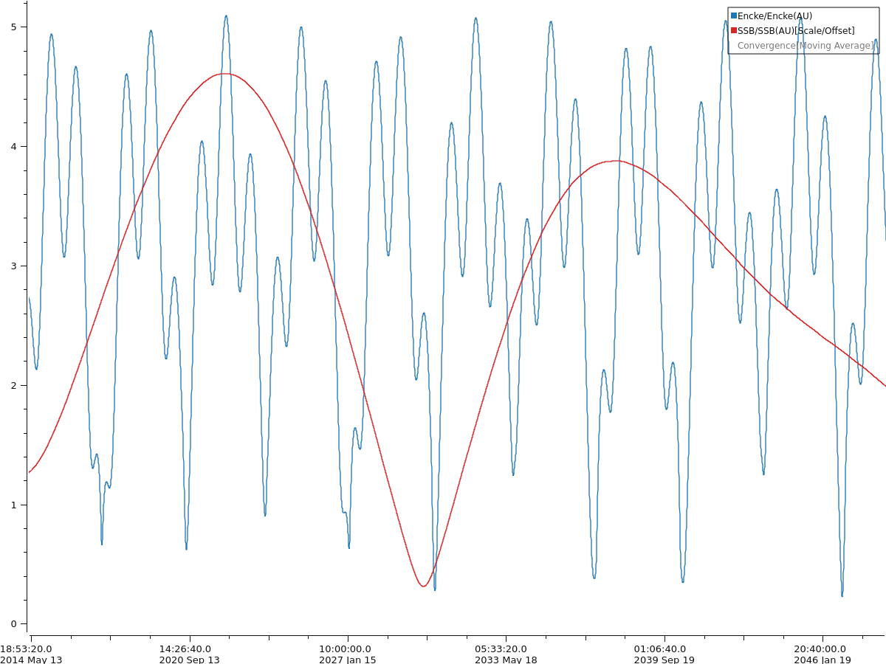
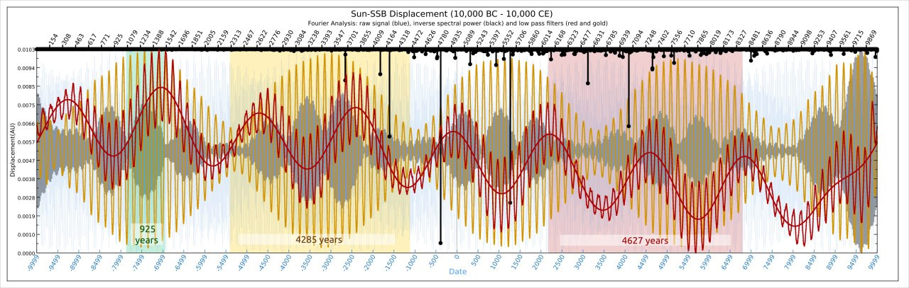

# SSB Analysis

## I've included the temporal markers...

I've included the temporal markers from the harmonic timeline discovery on the 20ka SUN-SSB harmonic decomposition. Black dotted verticals mark the 3700 year (V) intervals. The 4285 and 4627 cycles form a metacycle harmonic at 115ka - the glacial-interglacial cycle and the… https://t.co/evqJeJ94Qf

## The yellow chart is generated...

The yellow chart is generated from JPL's Horizons data. It shows the Sun's displacement from the Solar System Barycenter (SSB) from 1600-2059 - this is our main proxy for planetary harmonics. The particular Neptune/Uranus disturbances ~172 years apart (marked in blue) are the key… https://t.co/YZeNcG15aN

## What happens to this order...

What happens to this order when the governing force of the IV order is nulled? Is the V order perturbed? Do we get a bump in 2030? Red curve is the Sun's displacement from the SSB (as dictacted by the planets). Blue line is distance between Earth and comet 2P/Encke. https://t.co/1ZDWB1p78l https://t.co/5IuOLUr3Kw

## Revisiting one of my triggers...

Revisiting one of my triggers of interest; the distance of the sun from the solar system barycenter (as dictated by the positions of the four gas giants) shows a clear rhythm of a double minimum every 4,627 years, with a 40 year span between the coupled alignments. https://t.co/rilFNyEmJB

See img/1805998874080825675-vM08lh0yQUfAlNmA.mp4.

## There is a brief period...

There is a brief period of net zero gravitational influence upon the Sun and inner planets 3 times every 180 years when Jupiter establishes a position of opposition to Saturn, Uranus and Neptune. At these times our sun traverses the SSB. (Chart: Sun-SSB distance 1600-2060, JPL). https://t.co/NWFjwk3AnK

## There is a strong relationship...

There is a strong relationship between historic grand solar minima and the sun's distance from the solar system barycenter (as governed by the positions of the four gas giants) in a 4627.25 year grand cycle. https://t.co/uAmUEFyGGC https://t.co/O6KCG909wy

## Fourier Analysis [1,2]

I've indicated 4627 year periods with background colours.

Been trying to tease some of the components out of this 20ka dataset. The black dropstrings across the top are a Fourier transform which identifies resonant frequencies of SSB minimums within the set. Our 3700-year marker is clearly visible. I've also run a couple of Fourier filters to isolate a couple of the stronger signals. The resonance around 4285 years is a strong signal (gold), as is the known 4627 year grand cycle (red). Its interesting to see some of the many subcycles which are wrapped up in here.

Note the perturbations near the beginning and end of the 4627 filtered cycle (red line). The one at the beginning is smack bang on the end of the YD. These two kinks are roughly 18.5-19.5ka apart.

Spectral decomposition of the minimum points in the sequence (black dropstrings) reveals a clear coherence near the 3,701-year cycle (as expected). Low pass filters reveal the 4,627-year component (partially isolated and reconstituted in red). A strong 4,285-year period became apparent (gold). The shorter wave seen within the red and gold filtered signals is almost exactly the ±172 year JUNS cycle perturbation period described by Geoff Sharp[2].

I've shifted the red marker to more clearly show the cycle alignment. Also discovered another pattern as i'm stepping through the frequencies - grey blobs.

So the 2,400 year period is exactly half of the largest dropstring on this chart at 4800 years. Very likely a halfwave of that particular planetary harmonic. Interesting.

The grey blobs, it turns out, have an average period of 925 years (green). Half of the 1850 X harmonic.

I think I have found the 3701-year cycle in here. Now marked in green blobs (previously grey) and with black dotted lines to illustrate how that sequence interlocks every 3700 years.

I've adjusted the 3.7ka markers to align with our existing timeline. They occur on the downbeat of a rock ballad.

Digging a bit deeper into this 20ka dataset. The black drop-strings across the top are an inverse Fourier transform, indicating cycle periods (in Earth years) upon which the Sun falls closest to the solar system barycenter. The green, gold and red curves are low-pass and… https://t.co/oHhCyl0nLs

End of the YD. Tollman's 7640BC "comet", and now. Same pattern. The YDB is a bit perturbed by something else, but the rhythm primary resonance sequence is the same.

All three laid on top of one another (very hastily. I might add).

Looks like another one. Noahic deluge. 5400BC

Combined

GPT’s initial visual appraisal of this chart.

Claude gave it the same correlation - 90% on visual comparison. 

I've added in 1700BC here to illustrate the kind of variation which might need to be accommodated in finding these. Most interesting. The sequence is the same except for one thing - the Uranus-Neptune perturbations are reversed (the "kink" slopes the other way) - ie. they were in reversed position on the other side of the Sun.

Here I have overlaid the 1700 BC and the 2000 CE cycle to illustrate the Uranus-Neptune phase inversion. Note the numerous "butterflies".

The third in this series of minimums was marked by Landscheidt for the 2030 minimum. The most accurate historic date we have is 1750-1700 BC. The Noahic date of 5400 BC falls right near the third minimum. 2030 would seem to be the year.

I've added the Wolf Minimum to the comparison (purple). I believe I have the main sequence alignment of the primary minimums the same, but as can be seen, there are some dramatic variations to the peak formations and many of the minimums compared to the other (blue) periods. + I've also added some more comparison points to better illustrate what I see. ++ Added event labels as well. +++ Added the Maunder minimum. it looks like its the same flavour as the Wolf.

This paper also includes a handy chart, which I quickly cobbled onto the Wolf Minimum pattern. The third red marker is 2030 in the current sequence.  https://sci-hub.ru/10.1515/9783110660784-008

My built-in pattern recognition is starting to identify the flavors that occur within these cycles. I can see the genetics of each, but I don't know how to empirically filter and quantify what I'm seeing yet.

## 3000 BC event?

Centered around about 2960 BCish, as far as where the "event" would line up, correlated with the other SSB sequences for other cataclysms.

## Citations

1. [Craig Stone](https://nobulart.com)
2. `TOOLS-DEV/datasets/ssb`

# TODO

*"We have 400 years of current polar magnetic data spanning 1590-2025. We also have proxy polar wander data from 10ka and 13ka. We want to try to see if we can match one of these old records to the currently observed pattern which has occurred between our pole and the harmonic over the past 400 years."* [1]