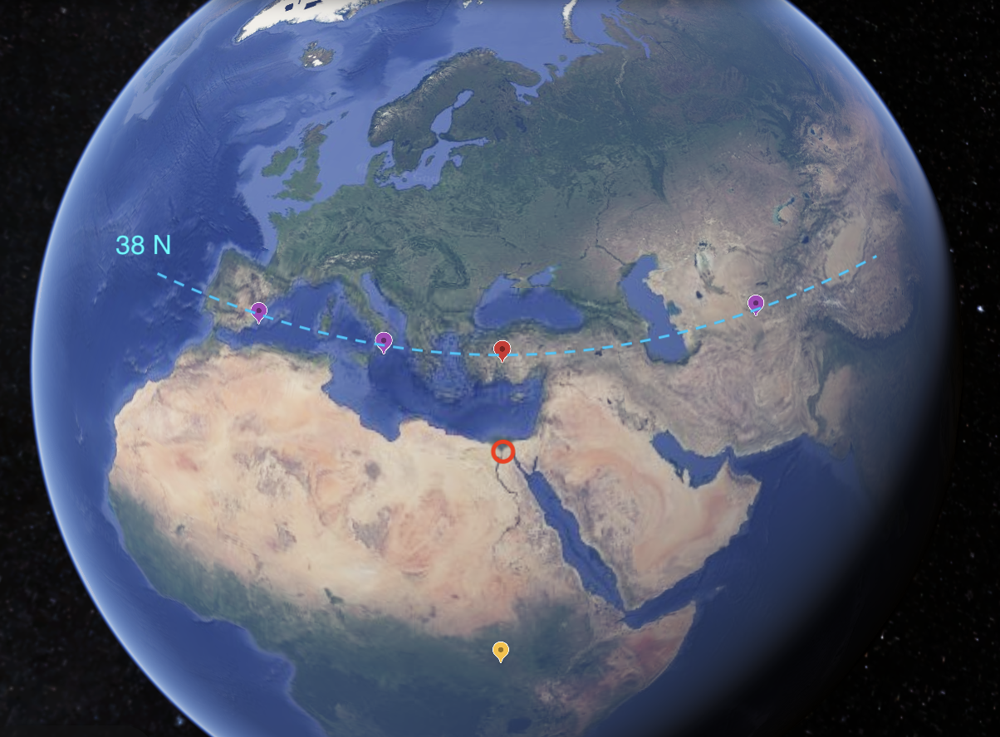

# Equatorial Bulge

Exploring how Earth's equatorial bulge may interplay with the ECDO.

## Intro

Earth is an oblate spheroid due to its rotation.

Earth's internal layers are of differing density, which allows this to happen.

After the S1 -> S2 rotation, Earth may continue to maintain this shape, along the same axis of rotation. This would mean that certain parts of the Earth's crust may rise, and others may fall, as they move to different positions on the spheroid.

This could not only cause a prolonged and significant change in coastlines around the world, exposing new land and covering old land, but also have significant consequences in terms of fault lines around positions that have significant changes in position on the spheroid.

## Explaining Khafre Pyramid Inundation

Earth's equatorial bulge could explain the Khafre pyramid's extended inundation to achieve the erosion on its surface. Why? Because the Mediterranean rotates to higher latitude values, higher up on the sphere, reducing the bulge, lowering elevation and bringing the coastline up by moving the land closer to the Earth's core.

The Khafre Pyramid has a present-day lat/long of (30 N, 31 E). Calculating the new coordinates is simple. Just rotate the latitude 104 degrees, and if you cross the poles, change the longitude by 180 degrees. The Khafre pyramid would go to (46 N, 149 W) from (30, 31).

As you can see, the Khafre Pyramid would move 16 degrees north in latitude. This would move it further from the equatorial bulge, potentially reducing its elevation, allowing the ocean to "rise up" in level.

On the above visual:
- The Khafre Pyramid is circled in red
- The red marker is (38 N, 31 E), and it is (one of) the point(s) on the 31 meridian which has the same latitude before and after S1 to S2.

In terms of elevation:
- The region above the blue line (38 N latitude line) would be closer to the equatorial bulge and rise in elevation
- The region immediately below the blue line would be further from the bulge and fall in elevation

The equatorial bulge, combined with the ECDO, provides a compelling explanation for the prolonged inundation of the Khafre Pyramid.

## Regions With Greatest Latitude Change (31 meridian, 149 meridian west)

The 31 meridian and 149 meridian west are the lines of longitude which experience the greatest rotational displacement, as these form the circle of Earth's surface that lies directly between the two pivots.

A third of the points on this circle experience greater than 60 degrees of absolute value latitude shift during the S1 -> S2 rotation:
- Africa: 31 meridian, 22 S to 8 N
- Arctic: 31 meridian, 68 N to 149 meridian west 82 N
- Pacific: 149 meridian west, 22 N to 8 S
- Antarctic: 149 meridian west, 68 S to 31 meridian, 82 S

## Shifting Tectonic Plates

Coupling the above knowledge with tectonic plate data, we can make some interesting predictions:

The Africa plate has a large chunk that moves 60+ degrees in latitude. The fault lines bordering it could be very violent during/after the ECDO rotation. Same for the Pacific plate.

## Things to look into

How fast could the equatorial bulge shift to maintain its shape around the rotational axis if Earth were to suddenly rotate?