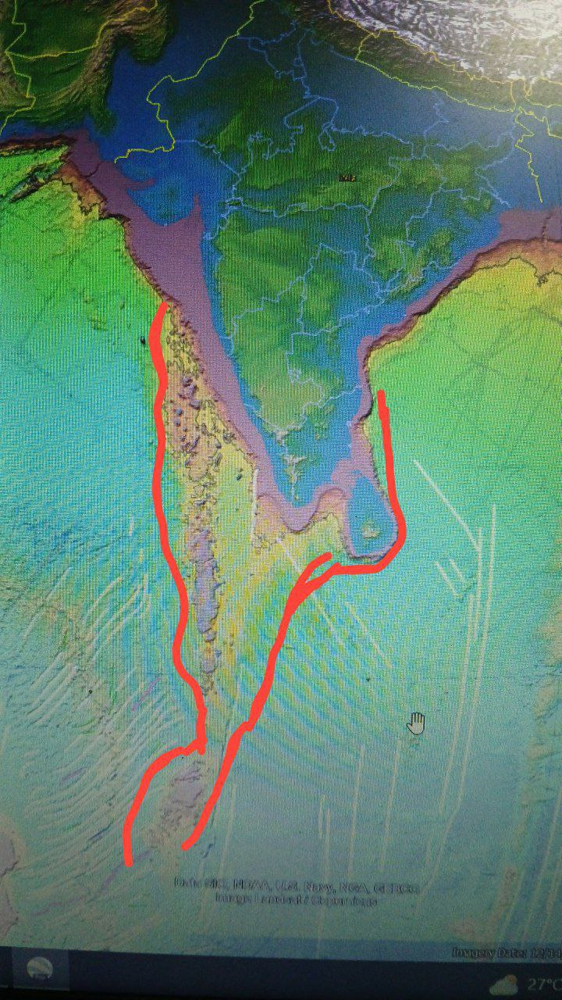
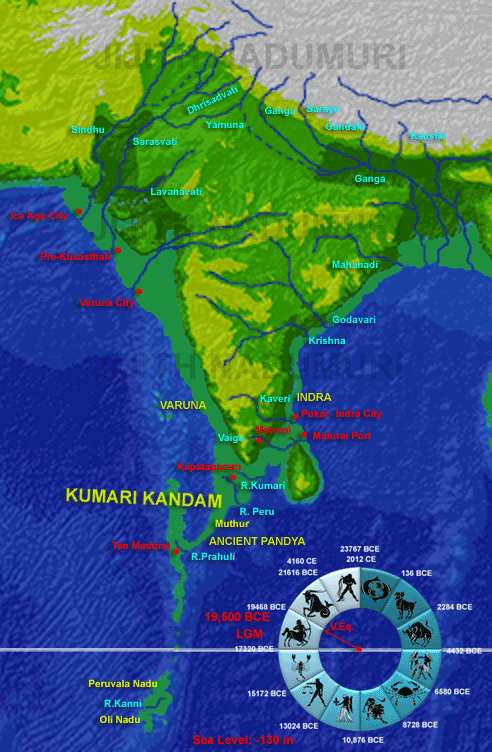

# Kumari Kandam

Such might be the map of Kumari Kandam before sinking.
Those islands on the leftern part probably were the older peaks formed due to previous deluges when kumari kandam did exist.

[Analysis by AncientVoice](http://ancientvoice.wikidot.com/article:kumari-kandam)
Kumari Kandam as revealed through Bathymetric studies. 
Sea Level at 130 meters lesser than current levels (-130 m) around 19500 BCE at LGM. Besides the sea level changes, the ocean surface elevation changes due to local tectonic activities to the south of Kanyakumari too is considered. 
The names of rivers and places mentioned in Tamil literature like Tenmaturai, Kapatapuram and the future city Maturai are indicated. 
The Devasura civilization mentioned in Sanskrit Vedic literature also is indicated. Kusasthali mentioned in Mahabharata and the Submerged city of Varuna mentioned in Bhagavata too are indicated. 
The locations are currently speculative, but should give impetus for future marine archaeological studies.
