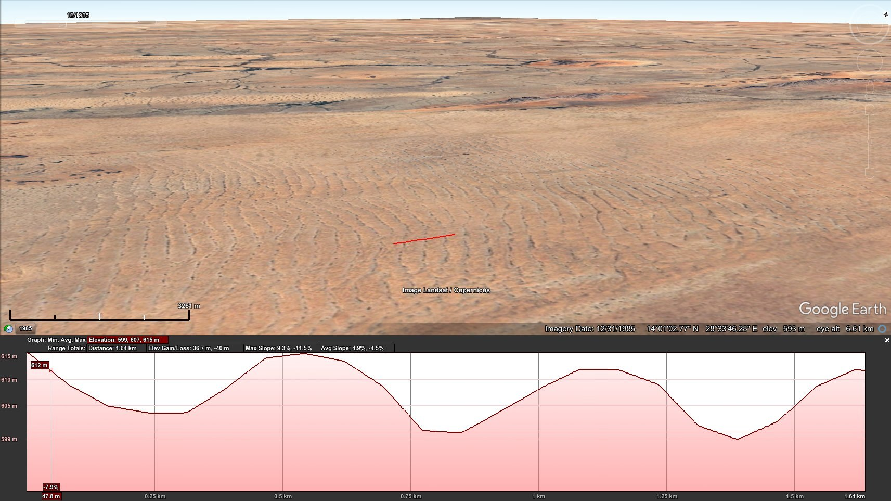
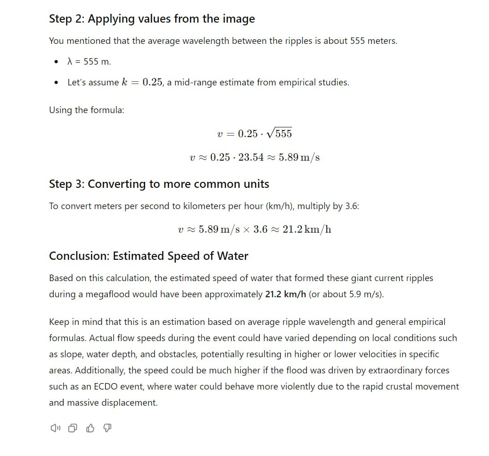

# North Africa

https://github.com/user-attachments/assets/eecae3f0-8dab-41db-868f-7a1819f490a5

See [here](https://github.com/sovrynn/ecdo/tree/master/6-LITERATURE-MEDIA/nobulart/ecdo-visualizations) for the high-res visualization. [1]

## Earth Engine DEM

## Overview [1]

ECDO displacement visualisation using V4.[1] Mega current ripples in Mauritania[2] and and teardrop island erosion[3] and more ripples in Sudan[4][5] indicating flows over 1 km deep.[6] Northern Africa has a fairly rich collection of flood 'myths': "The sun once met the moon and threw mud at it, making it dimmer. There was a flood when this happened. Men put their milk stick behind them and were turned into monkeys. The present race of men is a recent creation." - Lower Congo flood story.[7]

"The sun and moon are man and wife, and their best friend was flood, whom they often visited. They often invited flood to visit them, but he demurred, saying their house was too small. Sun and moon built a much larger house, and flood could no longer refuse their invitation. He arrived and asked, "Shall I come in?" and was invited in. When flood was knee-deep in the house, he asked if he should continue coming and was again invited to do so. The flood brought many relatives, including fish and sea beasts. Soon he rose to the ceiling of the house, and the sun and moon went onto the roof. The flood kept rising, submerging the house entirely, and the sun and moon made a new home in the sky." - Efik-Ibibio (Nigeria) flood story.[7]

1. https://theethicalskeptic.com/2024/05/12/exothermic-core-mantle-decoupling-dzhanibekov-oscillation-ecdo-theory/
2. https://x.com/nobulart/status/1809353377723158949
3. https://x.com/nobulart/status/1808555227609772237
4. https://x.com/nobulart/status/1808541981481501157
5. https://x.com/nobulart/status/1808501677340635357
6. https://x.com/nobulart/status/1808579489582174609
7. https://talkorigins.org/faqs/flood-myths.html#Africa

## Sudan [1]

If megafloods were all the result of outflows from glacial lakes, then what are [these bad boys](https://maps.app.goo.gl/oxieyw9w9C6P2Evz6) doing 15 degrees north of the equator in Sudan? They look like GCR's [Giant Current Ripples (https://en.wikipedia.org/wiki/Giant_current_ripples)] with an average 555m between troughs, and heights of 10m. They do not appear to be sand dunes - they're too shallow and they've remained static for at least the last 40 years according to available imagery. 

Using the GCR chord length [equation](https://pubs.geoscienceworld.org/gsa/books/book/275/chapter-abstract/3795280/Paleohydrology-and-Sedimentology-of-Lake-Missoula) to determine water depth based on ripple size, [I arrive at a water depth of 1,200m](https://chatgpt.com/share/6c38d048-e4fa-4e39-911d-bce8caf0eef4). I used a 10km long sample to determine average slope (0.0018) and chord length (555m).

The Sahara looks like one of the largest megafloodplains on the planet, with obvious flows thousands of kilometers wide running to the south and the west.

ChatGPT GCR speed deduction: *"Could definitely be correct. The water from the med would likely reach Sudan during the latter half of the rotation, during which time the movement will be decelerating. The water velocity would start to synchronize with the crustal rotation at this point and many flows would be deep but relatively slow moving."* [1]

## Flows

Comparing the flow paths to NOAA's ETOPO 2022 elevation data reveals the likely path through which the flow would concentrate - Gran Sirte off the coast of Libya.

Elevation cross-section suggests that gravity would direct remaining water towards Mauritania once State 2 is reached.

 

## Citations

1. [Craig Stone](https://nobulart.com)
