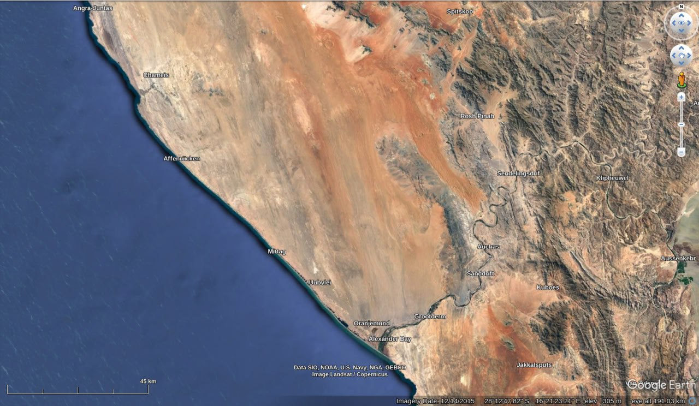
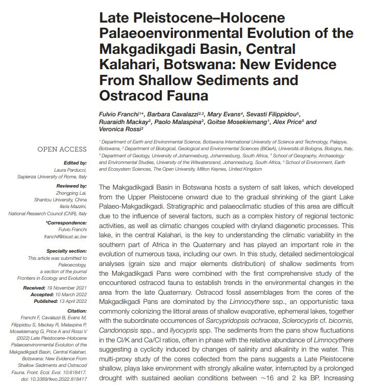

# South Africa

Appears safe from deluge from S1 to S2.

https://github.com/user-attachments/assets/03fc6500-19f1-4f4f-8bd3-3b854c07208e

See [here](https://github.com/sovrynn/ecdo/tree/master/6-LITERATURE-MEDIA/nobulart/ecdo-visualizations) for the high-res visualization. [1]

## Overview [1]

Southern Africa, "The Cradle of Humankind" [1]. Seemingly has no cultural flood stories that I have found. Bears no evidence of marine inundation within the past 66 million years.[2] Has some of the longest continuously inhabited caves, some with habitation periods spanning tens of thousands of years, and going back 250ka.[3] The shallow (50-150m) Agulhas Bank and the (7500ft) Swartberg and (11,400ft) Drakensberg Mountains would present a bow-shaped aspect to the oncoming water during S2>S1, much like that of a ship, possibly diverting most of the flow. [4][5][6] The long NS striations along the western diamond coast of Namibia suggest large volumes of water may have washed up there, and that those famous stones weren't carried dozens of kilometers up the coast and inland from Oranjemund by any ordinary ocean current.[7] Red line is the ECDO displacement path. [8]
(maps and refs. in comments)

1. https://en.wikipedia.org//wiki/Cradle_of_Humankind
2. https://www.researchsquare.com/article/rs-2656821/v1
3. https://en.wikipedia.org/wiki/List_of_caves_in_South_Africa
4. https://en.wikipedia.org/wiki/Agulhas_Bank
5. https://en.wikipedia.org/wiki/Swartberg
6. https://en.wikipedia.org/wiki/Drakensberg
7. https://nobulart.com/the-diamond-conspiracy/
8. https://theethicalskeptic.com/2024/05/12/exothermic-core-mantle-decoupling-dzhanibekov-oscillation-ecdo-theory/

## Youngest Marine Incursion Evidence

Youngest marine incursion evidence in SA is all along the coastlines at 6-7ka. Inland deposits (north of the Swartberg) are over 6 million years old.
https://t.me/nobulartchat/17516

There's an additional possibility here. During state 2 the water will retreat from the new polar lands due its centrifugal migration back toward the new equator. A 200ft drop in sea level around the southern part of Africa would expose most of the continental shelf, thereby further buffering the main land mass from the water interface during S2>S1.

## Saltwater Lakes

Red are saltwater, green are freshwater.

## Oranjemund

### Oranjemund Analysis

This is the diamond coast, from Oranjemund northwards. See the flow indications running north from the coast here. It comes at least 50km inland (probably more). I haven´t looked closely here yet, but I´d say that everything to the west of the red line (the ECDO moment) would be at risk returning from S2 to S1.

Red arrow marks pretty much the only point near to 5,000 ft in the region to the East of Oranjemund.

## Etosha Speculative Convo

If you look at the topography, and the locations of the salt pans, it looks like ocean water makes it way up via SA west coast / Namibia and then settles in the localized low areas.

The location of Etosha is quite interesting. Looks like only one way in is via the east.

Yeah, looks like a lot of water moves on the west coast. Etosha is right there.

It might slosh over to Etosha, or it goes via Makgadikgadi, implying quite a lot of volume makes it way up there.

I’m guessing it’s largely part of the return flow displacing to lower ground after the S2>S1. Was etosha I saw dating on.

Makes sense for it to be flooded less frequently, given the surrounding mountains and relatively high altitude.

I reckon the flow going from S2 - S1 is diverted by the formation on the southern tip of Namibia and then makes it way up to the basin in Botswana and only a small portion makes it as far as Etosha. Even then, possibly not every time.

The flow is probably much less severe than in other parts of the globe due to the bow effect you describe.

## Swartberg Range

### Analysis

The swartberg range has quite a distinctive form - multiple walls of rock jutting out towards the ocean. Maybe its enough to preserve something here during S2>S1.

### San People Genetic Uniqueness

Seems to suggest that there's a good anomaly in that region, across multiple 12000 year cycles. The genetic isolation & then rejoining the gene pool is also interesting.

Ditto cave drawings across the area.

*"Brenna Henn and colleagues found that the ǂKhomani San, as well as the Sandawe and Hadza peoples of Tanzania, were the most genetically diverse of any living humans studied. This high degree of genetic diversity hints at the origin of anatomically modern humans."*

*"A 2008 study suggested that the San may have been isolated from other original ancestral groups for as much as 50,000 to 100,000 years and later rejoined, re-integrating into the rest of the human gene pool."*

https://en.wikipedia.org/wiki/San_people#Genetics

## Eswatini Border Cave

Looks to be some topographical and visual evidence of flows in this area.

If you look at the underwater terrain near the coast in this area, you can see an underwater chokepoint that would lead to a surge in the above coastal area.

## Makgadikgadi

Makgadikgadi estimated to have last been wet 16ka BP.

## Fynbos

"The fynbos ecoregion is within the Mediterranean forests, woodlands, and scrub biome. In fields related to biogeography, fynbos is known for its exceptional degree of biodiversity and endemism, consisting of about 80% (8,500 fynbos) species of the Cape floral kingdom, where nearly 6,000 of them are endemic."

"The region occupies less than 0.5% of Africa's land area but supports approximately 20% of its plant life."

## Citations

1. [Craig Stone](https://nobulart.com)

# TODO

Southern Africa going to be blasted with hot air from the Sahara at 900+km/h?

Thing that still confuses me is the lack of marine fossils in South Africa - nothing since around 66 million years ago.
