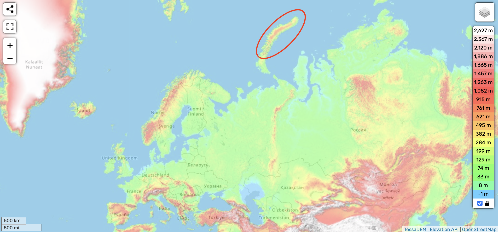
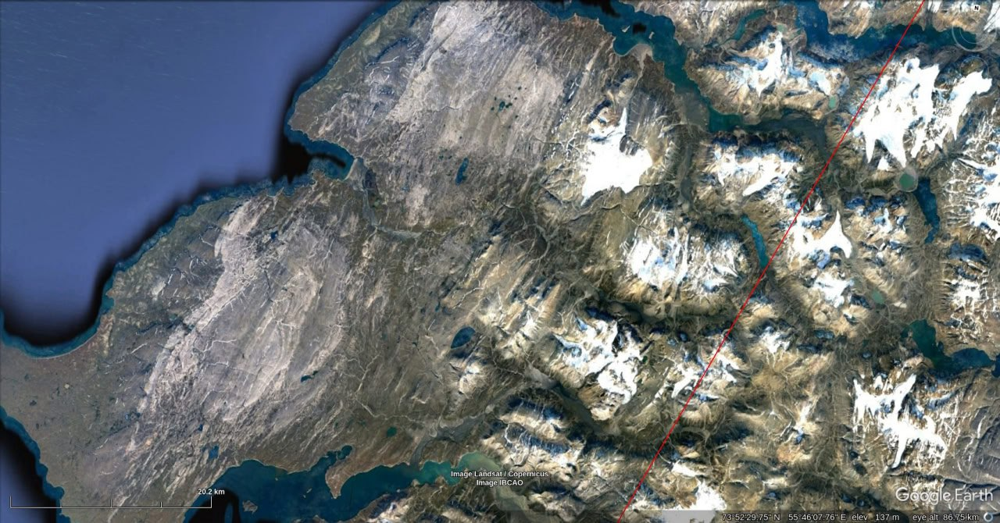

# Arctic

https://github.com/user-attachments/assets/6ea3f3cb-7f22-4d11-9b9c-64f842f2016b

See [here](https://github.com/sovrynn/ecdo/tree/master/6-LITERATURE-MEDIA/nobulart/ecdo-visualizations) for the full-res visualization. [1]

## Overview [1]

Arctic Ocean ECDO displacement visualization.[1] Bedrock without ice, including the Bering Strait, Siberia, Fennoscandia, Greenland, Canada and Alaska. The polar regions experience some of the highest land/water/air shear velocities during rotation due to their being at the maximum distance from both ECDO pivots. Add a few million gigatonnes of ice, and conditions would be about right to flash-freeze mammoths as are still being found in Alaska[2] and Siberia[3]. Swedish varved clay proxies spanning the Younger Dryas provide strong evidence for a displacement event around that time.[4] The star-like formation visible around the pole is a digital stitching artifact which arises from the projection of the map onto a sphere.

1. https://theethicalskeptic.com/2024/05/12/exothermic-core-mantle-decoupling-dzhanibekov-oscillation-ecdo-theory/
2. https://x.com/nobulart/status/1806268353306067285
3. https://x.com/nobulart/status/1806289032088813702
4. https://x.com/nobulart/status/1816565694244192663

## Severny Island

### Analysis [1]

Severny Island. Red lines are the ECDO moment of inertia. Extensive evidence of highly uniform directional scouring, as is characteristic of high velocity water flows.

[1] https://maps.app.goo.gl/4H5udi5mAWLa8AeP7

## Svalbard

### Analysis [1]

Svalbard. Bedrock striations are in agreement with the ECDO moment of inertia (red lines).

[1] https://maps.app.goo.gl/mbpafgEQwvPkp5EA6

## Citations

1. [Craig Stone](https://nobulart.com)
